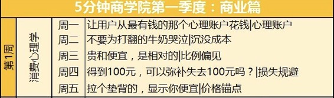

# 000丨人人都应该是自己的CEO

说明，课程都为各行业大咖，我精选整理与大家分享，有兴趣可以跟我一起学，对我也是督促。

* * *

下为今天内容。

01

今天，不管你愿不愿意，你都被卷入了一个“一切皆可经营”、“一个人就是一家公司”的时代。只不过，工商局注册的那些公司都是“有限责任”，而你“自己”这家公司是无限责任。

你需要用自己一生的时间和信用来为它担保。

还记得那4个抢月饼被开除的阿里员工吗？前一秒还守着一份人人羡慕的工作，后一秒就因为贪小便宜出了局。

谁敢说自己能稳稳当当地捧着饭碗？组织就一定可靠？

你必须像经营公司一样经营自己：构建自己的协作关系、塑造自己的产品和服务、呵护自己的名声、把注意力投放到产出更高的地方。

所以，人人都需要商学院的知识。商业逻辑、商学概念、管理方法和实用工具，都是从人性的骨子里来、被反复验证过的套路和模式。

过去，用于经营公司。

未来，用于经营自己。

不懂这些，不做好自己的CEO，别人就会把你从那个位置上赶下来，把你当成小兵来使唤。

02

这一年，你会学到什么？

我认真打磨了一套商业学习的基础体系，因为太长，把它放在文章最后了，如果你感兴趣，现在就可以拉下去看看。

每天，我会挑选一个最有用的概念，进行有趣讲述，用力扎破那层懂与不懂、会与不会的窗户纸。比如“我该如何给自己的产品定价”，导入概念，讲述逻辑，给出方法。

每周，我会围绕一门学科，一路展开，比如在“价格锚点”之外，我会接着给你讲“比例偏见”、“损失规避”等5个消费心理学的不同层面。

每季，我会构建一个体系，覆盖13周。比如在这个叫“商业”的体系中，一周“消费心理学”，一周“微观经济学”，一周“互联网营销”，等等。

每年，四大体系合体。1）商业，你与企业外部的关系；2）管理，你与企业内部的关系；3）个人，你与自己的关系；4）以及提升前三者的：工具。

03

今天是《5分钟商学院》上线第1天。

假设你自己这家无限责任公司已经成立，你给自己的战略目标是？

未来一年，我们将——

一天掌握一个概念，一周学习一个学科，

一季更新一个体系，一年完成一次升级。

* * *

下位下周课表

* * *

因为你刚我遇见我，留言足迹多美丽。