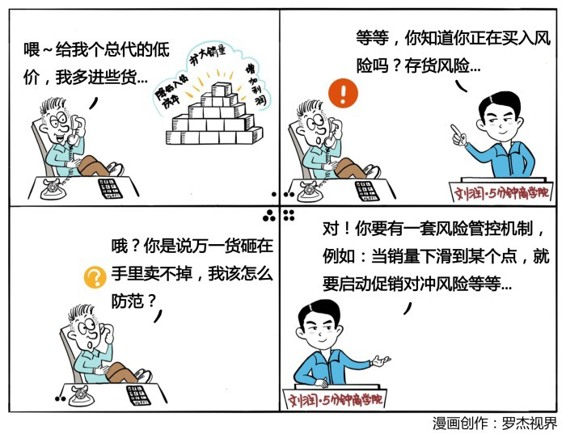

# 009｜风险不是你想买，想买就能买

### 概念：库存搏差价（风险）

总代所做的生意，其本质就是告诉品牌商，把你的库存风险卖给我，就算最后卖不出去，这个钱我照付给你，风险我来承担，但是作为交换，请你给我更大的差价空间，这种用库存搏差价的商业模式，其实就是在买卖库存风险。

### 案例

> 美国西南航空公司，为了避免受到原油市场太大的影响，到原油市场去买进期货，当油价猛涨多年，已经从25美元涨到60美元，它85%的用油仍然能够以26美元的价格可以拿到，其实它所买走的就是价格风险。

### 运用：场景

场景1：

> 总代生意，本质是买卖风险，要在第一天，就建立一个风险管控机制。比如说，全周期库存管理，一旦销量下滑到什么程度的时候，就启动大规模的促销来对冲风险，降到另外一个什么程度的时候，就启动和合作伙伴之间的交叉销售，再降到什么时候，就把这批货作为礼品搭送给其他的商品。这个所谓全周期的库存管理，其实就是一套风险管控机制。没有金刚钻，就不揽瓷器活，没有这套全周期的库存管理机制之前，千万不要随便去玩用库存搏差价的风险买卖。

场景2：

> 如果你有一双能够透过数据、看透人性的眼睛，能够更准确的判断谁会借钱不还，那么你就可以成立一家小贷公司，把不还钱的风险从那些有钱人的身上买过来，并因此获得利润。之所以网上有很多P2P公司倒闭跑路，就是因为没有这双风险之眼却想做这个生意。

场景3：

> 或者你是个数学家，你比所有人都能够更准确的判断某一种癌症的发病几率，你可以试着用保险的方式，把这种风险从每一个害怕得癌症的人那里买过来，并且靠做这个买卖赚钱。

### 小结：买卖风险

风险也是可以买卖的，如果想要创业做买卖风险的生意，前提是你必须有一双风险之眼，能看透别人看不透的风险，并有一套独特的机制来解决这个风险。商业世界里面，有太多的风险，买卖风险，就成了促进整个商业世界良性运转的一个重要的底层逻辑。

> 今天是你在这里学习的第9天，期待你的进步。