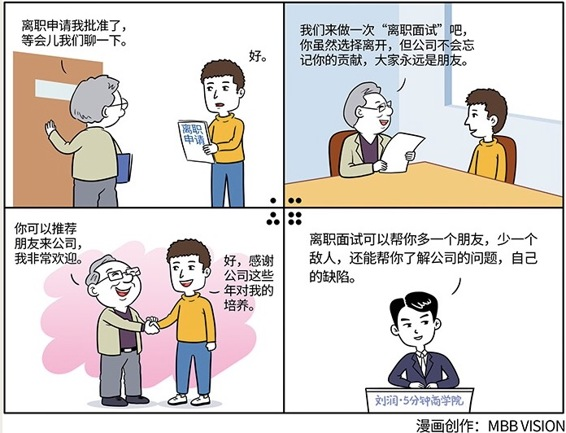

# 099｜多一个朋友，少一个敌人

### 概念：离职面试

离职面试，不是挽回，也不是批评，而是面向未来，建立你们之间的新关系。

一次好的离职面试，可以帮助多一个朋友，少一个敌人，甚至能够以他为镜，看到自己身上，或者公司身上的问题，加以改进。

### 案例

> 一个深受你重用的员工提出离职。你非常震惊，万万没想到，居然他会提出离职。然后，你开始焦虑，他手上那么多重要项目，如何是好？接着，你开始愤怒，我对你这么好，你居然无情无义。

> 但你也知道，震惊、焦虑或者愤怒，都无济于事。怎么办？

> 挽回吗？你可以试一下，但估计已经不大可能了。阻止一个优秀的人才离开，最好的方法，是不要让他开口。他一开口，基本就无法挽回了。

> 那怎么办？必要的挽回还是要做的。但你同时应该开始调整心态，接受这个结果。公司毕竟不是家，老板和员工，两个同路人，欢声笑语地走到了岔路口，应该用最合适的方式说声：后会有期。

### 运用：有效离职面试的三个建议

#### 第一，留不住人，就留住心

员工离职，多少可能有些对公司的不满，如果处理不当，很可能不满会变成怨恨，出去后，到处说你的坏话，处处与公司为敌。所以，离职面试很重要。它很重要的一个目的是：人可以走，把心留下。

留下他的心，就是要真诚地站在他的角度着想，看看能为他的前程提供什么帮助。

比如，他如果想先休息一段，再找工作，那就看看能不能帮他写封推荐信，或者聘请他当一段时间的外部顾问；如果他是去创业，那就和他聊聊他的创业想法，给些建议，并安排相关部门和他聊聊合作的可能性；如果他是因为更好的职位，去别的公司，那就祝贺他，并欢迎他在合适的时候回来，一起做更大的事业。

这些沟通的目的，是把你们之间的关系，从上下级，变为朋友。

#### 第二，人之将走，其言也真。

平常是你解雇员工，这次员工主动离职，就是他“解雇”了你。所以，你一定借离职面试的机会，了解他为什么要“解雇”你。是公司管理制度有问题，还是自己管理风格有问题，还是有些你不知道的暗文化、潜规则，让他不能忍受。

如果第一个环节的沟通没能交心，他会人之将走，其言也“善”，说：一切都挺好的，公司挺好，同事挺好，老板你也挺好，我离职纯属个人原因。但如果第一个环节的沟通，把你们从上下级，顺利地变为朋友，他就会人之将走、其言也“真”，给你一些有价值的反馈和建议。

#### 第三，善于提问，乐于倾听。

要想获得这些有价值的反馈和建议，你要善于提问，乐于倾听。

比如，很多人离职都是因为对直属经理不满。但如果你问：你对你的直属经理不满吗？他一定会说，没有没有，他挺好的。这是个傻问题。你要问：如果是你做你老板的位置，你会有些什么不一样的做法？这个问题可以让他说真话。他觉得可以做得更好的地方，就是他认为他老板做得不好的地方。

再比如，你不能问，你觉得我们是家好公司吗？这个问题没意义。你要问，你能推荐几个朋友加入我们公司吗？如果他直接拒绝你说：我觉得我周围没什么合适的。那基本上就说明，他对公司很失望，不愿意让朋友跳火坑。

如果你很想了解他对其他员工的评价，不要问：你觉得谁怎么样？那个谁谁呢？你要问：你觉得，公司里谁可以勉强接替你的职位？他列举的名单，一定是那些他心中比他更强的。如果你问，谁谁谁合适吗？他说，不合适。那多半是他认为这个人水平很差。

你还要问一个重要的问题：你离开之前所负责的那个项目，怎么做下去最好？他这时给你的观点，不会阿谀奉承，而会是中肯的看法，值得参考。

最后，不要忘了再向他提一个要求：我能不能再请你帮我最后一个忙？他会说：您说？你说：你能不能答应我，在1年之内，不从公司挖人？

他多半会答应你，因为在这个时间点上，他暂时只关心自己的职业发展，还没有动心起念要挖人。等他在新公司站稳脚跟，就可能要打老同事的主意了。提前获得一个君子承诺，非常重要。

### 小结：认识离职面试

离职面试，就是在员工正式离开前的一次的面谈。这次面谈非常重要，它可以帮你多一个朋友，少一个敌人，还能帮你了解公司的问题，自己的缺陷。

一个有效的离职面试要注意：第一，留不住人，就留住心，第二，人之将走，其言也真；第三，善于提问，乐于倾听。