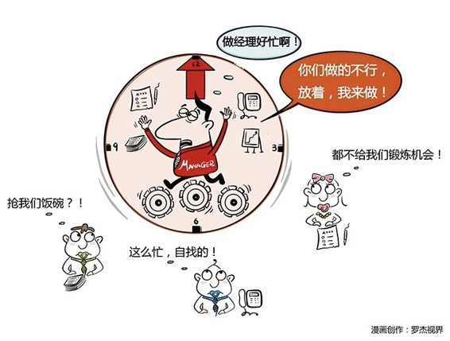

# 101｜人生中的第一个管理问题

从这一周开始，我们进入“反求诸己”部分。我将用三周，与你讲述从员工到经理，从经理到总监，从总监到CEO的自我修炼。

### 古狄逊定理

英国证券交易所前主管古狄逊，针对这种情况说：不做累坏的主管。管理是让别人干活的艺术。“古狄逊定理”，应该是你从员工到经理必须学会的，第一个定理，也是衡量你能否成为一名合格的管理者，必经的第一道生死门。

管理者也是一个工种，和工程师，设计师，环卫工人一样。10个人放一起，不经管理，可能只能产生3个人的价值。管理者，就是要让这10个人因为管理、因为协作，产生10，甚至15的价值，并因此可能拿2个人的收益。

所以，你拿2个人工资，却去做1个人的活，做得再好，把自己累死在办公桌上，都对不起公司。很多公司“学而优则仕”，都是专业能力最强的员工做经理。也因此，从员工到经理，心理上必须迈过去的第一道坎就是：他们都不如我。

### 案例

你在公司做了5年工程师，经验越来越丰富，业务越来越熟悉，很得同事和老板的信赖。有一天，公司领导找你，说你的直属经理要调任另一个部门，他们想让你接手，做这个部门的经理，问你的意见。

你说，那还有什么意见啊！太可以了，就那赶紧的吧。

你人生中第一次，从个人贡献者（英文里叫：Individual Contributor，又称IC），终于成为了管理者（People Manager）。很激动。可是，刚上任没多久，你就遇到了人生中的第一个管理问题：你的员工不如你。

> 交给他们做的事，拿回结果时，你简直想把资料撕得粉碎，最后全都砸他脸上。这都什么垃圾啊！回去重做！可是，重做之后，还是一样。你都要崩溃了，气不打一处来。但项目不等人，于是，你狠狠骂了一顿后说：算了算了，放着我来。

这样的场景，在全世界的每个角落，每家公司，每天都在发生。你确实用更少的时间，做出了更好的结果。但，这样正确吗？

当然不。你犯了几乎每一个初级管理者都会犯的错误，这个错误就叫：放着我来。拿主管的工资，抢员工的工作，你越来越忙，甚至成为瓶颈，但员工却没有成长，更没有成就感。

### 运用：迈过第一道坎的三个建议

#### 第一，明确分工。

所有的具体工作，都要合理地安排给员工，不要有“我擅长，我来做”的心态。给自己清晰的定位。比如，每天花2小时审阅代码，然后有针对性地辅导员工，安排经验分享。再比如，陪同拜访重要客户，下属主导，自己支持。等等。同时，接受可控的错误。把一定范围内员工犯错的损失，当成团队培训的成本。

#### 第二，轻易不动手。

在微软时，有任老板人称“老华”。有一次，我写了份重要的报告寄给美国，先发给老华。老华回信，提了很多意见，但就是只字不改。于是，我根据意见改了好半天，发回去。然后他的意见又来了。就这样来来回回。为了一份报告，我俩留在办公室加班。你可以想象吗？我们一直改到第二天早上7点。有人也许觉得这个老板有病，我却充满感激。他最经济的做法，是自己改完，然后回家。但他花了整整一夜，其实都是在对我投资。

#### 第三，区分方法和习惯。

从员工成为经理，就必须要学会区分，当你是一名优秀员工时的那些做法中，哪些确实是值得学习的好方法，哪些只是你的习惯。比如，一定要穿着得体去见客户，这是值得学习的好方法。但是穿白皮鞋，还是黑皮鞋，这就只是个人习惯，不需要强求。方法的不同，会带来结果的不同；但有些习惯的不同，只是让自己感觉舒适。很多新任管理者对下属的要求，其实都是希望别人按照自己无关紧要的特有习惯做事。

#### 小结：认识古狄逊定理

古狄逊定律，就是不做一个被累坏的主管。从员工到经理，要学会的第一课，就是忍住不要去抢员工的活。这是瘾，要戒。它会让你的员工没有成就感，更让你自己成为团队的瓶颈。

> 要学会：明确分工，轻易不动手，区分方法和习惯。

刘润

作为管理者，你会常常忍不住去抢员工的事做吗？作为员工，你希望你的老板对你说“放着我来”吗？来和我一起过过招吧。

欢迎把本期内容分享到朋友圈，没准会让你的老板有所启发、让你刚刚晋升管理者的朋友茅塞顿开，进而调整他们的工作方式。点击右下角“请朋友读”，一键分享知识红包。 

另外，3.18号，《5分钟商学院》商业篇第二次线下大课将在上海开课。400张票，本来打算卖1个月，但刚刚一周的时间，咱们的同学们又“包圆”了，400张票全部售罄，完全没给其他用户一点机会。第二次线下同学会，上海，咱们到时见！

第21期客座教授：梁小虹

中国运载火箭技术研究院原党委书记、研究员，长期在中国航天领域工作，在探索企业内部管理规律方面有着独到的见解，在企业党的建设、企业文化见解和人力资源管理等方面，有着丰富的实践经验。系中国航天科技集团公司“2518核心人才”、国防科技工业“511工程”高级管理人才。

你这位CEO有什么问题想问他，欢迎在留言区提出来，我们将挑选一个最有价值感的问题，请梁老师认真回答，并在本周学习结束的时候，公布这个CEO问CEO的结果。

这是《刘润·5分钟商学院》陪你成长的第101天，期待你的进步。