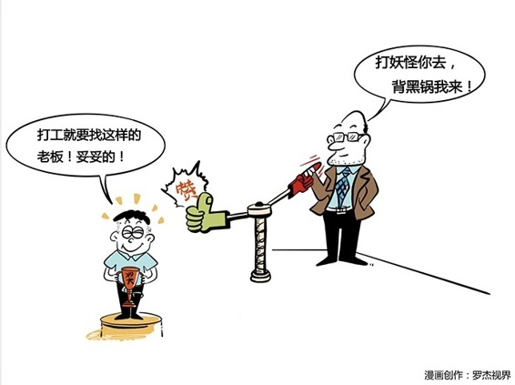

# 104｜打妖怪你去，背黑锅我来

### 概念：推功揽过

从员工成为经理后，除了“不要抢员工的活”、“懂得权力是员工给的”、“学习把目标翻译成任务”外，还有一项基本修炼，就是：打妖怪你去，背黑锅我来。

> 有人可能会觉得，凭什么啊？你没把工作做好，我就应该狠狠批评你，就算不批评你，也不能我替你背黑锅啊，凭什么啊？

理解这个“凭什么”，就要从“设计系统”的基础逻辑，“责权利心法”开始。

> 一旦成为经理后，你就拥有了达成团队目标所有的“权”，因此，你也必须承担与之对应的所有的“责”。成为经理之后，你是不是这个团队里最优秀的人，已经不重要了，因为你已经从球员，变成了教练。成为教练，就要懂得收起自己的“个人英雄主义”，退到球星们的光环后，确保团队胜利。你的团队进了多少球，就是你进了多少球；你的团队老不赢球，不管你觉得谁不行，首先都是你不行。

这是一个很难完成的转变，尤其是面对“问责”的时候。别的团队犯错，比如某国政府出了大事，你可能会说：这个总统，必须引咎辞职啊。到了自己的团队犯错，你可能会想，主要责任明显在员工，但我也有失察之责，那就罚酒三杯吧。

### 案例

李嘉诚初到香港的时候，在一家钟表公司工作。他非常好强，非常勤奋，为了提高技艺，专门拜了一个师傅。

有一次，师傅不在，李嘉诚自作主张地自己动手修手表。没想到不但没修好，反而把手表弄坏了。李嘉诚知道自己闯了大祸。但师傅回来后，不但没骂他，还把错误承担下来。李嘉诚向师傅道谢，师傅说：“你要记住，无论以后做什么工作，作为管理者就应该为自己的下属承担责任，部下的错就是管理者的错误，管理者应该负起这个责任。否则，就不配当领导。”

此后，“员工的错误就是管理者的错误”，就变成李嘉诚的口头禅。

新任经理喜欢在员工面前说“你们怎样怎样”，在外人面前说“他们怎样怎样”。这是一定要戒掉的坏毛病。你的团队不在你的后面，也不在你的对面，你的团队在你的“里面”。你只能说：“我们怎样怎样”。

> 每个上司都喜欢给自己“补台”的下属，同样地，每个下属也都喜欢给自己“搭台”的上司。那作为经理，应该怎么做呢？其实，就四个字：推功揽过。

### 运用：如何去做？

#### 第一，推功。

每当上司表扬你，你都要推举几个功臣，强调他们的贡献；每次你上台领奖，你都要言之有物地感谢，哪些人做了哪些具体工作。将心比心，你的老板在台上发言时，你是不是也竖着耳朵，万分期待他提到你的名字？所以，除了教练之功，要把所有功劳大声地、公开地推给所有做出贡献的员工。

不要既想当教练，又想当那个进球的人。

#### 第二，揽过。

美国著名橄榄球教练保罗·贝尔曾说过：“如果有什么事情办糟糕了的话，那一定是我做的；如果有什么事情做得还不错的话，那一定我们一起做的；如果有什么事情做得很好的话，就一定是全体球员他们做的。这是我们能取得比赛胜利的秘诀。”

项目失败，经理要站出来：不管怎么错，首先是我的错。你可以回去开部门会议，把所有人骂得狗血淋头，但是对外，就是你的错。

### 小结：认识推功揽过

从员工到经理，最容易出的问题之一，就是“功劳属于谁，错误怪罪谁”的问题，常常与下属争功，或贬低下属、抬高自己。

成为经理后，要懂得“推功揽过”。除了教练之功，所有的功劳，都要推到员工身上；除了法纪之过，所有的过错，都要揽到自己身上。成为经理后，要有“打妖怪你去，背黑锅我来”的心态，才能把“你们、他们”，变为“我们”。

欢迎把今天的课程分享给你的朋友，大家一起讨论收获更多。很多管理学上的处事方式，同样适用于很多地方。不信，试试下次吵架时和伴侣说：如果有什么事办糟糕了的话，一定是我做的；如果有什么事做得还不错，那一定是我们做的。看看她的反应。哈哈。