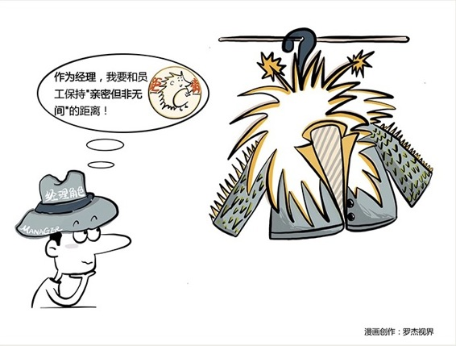

# 105｜亲密，但是不能无间

### 概念：刺猬法则

在一个寒冷的冬天，两只刺猬都冷得受不了，于是越靠越近、相依取暖，可是因为他们身上长满了刺，紧挨在一起，就会不小心刺痛对方。被刺痛的刺猬于是就分开一段距离。但是，分开后又实在冷得难受，就又彼此靠近，然后再被刺痛。最终，他们找到了一个最合适的距离，相互之间能够取暖，又能够很好地保护对方。

这是一个非常有趣的现象，心理学家根据这一现象，总结出“刺猬原理”，也就是说，人与人之间，必须保持一个“合适的”距离，才能彼此依靠，却不互相伤害。

很多新晋管理者到很晚才意识到，一旦成为管理者，身上所背负的权力和责任，就像是刺猬身上一根根的长刺。亲密，但是不能无间，这是刺猬们伤痕累累后才获得的，多么痛的领悟。

### 案例

法国总统戴高乐就是深谙刺猬理论的人。他有一个座右铭“保持一定的距离”。这听上去有点冷酷，但是戴高乐认为，没有距离感，领导决策过分依赖秘书或某几个人，容易使智囊人员干政，进而使这些人假借领导名义，谋一己之私利，最后拉领导干部下水，后果是很危险的。两相比较，还是保持一定距离好。

听完戴高乐的简介，你是不是突然想起了韩国总统朴槿惠？朴槿惠让她的好友兼智囊崔顺实参政，引发“闺蜜参政”风波，遭到弹劾，简直就是正中了戴高乐的预言。最终，朴槿惠向国会提出了“有条件辞呈”。

商界也是如此。通用电气的前总裁斯通，就很注意执行刺猬原理。在工作上，斯通毫不吝啬对员工的关爱，但业余时间，他从不邀请员工到家做客，也不接受这样的邀请。与员工之间保持合适的距离，不意味着你要高高在上，也不让你和员工混淆身份，让权力和责任之刺，伤到彼此。

我到了很久之后才明白，长了“管理之刺”后，亲密，但不无间，才是与员工之间最好的关系。

### 运用：三个建议

#### 第一，不冷漠。

千万不要误解，认为刺猬原理就是说，一旦成为管理者，就要从此板着脸，克制自己对员工的关爱，做一个铁面无私的判官。作为管理者，更需要关注、激励、帮助每一个员工。不冷漠，热爱你的团队和同事，这是一个优秀的管理者的必备的态度和能力。

#### 第二，不无间。

这是很多管理者最难接受的。难道，成为管理者，我就不能和员工做朋友吗？当然可以。但是，要注意防止过分“无间”的关系。最无间的关系，叫“家人”。家人犯了错，甚至是犯了法，你可能都会义无反顾地保护他，你的家人，也对你有这样的期待。“公司不是家”。过于无间的关系，就会让你和你的员工，在亲情和规则之间，面临两难。

#### 第三，不偏袒。

比“无间”更可怕的，是“偏袒”。甚至因为如果你对一群人特别好，使得这群人经常围绕在身旁，那么自然就疏远了其他人。最严重的情况的就是“鲨鱼群”现象，一群人把企业的领导者团团包围住，隔绝领导者有抱负与雄心，但了解的信息却都是单方面的（甚至是被篡改的），就可能产生错误的判断。

### 小结：认识刺猬法则

刺猬法则，就是管理者要意识到，你一旦从员工成为经理，就被插上了“管理之刺”。权力和责任越大，管理之刺越密越长。

保持和员工合适的距离，不冷漠、不无间、不偏袒，是管理者的必修之课。