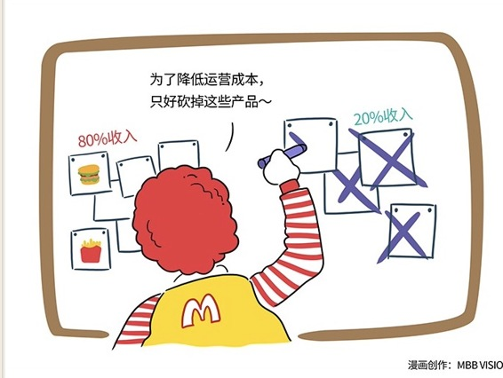

# 106｜你的部门，有必要存在吗？

### 概念：独立的损益表

损益表，简单来说，就是：收入 - 成本 = 利润。

在一个公司里，对成本承担责任的部门，叫“成本中心”，比如人力资源部、财务部、行政部等。在一个公司里，对成本和收入同时承担责任的部门，叫“利润中心”，比如汽车公司里会有跑车事业部、SUV事业部、家庭轿车事业部。每个利润中心，都有自己独立的损益表。

大部分员工，甚至是大部分经理，是没有成本意识的，更没有利润意识。比如你问他，你1万元的税前工资，到手7000多块，但是你知道公司付出了多少钱吗？他多半是没有概念的。很多员工兴奋地跑去找CEO，说自己有个特别好的创意。CEO听完后问，这东西怎么获得收入、利润？他可能从来没想过。

作为一个员工，或者经理，这样也许没问题。但是作为一个总监，或者CEO，这是绝对不行的。

### 运用：如何建立收入意识和成本意识

#### 第一，清晰知道收入来源

1937年，麦当劳兄弟制作了一份简单的损益表。表上显示，在麦当劳销售的25样产品中，汉堡包带来的收入达到了80%。因为清晰知道收入来源，麦当劳兄弟决定，砍掉了16样产品，降低运营成本，同时把汉堡包由30美分，降价到15美分。因此，麦当劳获得了更大的市场份额。

#### 第二，透彻理解成本结构

你说，可我是开发总监，是成本中心，不负责收入怎么办呢？那你至少要建立成本意识。

比如，你要知道，公司对员工的支出，和他的税后收入之间的关系。员工税前收入1万元，公司正常交税交金，那么支出大概1.4万左右。

那办公室租金呢？你的部门所占用的那部分办公室的租金、水电费、维修费，你算过吗？成为总监后，为了培养自己的成本意识，你可以试着去找行政部、财务部算算一年的办公费，然后平摊在自己员工上。比如办公费占员工支出的40%。那就意味着你一个1万元工资的员工，你的总支出，就是1.4万+4000元，总共1.8万。

那么，行政部、财务部、法务部、人力资源部，以及管理人员（其中包括你自己），他们的成本呢？他们并不直接创造价值或者传递价值，这些都是内部的有价资源，你使用了他们的服务，就该付费。所以，再用他们的所有成本，除以你所有创造价值、传递价值的员工总数，也许得出每个人分担的成本是3000元。那么，你的每个员工的成本，就从1.8万，变成了2.1万。

所以，你现在明白，员工拿到手7000元的时候，公司其实付出了2.1万。三倍。你有多少员工？50个？那就意味着，你部门每月的成本是100万。

也就是说，总监大人，你带着你的团队，每月创造的价值比100万多，公司才有留着你的理由。否则，一定干掉。这就是为什么很多利润中心负责人说，每天一睁眼，就欠了几十万。

#### 小结：认识独立的损益表

独立的损益表，就是：收入 - 成本 =  利润。作为总监，就算你不是利润中心，而是成本中心，也要清晰知道收入来源，透彻理解成本结构。