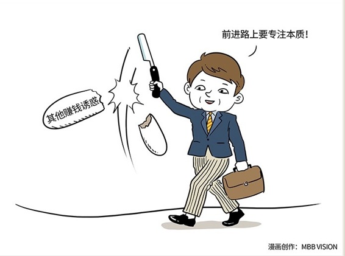

# 107｜如无必要，勿增实体

### 概念：奥卡姆剃刀定律

奥卡姆剃刀定律是由14世纪逻辑学家，奥卡姆的威廉提出。奥卡姆是个地名，提出这个定律的人，是威廉。这个定律常被称为“如无必要、勿增实体”。

这听上去很高大上，它的本意是：如果有两套理论都可以解释一件事情，用那个简单的理论。空洞无物的普遍性要领都是无用的累赘，应当被无情地“剃除”。但现在大家提到“奥卡姆剃刀定律”，更多是取它的延伸含义：把复杂的事情简单化。两步可以做成，不要三步。也就是“简单有效原理”： 抓住本质。

### 案例

我有一次和小米的投资人，晨兴资本合伙人，刘芹一起出差，共同辅导一个创业项目。这个团队主业还不成熟，就开发了金融板块，赚了不少钱。刘芹对创始人说：你缺钱，我投给你，但你能不能答应我，在未来几年之内，不碰金融。做金融没赚到钱，团队会元气大伤；赚到了钱，团队会再也没兴趣艰苦创业，元气会更加大伤。

抓住本质，说起来容易，做起来难。剃掉赔钱的业务，尚需咬牙跺脚；剃掉赚钱的业务，以追求专注，简直比登天还难。所以，从经理成为总监，如何透视极其复杂的管理系统，抓住本质，利用“奥卡姆剃刀定律”，手起刀落，化繁为简，是一项毕生的修炼。

### 运用：修炼需三招

第一，流程精简，剃节点。

某日本化妆品公司收到客户的抱怨，说买来的肥皂盒里面，居然有空的。于是为了预防生产线上再次发生这样的事情，工程师想尽办法发明了一台X光监视器，去透视每一台出货的肥皂盒。

同样的问题也发生在另一家小公司，他们的解决方法是买一台强力工业用电扇去吹每个肥皂盒，被吹走的便是没放肥皂的空盒。

这也许只是一个故事，但这个故事非常准确地说明了“奥卡姆剃刀定律” 那种对待流程，“如无必要，勿增实体”的信仰。

第二，组织扁平，剃部门。

我们常常说“组织扁平化”，但是我们必须理解，组织扁平化，是手段，不是目的。目的是什么呢？目的，是减少信息传递的损耗。个人，是用自己大脑“指挥”自己双手，信息传递是没有损耗的；管理，是用自己大脑“影响”别人大脑，再用别人大脑“指挥”别人双手。这个“影响”，在每次信息传递中，都有非常大的损耗。所以，组织越复杂，信息传递次数越多，组织能力几乎必然越差。

上世纪80年代，杰克·韦尔奇接手GE时，发现整间公司机构臃肿、等级森严，这就导致组织迟钝、官僚。于是，他把原本8层的管理精简下来，把工资层级从29个级别调整到5个级别。这种“扁平化”加速了信息传递，对治疗“大公司病”有很好的效果。

第三，战略专注，剃功能。

我在《刘润·5分钟商学院》的后台，看到一则留言，有同学嫌弃我的发音L和N不分。我很愧疚。于是找脱不花以及团队商量，说我以后就别出来丢丑了，请个专门的播音员吧。或者，每天出两个版本的录音，由学员自己选择？

脱不花说：奥卡姆剃刀定律。意思是：两个版本，会让用户面临更复杂的选择。如无必要，勿增实体。就你，就你，就你给我接着录。

### 小结：认识奥卡姆剃刀定律

奥卡姆剃刀定律，就是“如无必要，勿增实体”。从经理变为总监，独立面对一个小系统，要不断思考三件事：流程精简、组织扁平、战略专注。

问自己三个问题：这件事能不能取消它？能不能把它与别的事情合并起来做？能不能用更简便的方法来取代它？