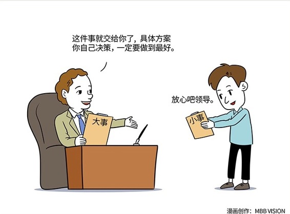

# 108｜管理六字真言：抓大、放小、管细

作为经理，和作为总监（总监大多是经理的经理），从管理的角度来看，有什么不同？也许你可以举出很多。我想从管“人”，而不是管“事”的角度列举一条，那就是：信息传递的方式，截然不同。

### 概念：抓大放小管细

#### 例外原则：

> 提出“科学管理”的那个美国管理学家泰勒认为：“ 为了提高效率和控制大局，上级只保留处理例外和非常规事件的决定权和控制权，例行和常规的权力由部下分享。”也就是说，大事，就是“例外的、非常规事件”。这句经典名言，在管理学上被称之为“例外原则”。

洛克忠告：

所谓管细，就是一套严格的监督制度。英国教育家洛克说：没有有效的监督，就不会有满意的工作绩效。明智的管理者会利用监督这把利剑，促使员工们既心有紧迫感，又满怀热情地投入到工作中去。

> 这就是著名的洛克忠告，这也是为什么军队里有宪兵，党派内有纪委，政府中有检察院。

#### 运用：六字真言：抓大、放小、管细

#### 第一，抓大。

抓大的意思就是：只管大事。

执行“例外原则”：财务上的预算制，管理上的流程化，都是不错的方法。

财务预算制，就是确定财务上什么“不算”例外。比如部门预算确定，可以招15名员工。15人以内的进出，“不算”例外，无需批准。招第16名员工，就是例外，需要申请。

管理流程化，就是确定管理上什么“不算”例外。比如报销流程确定，宴请客户，最高级别的员工买单、报销。这个报销流程，可以一定程度防止内部腐败。如果某次宴请客户，因为特殊情况，最高级别的员工无法买单，就是例外，需要申请。

### 第二，放小

放小，就是授权。授权，不是一句“这件事交给你”就完了。我在第94课“拜伦法则”里讲过，“你那不叫授权，你那叫授责”。

放小，首先要知道什么算“小”。所有财务预算内、管理流程里的，都是小事。对于小事，总监要懂得让经理决策。怎么做？你可以试着“不直接回答下级的问题”。

当下级有问题时，你可以让他自己提方案。点评方案，而不是回答问题。如果直接回答问题，你觉得你在给建议，他觉得你在下命令。长此以往，这个“小”是放不下去的。

理解了“小”，还要懂得“放”。最重要“放”的方式，是从审批制，变成备案制。你的下属要做一些“不算例外”，但是重要的决策，你可以请他把具体的做法备案。备案的意义就是通知你，如果发现有什么问题，就严格按照制度来查处。

> 简而言之，“抓大放小”就是：不算例外的决策，备案；算是例外的决策，报批。

### 第三，管细。

很多管理者都在说“抓大放小”，但常常忽视“管细”。

微软前任CEO史蒂夫·鲍尔默，是“抓大放小”，尤其是“管细”的典型。有一次，他接受各国CEO的年度汇报。巨大的屏幕上，每一页都是密密麻麻的业务数据。数学系毕业的他，虽然平时“抓大放小”，不参与各国分公司的管理，但利用听报告的方式来“管细”。他突然说：停，你翻到前面，这一页的这个数字，和那一页的那个数字，是矛盾的，请你解释一下。那个CEO瞠目结舌，答不上来。史蒂夫说，你根本不懂你的业务，当场就把他解雇了。

### 小结：认识抓大放小管细

从经理到总监，最大的不同，就是你不直接管理最一线员工了，所以，必须从“兄弟们跟我上”式的“单层管理”，过渡到“隔层管理”。

> 记住六字真言：抓大、放小、管细，克服“一放就乱、一管就死”的状态。

企业高层无为，中层有所为，基层无所不为，企业才能大有所为。