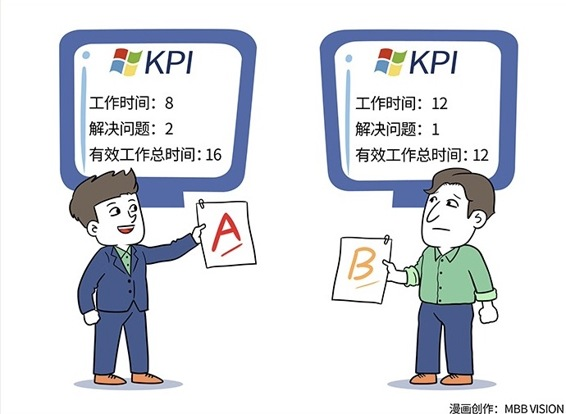

# 109｜坐进你的管理驾驶舱

### 概念：关键绩效指标

KPI是一套绩效管理的方法。全称为：Key Performance Indicator。中文叫：关键绩效指标。

> KPI，和我们在第103课讲的“任务分解”不同。任务分解，是把目标，分解成可执行的任务。是在“如何执行”层面的思考。KPI，是把目标，分解成可考核的指标，是在“如何管理”层面的思考。

### 案例

微软应该如何做销售？如何才算做好了销售？

从“任务分解”，也就是“如何执行”的角度看，微软可以按行业、地域划分客户，雇佣经验丰富的销售，配合渠道一起，把产品卖给客户。从KPI，也就是“如何管理”的角度看，把“微软在中国的销售额，对比每年中国的PC出货量”，作为KPI。这个KPI高，就代表微软跑赢了市场，这个KPI低，就算销售收入增长，还是输给了市场。

> 总监，和经理巨大的不同之一，是不但能把目标翻译成任务，还要能把目标翻译成，可以有效衡量目标是否达成的“指标”。

### 运用：关于制定KPI的三个建议

#### 第一，平衡性。

指标的不平衡，会误导员工只关注一点，偏废其他。

微软技术支持部门的工作，是接受来自客户的产品质询。怎么考核这个团队的效率呢？微软设计了三个指标：

A、解决每个问题的时间。这是员工自己记录的；

B、解决问题的个数；

C、有效工作总时间。这个数字，就是A和B的乘积。

A越短越好，这代表技术能力；B越多越好，这代表工作量；C越长越好，这代表努力程度。这三个指标之间的平衡关系，A x B = C，有效地杜绝了员工只关注一点、偏废其他。

比如，有的员工为了展现技术能力，用2小时解决问题，他记录成1小时。但因为A x B得出的C，他的有效工作总时间就会减半，显得很不努力。

有的员工为了展现努力程度，工作8小时，想显得工作了16小时。A x B = C，因此，他必须把用2小时解决的问题，记录成4小时。但这样就显得他的技术能力不行，解决问题时间比同事长很多。

这三个指标的平衡性，几乎杜绝了技术支持员工，只关注一点、偏废其他的可能性。

#### 第二，前瞻性。

有一些KPI，当发现有问题时，已经晚了，比如销售指标，和利润指标。当这个KPI可衡量时，已经不可改变了。我们把这种指标，叫做后置指标。

有一些KPI，当发现有问题时，真正严重的后果还没有发生，来得及调整。比如“潜在销售机会”这个KPI。如果潜在销售机会，小于销售指标的两倍，我们就应该警示销售团队，要及时改进。改进及时，最终销售指标，还是有可能如期完成。我们把这种指标，叫做前置指标。

> 所以，KPI不能只有“后置的”结果指标，还要有“前置的”行为指标。“以结果为导向”虽然没错，但是等你可以考核结果时，结果已经不可改变。

### 第三，适用性。

但也要注意，KPI有其适用性。KPI有用的前提，是战略已经清晰到可以流程化，所以目标可以分解为指标。但创业公司处于战略探索期，过早使用KPI，会因为KPI不能反应变化中的战略，而导致行为扭曲。雷军、张小龙都说要警惕KPI。为什么？不是因为他们是互联网公司，而是因为他们是创业公司。这个话题，我还会在129期，“创业期管理”里面，专门来讲。

### 小结：认识KPI - 关键绩效指标

任务分解，是把目标分解成可执行的任务，是在“如何执行”层面的思考。KPI，是把目标，分解成可考核的指标，是在“如何管理”层面的思考。

KPI是非常重要的一种管理手段，只是它有它的适用性。KPI，是你管理驾驶舱中的仪表盘，让你时刻知道组织的运行状态。使用KPI管理部门，需要注意其平衡性、前瞻性和适用性。