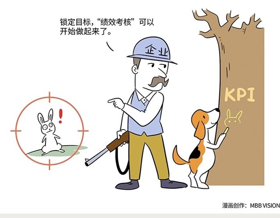

# 110｜不但要锁死目标，更要锁对目标

### 概念：目标管理

1954年，现代管理学之父，彼得·德鲁克提出了一个划时代的概念——目标管理（Management By Objective，简称为MBO）。

> 他说，“企业的使命和任务，必须转化为目标”。也就是说，你先想清楚没有，你到底想要什么。然后才是“绩效管理”，怎么通过KPI，把目标翻译成指标，或者OKR，把目标翻译成小目标，去实现它。

你可以把“目标管理”，看成是“绩效管理”的一部分，也可以认为目标管理，先于绩效管理。如果说，我们需要一把同心锁，把员工和企业牢牢锁在一起，目标管理，是确保我们锁对了目标，绩效管理，就是确保我们锁死了目标。

### 案例

18世纪末期，英国政府决定把罪犯发配到澳洲去，于是实行以上船的犯人数支付费用的方式，雇佣私人船主运送犯人。

很快，政府发现：犯人的死亡率达12%，最严重的高达37%。政府想了很多办法，比如派监督、派医生、规定犯人生活标准，对船主进行教育，都无法解决死亡率的问题。

最后，英国政府决定，以到澳洲上岸的人数为准，计算报酬。问题立刻迎刃而解。英国政府不是没有锁死目标，而是没有锁对目标。

### 运用：学会先锁对目标

当天外伺郎哀叹因为万恶的绩效管理，索尼砍掉了不创造短期收益的“机器人实验室”的同时，在同样严厉的绩效管理之下，华为成立了专门研究黑科技的“2012实验室”，并诞生了一开始无用，但后来帮助华为在智能手机领域获得巨大竞争优势的麒麟芯片。

同样属于科技行业的华为说：这个世界没有不懂绩效管理的成功者。华为不但用绩效管理锁死了目标，还用目标管理锁对了目标。

在绩效文化的发源地美国，微软在全球拥有每天不知道在干什么的四大研究院，谷歌给员工20%的自由时间，而贝尔实验室更是几十年前就享誉全球。这些都是天外伺郎说的“短期内难见效益的工作”，但却在绩效管理下，生根发芽。

所以，作为管理者，在用“绩效管理”锁死目标之前，第一重要的事情是，想想自己锁对了目标没有。你的目标是短期的业绩指标，还是长期的盈利能力。换句话说，你到底想要钱，还是用钱换未来能赚钱。

> 毁掉索尼的，可能不是绩效管理，而是把员工锁死在错误目标上的管理层。

### 小结：认识目标管理

> 所谓目标管理，就是把企业的使命和任务，转化为经营目标，然后再用KPI、OKR等绩效管理工具，分解、执行、考核。

企业与员工之间需要一把同心锁，目标管理，就是锁对目标；绩效管理，就是锁死目标。