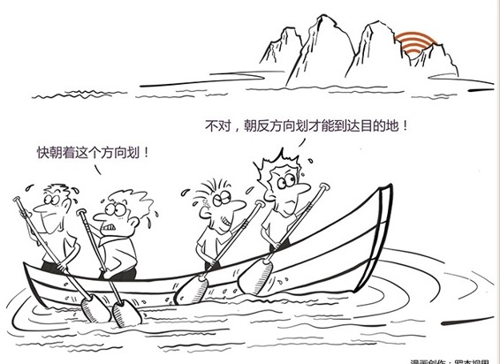

# 111｜用一个人的梦想，点燃一群人的理想

今天是“从总监到CEO”的第一课，我想先从诗和远方谈起，谈谈很多人都在说，但很少人真正理解，以至于被认为实在是太虚的几个概念：愿景、使命、价值观。常有人问，“企业一定要有愿景、使命、价值观吗？”，这就和“人一定要有梦想吗”，是同一个问题。

### 概念：愿景、使命、价值观

愿景就是梦想；使命就是职业；价值观就是道德。

如果把“赚钱”当梦想，那么每个员工都会仅仅思考如何实现个人利益最大化，偷懒，腐败，可能防不胜防。所以，作为CEO，一定要想清楚，到底什么才是这家企业的梦想。把梦想当成目标，赚钱当成结果，这家企业，才可能是万众一心、富有战斗力的伟大企业。

### 案例

美国黑人运动领袖马丁·路德·金，1963年在华盛顿林肯纪念堂发表著名演讲《我有一个梦想》，他说：我有一个梦想，有一天，我的四个孩子将在一个不以他们的肤色，而是以他们的品格优劣来评价他们的国度里生活。

个头矮小、其貌不扬的马丁·路德·金并不是总统，他没有权力，但他却影响大家，激励大家，引发了数百个城市的黑人运动，赢得了公共汽车种族隔离制度的废除，赢得了全世界对伯明翰黑人运动的关注，最终赢得了美国国会通过民权法案，从法律上正式结束美国黑人的被歧视地位。

整整50年后，美国总统奥巴马在马丁·路德·金当年发表《我有一个梦想》演讲的林肯纪念堂前讲话，以纪念该演讲。虽然马丁·路德·金不是总统，但他“用一个人的梦想，点燃了一群人的理想”，让奥巴马，一个黑人也终于能够成为这个国家的总统。

企业也是一样。很多企业思考的问题，自始至终都是“怎样赚钱”，却很少思考“为什么赚钱”。

### 理解：诗和远方的三个部分

#### 第一，愿景。

愿景，英文叫Vision，就是一幅描绘了美好未来的图景。作为CEO，你要想想，因为你的存在，10年、20年后的世界是什么样子。画面感越强，越能激发憧憬。比如马丁·路德·金的“我的四个孩子将在一个不是以他们的肤色，而是以他们的品格优劣来评价他们的国度里生活。比如什么是小康社会？就是：土豆炖牛肉。比如微软的愿景：每个人的桌面上，都有一台电脑。

当然，改变世界，是高级愿景。有不少公司的愿景，不是改变世界，而是成就自己。比如万科：成为中国房地产行业领跑者；联想集团：高科技的联想、服务的联想、国际化的联想；麦当劳：控制全球食品服务业。

不管是改变世界，还是成就自己，只要是真的心向往之，能点燃激情，就不要怕愿景太大。万一实现了呢。

### 第二，使命。

使命，英文叫Mission，就是我的企业为什么而存在，到底在做什么，在实现改变世界的愿景的路上，扮演什么角色。

微软的使命是“通过软件，释放企业和个人的全部潜能”，通用电气的使命是“让天下亮起来”，迪士尼的使命是“让世界快乐起来”。

中国有句古话，叫物以类聚、人以群分。你一旦有了明确的“干什么”，以及因此“不干什么”的使命后，招聘的标准是完全不一样的，建立的组织也是完全不一样。

如果没有使命和愿景，也就是没有诗和远方，员工就是为薪水和老板打工，CEO会非常辛苦，天天哀叹“人心散了，队伍不好带啊”。

### 第三，价值观。

价值观，英文叫Value，如果说规章制度，是企业的法律，价值观，就是企业的道德。

一个企业，明文在规章制度里规定什么能做、什么不能做，永远是有限的。当员工面临复杂的商业环境，想不起来规章制度，或者就算想起来也找不到对应的规定时，价值观，也就是企业的道德标准，就成为一个基础依据。

比如IBM的价值观是：成就客户、创新为要、诚信负责；阿里的价值观是：客户第一，拥抱变化，团队合作，诚信，激情，敬业。

我斗胆分享一下我的公司，润米咨询的价值观，那就是：激情，承诺，思考，行动。没有承诺的激情，是冲动；没有激情的承诺，是责任；没有行动的思考，是空想；没有思考的行动，是蛮干。我自己，我招聘员工，都必须认同、符合这个价值观。

### 小结：为什么要有愿景、使命、价值观？

三个原因：能够网聚志同道合的战友；让大家被梦想而不仅仅是金钱激励；为无数的大决策、小选择，提供判断的方向和原则。