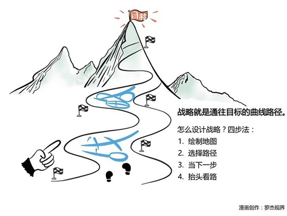

# 112｜不要用战术的勤奋，掩盖战略的懒惰

### 概念：战略思考

你想从上海去珠穆朗玛峰。珠峰是愿景，从上海到珠峰画条直线，就是方向。但如果你恰好不是超人，不能顺着这条直线飞过去，那这个直线就不是路径。

> 你必须深刻了解地面环境，选择可行路径，曲线到达目的地。这条曲线路径，就是战略。

作为CEO，最重要的工作，不仅仅是定愿景、指方向，然后激励大家前行，更要懂得战略思考，画出曲线路径。这是CEO不能推卸的责任，不可没有的能力。

### 案例

> 宝洁的愿景是“成为并被公认为提供世界一流消费品和服务的公司”。但它发展到一定程度后，遇到了瓶颈，怎么才能持续扩大自己的市场份额，成为“世界一流”？

> 宝洁制定了著名的“多品牌战略”。你想买洗发水？飘柔怎么样？飘柔不喜欢，那潘婷呢？伊卡璐呢？沙宣？海飞丝？在渠道为王的货架时代，宝洁利用多品牌战略，自己与自己竞争合作，占领了更多的超市货架，最终实现了公司的愿景。

### 运用：战略四步法

“战略四步法”。

### 第一，绘制地图。

从上海到珠峰，需要绘制一张“动态地图”，而这个动态地图，来自全局观和远见。

先说全局观。出发去珠峰之前，你要先看看地图，对路线有全面认知。

对应到企业，CEO必须对你所在的行业，也有全面认知。行业里主要的玩家是哪几家？有哪几种商业模式？这是一个赢家通吃的行业，还是一个分散市场？这个行业主要是靠产品驱动，还是营销驱动，还是渠道驱动？赢得市场主要的资源是资本，还是人才，还是技术创新？在这个行业建立护城河的方法是什么，网络效应，还是规模优势，还是心智模式？等等。

再说远见。有了地图，你还要知道，哪段时间，哪条路可能会不好走。

对应到企业，CEO必须对行业的未来有个预判。消费者的习惯，正在发生哪些变化？哪些新技术会出现，会成熟，会跨过死亡之井？创造价值和传递价值，资本和人才的博弈关系，会发生哪些改变？等等。

绘制这张“动态地图”，需要有洞察行业和趋势的能力。所以很多成熟的企业家选择“买”，这也是他们请战略顾问的原因。

### 第二，选择路径。

看懂了地图，然后就要选择路径。

比如，你看到了在人口红利下，移动互联网用户爆发的这个机遇，就可以选择一条路径：做个撮合交易网站，融资，补贴买方，再补贴卖方，刺激双边用户数迅速突破引爆点，然后利用“网络效应”建立护城河，最后收割。这条路径有个名字，叫：平台战略。

再比如，你看到了因为交易成本迅速降低，低成本收集小众用户变得越来越容易，就可以选择一条路径：设计一款功能简单、设计简约、价格简直的产品，然后和所有流量平台合作，获得巨大的销售，最后收割。这条路径有个名字，叫：爆品战略。

条条大路通罗马。跟随战略，差异化战略，持久战战略等等，都是基于你对地图的理解、敌我的了解、选择的曲线路径。

### 第三，当下一步。

这一步是最不性感的。但也是战略思考的意义所在。有了战略，才知道下一步该怎么走，然后为当下一步，设定目标，制定计划，考核成绩，收获结果。

在当下一步中遇到的挑战，都是战术问题。你选择走过丛林是战略，披荆斩棘是战术。有了好的战略，并不会让你不需要披荆斩棘，而是让你知道为什么必须要披荆斩棘。然后，全力以赴，ALL-IN，打赢每一场局部战役。

### 第四，抬头看路

时代变化不快时，你手上的“动态地图”，不怎么动。这时你可以制定5年战略，然后埋头前行。但时代变化快速时，你手上的“动态地图”，也在快速变化。这时还要不要5年战略了呢？

要。这确保你心中有路。但你必须走几步，就抬头再看方向。变革时代，要频频抬头，不断“重新计算路径”，我们称之为应急型战略。

### 小结：认识战略思考

雷军曾经说过：不要用战术的勤奋，掩盖战略的懒惰。战略思考，是每个CEO不能推卸的责任，不可没有的能力。

那什么是战略？就是通往目标的曲线路径。怎么设计战略？四步法：绘制地图、选择路径、当下一步、抬头看路。