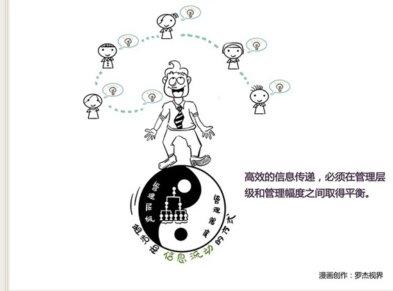

# 113｜组织，就是信息流动的方式

### 概念：组织

> 组织，就是信息流动的方式。

当你管理“个人”的时候，你与他的大脑打交道。他的大脑怎么把信息传递给双手，你是不用管的。事实上，那个传递的效率，高到让你惊叹，信息损耗可以忽略不计，信息延迟也可以忽略不计。

但作为CEO，你管理“组织”时，信息怎么传递到最底层员工，再怎么反馈回来，就不是自然发生的了。它必须有个传递的路径，这些路径，就是“组织架构”。可是，一旦有了组织架构，它的层次，就会造成信息的延迟；它的节点，就会造成信息的损耗。这些延迟和损耗，会降低组织从决策到执行的速度，从反馈到调整的灵活度，让组织显得笨拙，降低战斗力。

### 案例

> 网上曾流传过一组漫画式的组织架构图。亚马逊是看上去最中规中矩的树状架构；谷歌在树状架构间，增加了很多跨部门连接，甚至有些中层一管到底；微软把树状的架构，分成了几个相互竞争的事业部；苹果的架构，根本就没有树，而是以乔布斯为核心的无数闭环；Facebook，则是一张去中心化的网，你找不到CEO的位置。

首先，这五家公司的组织架构真的是这样吗？你千万别当真，苹果怎么可能没有“树”，Facebook怎么可能不给CEO“Face”。你权把这5张图，当成是漫画好了，通过夸张的手法，赞扬，或者讽刺这五家公司的管理问题。

### 运用：三个建议

管理幅度，就是到底一个管理者，作为存在于组织架构中的一个信息传递的节点，管理多少员工是最有效的。根据前面的计算，你应该已经明白，这个管理幅度，几乎决定了你必须有几级管理层级。

> 很多学者对管理幅度问题做了研究。汉密尔登认为3～6人较宜。法约尔认为，高层管理4～5个人、基层管理25～30个人。还有的认为不能超过6人，有的认为不能超过24个人。

如果我们以6人为最优管理幅度，3级为最优管理层级，我们就可以计算出一个组织的最佳人数是43个人。一个CEO，6个经理，36个员工。

那我的组织，如果多于43人怎么办呢？如果你是超人，比如乔布斯，你可以采取漫画中“苹果没有树式”的中心化组织架构，一个人对所有人。如果你不是，那么，基于管理幅度，和管理层级的逻辑，我给大家三个建议。

### 第一，借助工具，提高幅度。

管理幅度不是固定的，它受沟通工具的影响。如果设计合理的沟通流程，使用高效的沟通工具，最优管理幅度可以从6，提高到10，或者12。

看看漫画中的谷歌。他在部门之间建立很多沟通连接，甚至中层直管到底，因此管理幅度可以有效提升。

### 第二，不能提高，那就切小。

如果管理幅度已经提升到极致了，组织还是太大，那就试着把组织切小。

看看漫画中的微软。把庞大的组织架构，虚拟切割成几个相对独立的事业部，信息在事业部内，完成更小的闭环传递，将极大解决信息传递的损耗和延迟问题。

### 第三，不能切小，那就下沉。

如果因为业务的巨大关联性，无法把大组织，切为独立的小组织，那就必须把决策权下沉。

看看漫画中的Facebook。每一个节点都可以拎起来，作为起点，成为一棵树。CEO通过合理的授权机制，把一部分的决策权，交给行动者。这也是为什么任正非说：让听得见炮火的人，指挥战争。其本质，是消灭决策信息传递的回路。

### 小结：组织是什么

组织，就是信息流动的方式。提高信息传递的效率，必须在管理层级，和管理幅度之间取得平衡。

三个建议：借助工具，提高幅度；不能提高，那就切小；不能切小，那就下沉。