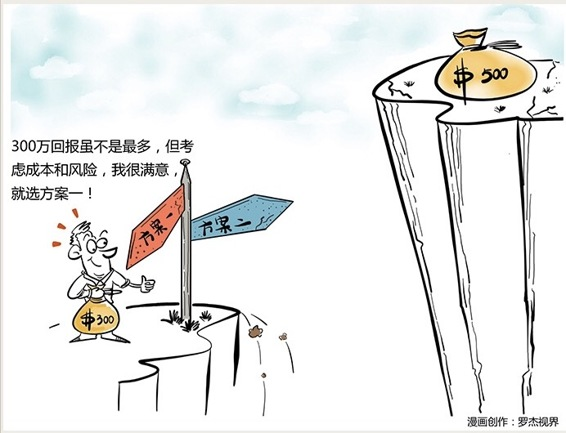

# 114｜如何做出好的决策

问题：如何做出好的决策（决策理论）

研究人员曾经做过一次调查，他们向每位管理者提三个问题：

你每天最重要的事情是什么？

你每天做什么花时间最多？

你在履职时感到最困难的是什么？

> 结果显示，90%以上的答案都是“决策”。

今天我们就来谈谈“决策”。但是，我们不讨论WHAT，什么是好的决策，我们讨论HOW，如何做出好的决策。我们不讨论什么菜好吃，我们讨论做出好吃的菜的方法。

### 运用：三个主流方法

第一，完全理性决策。

提问：你现在有4个项目可供选择投资。项目A，需要投资40万，预计收益30万；项目B，投资50万，预计收益40万；项目C，投资35万，收益25万；项目D，投资40万，收益35万。你手上有最多100万可以投，怎么组合，会获得最大收益？

此处忽略1万字决策过程，答案是：投项目B和D的组合，总投资90万，收益75万。

这不是管理课吗？怎么好像开始讲数学了？是的，完全理性决策，也就是在信息完备情况下的决策，就是数学，一门叫做“运筹学”的数学。运筹学，就是研究“最优决策”的学问。

我知道，不是每个CEO都学过运筹学，但你至少要知道运筹学的存在。请记住下面这五个运筹学工具，这样就能在需要的时候，知道应该去寻求运筹学专家的帮助。他们是：

规划论。研究给定任务，人财物等资源配置的最优决策；

网络分析。研究最短路径、最小连接、最小费用、以及最优分派等问题的最优决策；

排队论。研究机器排队等待维修，船舶排队等待装卸，顾客排队等待服务的最优决策；

存储论。研究原材料、半成品、成品库存的最优决策；

投入产出分析。研究有限资源在各部门分配的最优决策。

### 第二，有限理性决策。

但其实，在大多数情况下，信息不是完备的，人是有限理性的。著名管理大师赫伯特·西蒙认为，完全理性的最优决策，在现实世界中很少存在。他把毕生都用在了研究“有限理性决策”问题。

西蒙是一位真正的神人。他拥有9个博士学位，并因为研究决策理论，先后获得心理学领域最高奖“心理学杰出贡献奖”，计算机领域最高奖“图灵奖”，以及诺贝尔经济学奖。他说：当你无法获得决策所需的所有信息时，不要追求“最优决策”，而要追求“满意决策”。

什么叫“满意决策”？他说：一切决策都是折中，只是在当时情况下可选的最佳行动方案。为了满意，而不是最优，你的决策应该遵循以下原则：

第一，定下最基本的满意标准；第二，考察现有的可选方案；第三，如果有可选方案满足最基本的满意标准，就不再寻找更优方案。

具体来说，你面试了一个人，达到你的基本要求，那就立刻来上班，而不是想：说不定有更好的；有收入让你满意的商业模式，那就立刻实施，而不是想：说不定有更多的。

### 第三，博弈论。

如果不止你一个人在决策，你和你对手的决策相互影响，那就更有意思了。这时你需要好好学习：博弈论。

啊，这又是个三天三夜也讲不完的话题。关于这个话题，已经出了6个诺贝尔经济学奖获得者。今天，我只举个简单的例子。

比如：不要在旅游景点买东西。旅游景点的买卖，是一次性博弈。凡是一锤子买卖，卖家的最理性决策都是“宰客”。所以，从博弈论的眼光看，青岛大虾的宰客事件，几乎是必然的。怎么破？不是重罚，而是把多个一次性博弈，通过用户评价，合并成连续博弈，这样卖家欺诈时会更加顾虑。这也是为什么淘宝、大众点评能火，从博弈论视角来看的原因。

为了帮助大家建立基于博弈论的决策能力，我会在第四季度工具篇，花2周10节课的时间，分享一些最著名的博弈论工具。

### 小结：理解决策

决策是个高难度的技术活，我希望你能记住关于决策的三个主流方法，并作为终身修炼的开始。

第一，完全理性决策，请了解五个运筹学工具：规划论，网络分析，排队论，存储论，投入产出分析。

第二，有限理性决策，信息不是完备的，人是有限理性的，这时不应追求最优决策，而应追求满意决策：定义满意，评估方案，满意就行。

第三，博弈论。当若干决策者的决策，彼此影响时，博弈论就大放光彩了。你可以找些书来看，也可以等我在工具篇与大家分享。