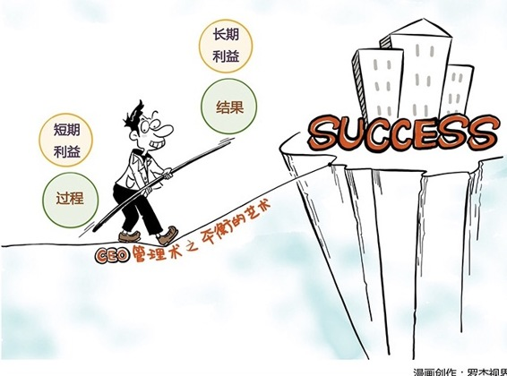

# 115｜这不是一个坏问题，但我没有一个好答案

今天是反求诸己部分，从员工到经理，从经理到总监，从总监到CEO三步曲的最后一课，我们要讨论一个特别困难的话题，管理常常没有“完美”的决定，甚至都没有能被验证的“最好”的决定，管理，常常是在各种要素之间的复杂平衡。这种平衡不仅仅是技术，更是一种艺术。

### 概念：平衡艺术

你面前摆着一盘棋。经理，就是起手式，很多书教你各种起手技巧。但作为CEO，下到中盘，书上再也翻不到答案。每一个落子背后的长考，都是判断、取舍和平衡。而这些判断、取舍和平衡的复杂度，让CEO们成了孤独的思考者。因为你知道，你和喧嚣的观棋者们看到的，根本就不是一盘棋。

### 案例1

> 你是一家传统零售企业的CEO，每年收入300亿。2年前，你下令成立电商部，今年做到了3亿，电商总经理对你说：报告老板，我预计明年能做6亿。你大喜：太好了，好好干！他接着说：但是，我们会顺便干掉原来线下的60亿。

> 涨3亿，掉60亿，就是损失57亿。作为CEO，你怎么办？同意吧，业绩断崖式下滑，怎么向董事会交代？不同意吧，看看那些纯电商，每年500%增长，摧枯拉朽。短期利益，和长期利益之间，如何平衡？

这位CEO选择，优先保护短期利益。

### 案例2

> 2014年，Satya接任Steve担任微软CEO。上台后一周内，他发布了一款新产品：Office for iPad。有些同学可能不理解这意味着什么。微软真正最核心的产品，是Windows，然后才是Office。Office for iPad发布后，你在iPad上加个键盘，就能满足大部分需求，可能再也不要Windows了。也就是说，Office for iPad的发布，简直就是宣布，微软战略性地放弃了Windows的核心地位。

这位CEO选择，优先保护长期利益。

> 你们猜，发布后的第二天，微软的股价，涨了，还是跌了？第二天，微软的股价暴涨，涨到了几乎是14年来的最高点。这说明，微软的股民们，早就盼望微软，走出它曾经最引以为豪的Windows了。而那家零售企业，几年之后，利润迅速下滑，跌掉了原来的近95%。

但是，这表明微软就做对了，那家机构就做错了吗？也不一定。比赛还没有结束，谁知道呢。短期利益，和长期利益之间的平衡艺术，是全球最顶尖的CEO们，都很难做的决定。

### 运用：有哪些问题需要判断、取舍、和平衡呢

第一，短期利益与长期利益。

刚才提到的微软，还有那家传统零售机构，都在面临这样的取舍和平衡。假如你问：那么，短期利益和长期利益哪个更重要？我会说，这不是一个坏问题，但我没有一个好答案。可我知道，你回答A更重要，或者B更重要，都是坏答案。在真正的高手眼里，这个问题是没有答案的。因为没有答案，所以才需要取舍、平衡。

### 第二，股东、员工与客户。

哪个更重要？你一定知道我会说：这不是一个坏问题，但我没有一个好答案。

有人会说，当然客户第一。那是因为你知道，满足客户需求是因，获得利益是果。但是如果这个因果不成立呢？“不惜一切代价”满足了客户需求，结果公司亏损，企业裁员了呢？有人说，员工才是第一，那是因为你知道，工作最终都是他们做的。但你怎么看底特律工会制度？员工真的几乎第一，但公司纷纷倒闭，底特律沦为鬼城。有人说，股东才是第一。好吧，你是资本家。我什么也不说了。

没有第一，只有平衡。

### 第三，结果与过程。

“以结果为导向”是很多企业的信条。通往结果的，可能是正确的行为，也可能是扭曲的行为。你说，我不管，不管黑猫白猫，抓到老鼠就是好猫，但我们在第16课讲过，如果抓到老鼠的是瞎猫呢？

安达信会计师事务所成立于1913年。1914年，芝加哥铁路公司要求安达信做假账。刚创业、年仅28岁的安达信连付工资的钱都没有，但他却正告该公司：即使倾芝加哥全城之财富，也难以诱我让步。

后来，安达信成为全球最大的会计师事务所。

但是2001年，安然丑闻爆发。安达信为了公司业绩，也就是“结果”，不顾“过程”，帮助安然做假账。安达信这家百年老店，一夜之间，灰飞烟灭。

### 小结：认识平衡艺术

管理，没有完美的决定，甚至都没有最好的决定，管理，不仅仅是一项技术，更是在各种要素之间，比如短期利益，与长期利益，股东、员工、与客户，结果，与过程之间的判断、取舍，和平衡的艺术。