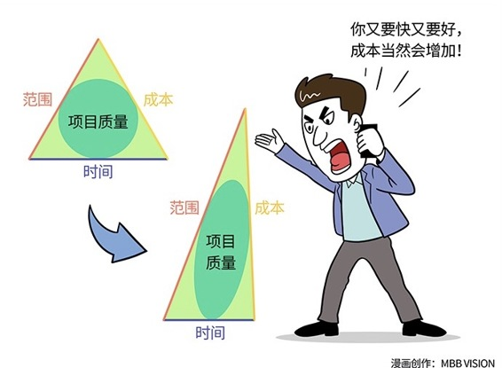

# 116｜优质、快速或廉价，只能选两样

这一周，我们将进入管理篇的第五大逻辑：面向绩效。面向绩效，除了管变化莫测的人，还要管纷繁复杂的事。今天，让我们从“项目三角形”开始，讲讲如何管“事”。

### 概念：项目三角形

> 我们把范围、时间和成本，作为三条边，画一个三角形，然后把范围的边加长。有一些基础几何知识的同学就知道，这时我们必须相应加长时间，或者成本，来使得三角形保持闭合。如果我们想降低成本呢？同样，我们需要调整另外两者。这就是著名的“项目三角形”。

### 案例

作为项目经理，你有没有遇到过这样的情况？销售为了赢得项目，客户提什么要求，他都答应。你很不满，他说：都是为了绩效啊，而且我算过，没增加多少工作量。你咬了咬牙，认了。他接着说：我还答应了客户，提前两个月完成项目。你把咬碎的牙咽进肚子里，找老板投诉。老板说，都是为了绩效啊，我们拼了吧。他接着说：这个项目的合同金额打了很大的折扣，为了节省成本，要再减少20%的人员投入。拜托你了！

这个熟悉的场面，是很多项目经理的日常。项目延期、预算超标、最终客户还不满意。为什么会这样？因为，你对这个项目失控了。为什么会失控？因为，你的项目有个很危险的指标：多快好省。啊？为什么你居然说，多快好省，是个很危险的指标？因为它稍有不慎，就会让“项目三角形”无法闭合。

### 分享：

同时做到“优质、快速、廉价”，是对项目管理的理想化要求，以此为目标，容易让团队不切实际，把本可以事先防范的风险后置。像开始的案例那样，既要马儿跑，又要马儿不吃草的项目，大多以无休止延期、预算失控，客户失望、甚至绝望结束。

16年前，也就是2001年，我通过了美国项目管理协会（PMI）的考试，成为其认证的中国最早的一批项目管理专家（PMP）。后来，我组织团队，编写了一门三天的高级项目管理课程，也获得了PMI的课程认证。随后几年，我用这门课程，培训出了不少的项目管理专家。关于项目管理，请允许我斗胆分享一点看似空洞的经验，那就是：千万不能贪婪，优质、快速或廉价不可兼得，你最多只能选两样。

项目经理不是魔术师，他的工作不是承诺奇迹，而是防止整个三角形失衡，最大可能地保证项目成功。

### 运用：如何保证项目三角形不会坍塌

第一，固定第一边。这个项目，到底什么是底线？需求神圣不可删减？还是死也要在国庆节前上线？还是花费超标提头来见？把优质、快速、廉价中的一项、且只有一项，确定为不可妥协的第一边，作为衡量项目成功的底线。

第二，调节第二边。假如确定了“准时上线”，也就是“快速”作为死也要坚守的底线后，然后就要调节，优质和廉价中，我们更重视哪一个。试着减少一些预算，在工期不变的情况下，看看对品质有什么影响，在客户预期范围内吗？反过来，调节一下品质呢？

第三，投资第三边。在优质、快速或廉价中，选择了两样后，就要全力以赴地在第三边投入。该投入时间投入时间，该花费金钱花费金钱，该砍掉枝节功能就砍掉枝节功能，不能手软。你想要苹果又大又甜，就必须剪掉一些小的果实和枝叶。

### 小结：认识项目三角形

项目三角形，就是由范围、时间、成本构成的闭合的三角形。项目管理最重要的心法，就是保持这个三角形的平衡。

今天这节课，我只希望大家记住一件事：范围的优质、时间的快速，或者成本的廉价，只能选两样。具体的做法是：固定第一边，调节第二边，投资第三边。