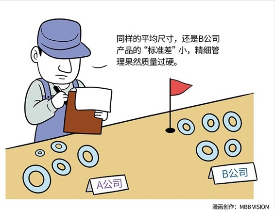

# 117｜变态的质量，源自于变态的过程管理

### 概念：六西格玛

Sigma 是统计学上的一个概念，中文叫“标准差”，用来衡量一组数据与“标准”之间的“偏差”。

> 这个标准差，我们通常用“每百万次采样数的缺陷率”（DPMO）来衡量。1-sigma，就是每百万件抽样中，有69万个不合格，相当于一本书每页有170个错别字。3-sigma，就是每百万件抽样中，有6.7万个不合格，相当于一本书每页有1.5个错字。那么6-sigma呢？就是每百万件抽样中，有3.4个不合格，相当于整个小型图书馆的所有藏书中，只有1个错别字。

### 案例

至于标准差怎么计算，我就不解释了。数学好的同学可以在留言中，或者学生会中给大家普及。

我举个例子，A、B两家公司各送6件产品参加检测。A组产品的直径为95、85、75、65、55、45厘米，B组产品的直径为73、72、71、69、68、67厘米。两家产品的平均直径都是70厘米，但很显然，B公司的产品直径之间的差距，要比A公司小得多。我们说，B的“标准差”比较小。

在商业上，标准差越小，产品质量的“稳定性”越高。这个“稳定性”，特别重要。比如上述两家公司的产品，平均直径一样，但B对质量的控制更加稳定，我会把订单交给B。比如两个投资经理，你看他们今年的总投资收益都是15%，但是A大起大落，B非常稳定，我会把钱投给B。这个稳定性，几乎就代表质量管理水平和过程管控能力。

### 运用：如何提高质量管理呢？

1982年，摩托罗拉遇到了质量危机，他们吸取各家所长，提出了6-sigma质量管理的理念，并于1984年～1986年期间，开始实施。1988年，摩托罗拉赢得美国国家质量奖。1987～1997年，摩托罗拉公司节省下来的成本累计达140亿美元。同样实施6-sigma的霍尼韦尔公司，1999年一年就节约成本6亿美元。1995年GE开始实施6-sigma管理。推行期间，总资产从250亿美元，增长到4500亿，市场规模从全美第10位，发展为全球第1位。

这个神奇的6-sigma，不仅是统计学概念，其实更是一套死磕过程改进的管理哲学，和一套叫做DMAIC的管理工具。

DMAIC是五个英文单词的缩写。D代表Define，定义质量问题；M代表Measure，收集有关质量问题的数据；A代表Analysis，分析数据、发现问题的主要原因；I代表Improve，针对原因进行改进；C代表Control，监控改进结果，不断循环。

这个DMAIC讲起来，是几天几夜的课程。今天我只希望大家记住三件事：1）变态的质量，源自于变态的过程管理；2）看似简单的DMAIC，不断循环，会有奇效；3）质量，就是稳定性，就是一次性把事情做对。

“一次性把事情做对”，听上去像上个世纪的管理思想，与我们在第40课讲的“小步快跑，不断迭代”完全相反。这也是为什么6-sigma叫“精益管理”，最小可用品叫“精益创业”。我建议大家试着在脑中放下两套甚至截然相反的管理思想，并让他们和平相处，这才是真正的智慧。

### 小结：认识6-sigma

6-sigma在统计学上，代表百万分之3.4的错误率；

在管理哲学上，是一种坚信“质量、源自变态的过程管理”的思想；

在管理上，是一套基于DMAIC，定义、收集、分析、改进、控制的循环改进的方法论。