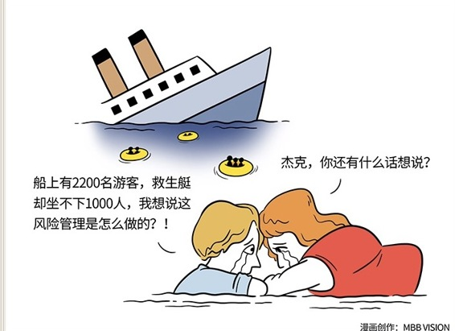

# 119｜悲剧里挖出来的学问

### 概念：风险管理

风险管理的目标就是要以最小的成本获取最大的安全保障。要理解风险管理，必须首先理解风险的两个维度：损失和可能性。

损失，就是如果这个风险发生了，会造成多大的伤害？比如得了感冒，会一个星期头晕无力流鼻涕；但得了非典，伤害就大得多了，很可能会致死。

可能性，是这个风险发生的概率有多大？校长说，明天如果下雨，运动会取消。你回去听天气预报：明天降水概率30%。那么，运动会不召开的概率，就是30%。校长说，明天如果下刀子，运动会取消。那你就要明白，运动会不召开的概率几乎为零。

> 风险=损失x可能性。

这个看似简单公式，给了我们识别风险、管理风险的基本框架。基于这个基本框架，管理专家们提出了四种风险管理方法：转嫁，规避，降低，自留。

运用：四种风险管理方法

#### 第一，转嫁。

有些风险，发生的可能性其实很小，但如果一旦发生，会造成巨大的损失，比如癌症。得癌症的概率并不高。但如果很不幸患得了癌症，很难治好；就算能治好，也要花很多的钱。对于这样的风险，应该转嫁。

买保险，是转嫁风险很重要的手段。过去，保险在中国还不被普遍接受。现在连淘宝上买东西都有运费险，买手机还有碎屏险，成为上市公司董事还有董事责任险，这些都代表了商业文明在“风险管理”上的进步。

另外，航空公司为了转嫁油价波动的风险，可以购买原油期货，锁定价格；外贸公司可以进行远期外汇买卖，转嫁汇率波动的风险。

### 第二，规避。

如果发生的可能性挺大，发生之后，损失也很大的风险，其实就不能叫“风险”了，它接近一定会发生。

比如赌博，大概率你是要输钱的，从损失上看，有多少你就能输多少。对于这种风险，策略就两个字：规避。在商业上也一样。很多人的商业策略形同赌博，在几乎必输的游戏中，心存侥幸，总觉得“万一呢”。对于这样的风险，记住：不赌就是赢。

### 第三，降低。

对于比较有可能发生，损失也尚可接受的风险，要降低风险发生的可能性。这也是我们常说的“预防”。

比如，培训员工合规经营，预防企业经营的法律风险；经常找员工谈话，预防突然离职的风险；给项目设置合理检查点，预防项目的失控风险；和客户保持联系，预防客户的流失风险；等等。

### 第四，自留。

对于不大可能发生，发生了也没什么大不了的风险，可以选择“自留”。意思就是：损失我认了。

比如，员工请病假是小概率事件，就算请了，也没什么大不了的。客户退货是小概率事件，退几件货，也没有巨大损失。对于这样的风险，可以计提一笔“管理储备”的预算，专门用来消化这些损失。

### 小结：认识风险管理

> 风险管理的目标就是要以最小的成本获取最大的安全保障。

怎么做风险管理？

对于可能性小、损失大的风险，要懂得转嫁，比如买保险；

对于可能性大、损失大的风险，要懂得规避。收手不干，不赌就是赢；

对于可能性大、损失小的风险，要懂得降低可能性，想办法预防；

对于可能性小、损失小的风险，可以考虑自留，留一笔费用做管理储备，然后坦然接受风险的发生，把精力用在更重要的事情上。