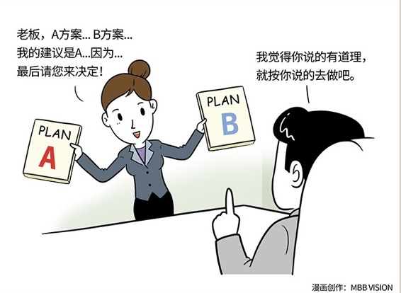

# 120｜你敢管理你的老板吗？

### 概念：向上管理

> 通用电气的前CEO杰克·韦尔奇，是一位神一样的管理者。他的助手罗塞娜·博得斯基做了杰克·韦尔奇14年的助理，她把和老板一起工作的经验写成了一本书，叫《向上管理：做副手的智慧》，提出了“向上管理”（managing up）的概念。在她看来，管理需要资源，资源的分配权力在你的老板手上，因此，当你需要获得工作的资源时，就需要对老板进行管理。但其实，你并不真的拥有管理你老板的权力，比如你不能给他发工资、定奖金、给绩效打分，或者把他叫到你办公室来骂一顿。“向上管理”是一种有趣的说法，其本质是一种影响力，一种更高超的影响力，用来影响那些对你有管理权力的人。

### 运用：如何获得这种叫做“高超的影响力”呢？

第一，也是最基础的方法：建立信任。

信任，是影响力的基础。如果老板不信任你的人品、可靠性、专业能力等等，你对他就基本没什么影响力。让老板信任你，你首先要“送”他一个权力：知情权。什么叫知情权？就是主动地汇报自己的工作进展。“老板，您交代的事情我已经在办了。昨天去拜访了客户，张总不在，说要下周回来。我和他的同事聊了一个小时，很有收获。我根据沟通，会修正一下方案，这周三前邮件发给您。我下周一会再去拜访。有进一步情况，我再向您汇报。”老板看到这样一条微信，估计只会说一个字：好。但是，这个“好”字背后，是放心，是信任。建立信任，更重要的是，始终兑现你的承诺。“这周三前邮件发给您”。那周二下班之前，这个方案一定、一定、一定要发给老板。不要和我抬杠，说周三早上9点之前行吗？值得放心、信任，不是让老板先担心，然后在截止时间前最后10秒钟，解除担心。

第二，储蓄影响。

你要相信，你老板能做你老板，一定有过人之处。但即便这样，在某些方面，他也一定需要你帮助。尽可能多地帮助他，让他更成功，你才能更成功。怎么帮助呢？首先，你可以帮他省时间。老板的时间通常比你的时间值钱，用你的时间，省他的时间，会备受感激。罗塞娜说，我用两小时进行电话沟通、阅读成堆的文件、审核各种陈述材料，就是为了，让杰克只需要用30秒的时间，进行最后的处理，然后，继续做其他事情。30秒原则，是你工作到不到位的重要准则。你甚至可以帮他提高。有空没空，可以分享一些有价值的文章到微信群里，比如《5分钟商学院》。但如果要分享，就经常分享，不要等有篇特别有针对性的文章再分享，会让群里所有人都觉得你有所指。提供越多真诚的帮助，就是往你在他的影响力账户里储蓄越来越多的影响力，供日后取用。

第三，向上沟通。

“老板，我有个想法想和您聊一聊，方便吗？”“你说？”“关于周三要交给您，给张总的方案，我觉得有三种做法。第一种，blabla，第二种，blabla，第三种，blabla …… 他们各有优缺点，分别是blabla……我比较建议第一种和第二种，因为blabla……老板，您看看我们应该怎么选？”“如果在第一种和第二种中，再选一个呢？”老板问。“老板，您曾经说过，用产品打动客户才最长久，我非常有启发，根据这个思想，我觉得第一种更合适，您觉得呢？”“我也觉得是。那就去做吧。有问题，随时向我报告”。这一小段对话中，有很多套路，你慢慢体会。但是总结来说，就是：1、不只是提问题，同时也要提出建议；2、提两个以上建议，并加以分析；3、与上司讨论，并由上司作裁决。

### 小结：认识向上管理

向上管理，就是一种向对你有管理权力的人，施加影响力的方法论。想要向上管理，需要记住三点：1）建立信任；2）储蓄影响；3）向上沟通。向上管理的目的，不是办公室政治，不是溜须拍马。向上管理的目的，是利用高超的影响力，善用老板掌握的资源，达成企业、部门和自己的目标。