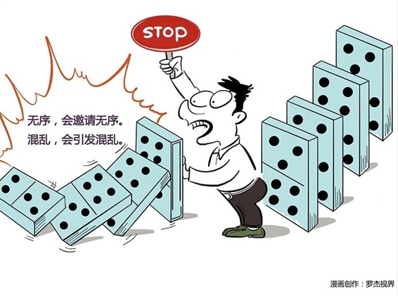

# 121｜无序邀请无序，混乱引发混乱

用10周50课讲了管理的5个逻辑“激发善意，设计系统，知人善用，反求诸己，面对业绩”，也就是“应该怎么管理”之后，我想再花1周的时间，讲讲“不该怎么管理”。因为，我们从教训中学到的，有时比经验更多。

概念：破窗效应

> 破窗效应，是1982年，由美国政治学家威尔森和犯罪学家凯琳提出的。它是指，如果有人打坏了一幢建筑的窗户玻璃，却没有人维修，经过的路人，就会像受到了暗示一样，被诱发打破更多的窗户。然后，这个街区其他建筑的窗户，也可能被打破。然后是其他街区。

> 其实这很好理解。在干净的墙角，扔几张碎纸。过几个小时后你再去看，那个地方多半就有了一小堆垃圾。十几个行人在等红灯，只要有一两个人旁若无人地闯红灯过马路，后面很多人就会跟上，这就是所谓的中国式过马路：凑够一撮人就可以走了，和红绿灯无关。

> 无序，会邀请无序。混乱，会引发混乱。“凭什么他可以，我就不行啊？”，“大家都这样，总不会有事吧？”在占便宜、做坏事上，寻求公平，这种心理，就是“畸形公平”的心理。所以，在第一扇破窗出现时，就必须立即修复。否则，当整个街区都出现混乱时，就积重难返了。

### 案例1

你有没有看到过这样的现象？很多人在井然有序地排队买票，这时一个人突然插到前面去，把钱伸进柜台。如果没有人制止他，就会有两三个人也到前面去，说自己赶时间，能不能先买。售票员假如一时心软，或者说一时糊涂，把票卖给了这几个人，很快，整个队伍就乱了。每个人都觉得自己最着急，全都挤到了前面去，人群从直线型，变为扇形，混乱不堪。这时候售票员再叫：请排队，请排队，已经没有人会理她了。

一个秩序的建立非常困难，可是一旦被破坏，将如山崩地裂般，顷刻间灰飞烟灭。为什么？这是因为一种叫做“畸形公平”的心理，引发了：破窗效应。

### 案例2

2013年，湖北钟祥发生令人匪疑所思的“家长围攻监考老师”事件。学生高考作弊，被现场抓住。然后，我估计你怎么也不会想到，作弊家长们，居然恼羞成怒，开始殴打老师，把54名监考老师逼进了阶梯教室。家长们用石头砸破教室的玻璃，然后一边砸着防盗门，一边高喊：我们要公平，不让作弊不公平。

为什么会这样？钟祥县过去几年高考作弊泛滥，家长们开始砸越来越大的价钱帮子女作弊。当作弊已经成为常态，被抓，就是不正常的了。大家都作弊，你凭什么抓我？我投的巨资打了水漂，谁赔给我？不让作弊不公平！还我公平作弊权！

匪夷所思。而这一切，都是从第一扇破窗，也就是第一个作弊没有被抓，却上了好大学的学生开始。

### 运用：如何应对破窗效应呢？

第一，立即处理。

一家公司规定：员工必须佩戴员工卡，否则罚款20元。一开始，1、2个员工没带员工卡，但管理层有很多“更重要的”事情要处理，或者这几个员工业绩斐然，管理层没有严格执行规定。很快，公司有超过一半员工都不再戴员工卡。而剩下的那些，觉得自己很傻。

一旦发现破窗，要立即修补。破窗蔓延的速度，会快于你反应的速度。

第二、绝不包容。

公司规定，迟到罚款100元。某天，李雷因送家人去医院急诊而迟到，你如何处理？

你罚了，怕员工说你不近人情。你不罚，明天就会有人因为身体欠佳迟到，后天就会有人因为见义勇为迟到，大后天就会有人因为找不到小孩迟到，然后，制度从此形同虚设。有制度不执行，比没有制度更可怕。

那怎么办呢？先罚款，再慰问。罚款，是对好窗的维护，破窗的修补；慰问，是人情上对员工和员工家人的关怀。那100元也许你可以买成水果，或者甚至包成红包，都可以。

第三，小题大做。

对一些看似很小，但其实触及红线、影响深远的“小过错”，千万不能姑息，甚至要“小题大做”。

2016年中秋节，阿里几个员工写程序抢月饼，被当天解雇。这件事在网上引起了轩然大波，正反双方辩论了好多天。但这正是阿里的策略：小题大做。你不认同阿里的价值观，可以不来。来了就要知道，阿里的价值观这扇窗户，不能破。

### 小结：认识破窗效应

破窗效应，这是一种由“畸形公平”心理引发的，对错误行为的从众效应。第一扇窗户被打破，如果没有及时修复，就会蔓延，导致更多的窗户被打破，甚至引发更大的混乱。

在企业管理中，如何规避破窗效应？第一，立即处理；第二，绝不包容；第三，小题大做。