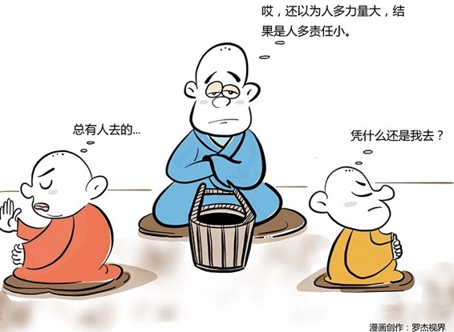

# 122｜责任除以二等于零

### 概念：旁观者效应

旁观者效应，又叫“责任分散效应”，如果有一个人被要求单独完成任务，他的责任感会很强，并做出积极的反应。但如果是要求几个人，或者一群人共同完成任务，那群体中每个人的责任感将大大减弱，遇到困难时，往往会向后退缩，心里会想：反正还有其他人呢。旁观者效应，有很多原因。其中最重要的原因是：责任分散。

### 案例1

> 有一次，我和我担任商业顾问的一家企业开会，梳理他们的管理架构。其中梳理到他们的责任分配时，我大吃一惊。这家公司最重要的业绩责任，销售额和利润，是由营销副总裁，和产品副总裁，两个人同时承担的。

> 我其实特别能理解，很多管理者心中都有一个朴素的观点：人多力量大。没错。但这句话还有另一个表达，那就是：人多责任小。

> 为什么我说：人多力量大，但是责任小？这是因为多人承担同一个责任，会触发社会心理学中的一个不可忽视的现象：旁观者效应。

### 案例2

> 1964年，美国纽约郊外，一位叫朱诺比白的年轻女子，在结束酒吧工作后回家的路上，遇到歹徒。她大声呼喊：有人要杀人啦！救命！救命！据说她的邻居中有至少38人开灯到窗前查看，但是无人来救，甚至无人报警。最后，朱诺比白被害身亡。

> 这起命案，震惊了整个美国社会，也引起了很多社会心理学家的重视。这种现象，后来被称为“旁观者效应”，也就是：当有其他旁观者在场时，人们介入紧急情况的可能性会显著的降低，因为大家都觉得别人会帮助。

> 后来有人指出，《纽约时报》这则引起轰动的报道失实，其实只有十多人听到呼救，或看到部分过程，没有人知道凶案正在发生。但是，社会心理学家们纷纷对“旁观者效应”，展开了研究。

拉塔尼和罗丁在1969年做了一项实验。他们让一位女士假装从隔壁办公室的椅子上重重摔下来，并大声叫喊：“哎呀，我的天呐！我的脚 …… 我不能动了”。实验显示，在只有1位陌生旁观者的情况下，有70%的被试者去帮助受害者；但在有2位陌生旁观者的情况下，只有40%的被试者去帮助受害者。

年轻的心理学家约翰和比博也做了类似的实验。实验表明，当只有1个人收到求救时，85%的人都会提供帮助。当有4个人同时收到求救时，则只有31%的人采取了行动。

### 运用：如何避免这种现象呢？

第一，责不可共。

教大家一个求助的小窍门。如果你在人群中摔倒了，千万不要大叫：谁来帮帮我，扶我一下吧。人们都觉得自己很忙，而且总会有别人扶的。你要叫：那个穿红色衣服的小伙子，对，就是你，请你过来扶我一下吧，谢谢。当他被点名后，责任就从一众人身上，降落到了一个人身上，他来帮你的可能性会大大增加。企业管理也一样。虽然你觉得这件事，需要很多部门共同协作才能完成，你也确实安排了大家协作，也还是要指定一个最终的责任人，而不是说：你们一起好好干，完不成，谁都别来见我。责任除以二等于零。群体共同承担责任，会导致每个人心中，会自动缩小责任，放大贡献。遇到问题，觉得我的责任小；获得收益，觉得我的贡献大。

第二，责不越级。

权力是热的，责任是冷的。如果不干预，责任会下沉到最基层员工，权力会上浮到最顶层管理者，造成基层有责无权，顶层有权无责。我们常常听到这样的说法：我确实没想到，小王会把这件事做砸了，平常看他挺靠谱的。您放心，我一定会重罚他。当然，我也有失察之责，来，我自罚三杯。什么叫失察之责？这是典型地把责任往下推脱，让下属越级帮你承担责任的说辞。你承担了责任，然后指派下属做。如果你的下属做砸了，不管你打算油炸了他，还是锅煮了他，炸了、煮了之后，你回来，还是要承担责任。这就是“责不越级”。上级的责任，是所有下级责任的总和。这也是为什么，一些重大事故后，高官必须引咎辞职。

### 小结：认识旁观者效应

中国有句谚语：一个和尚挑水喝，两个和尚抬水喝，三个和尚没水喝。从社会心理学的角度看，这背后的原因就是“旁观者效应”，也叫“责任分散效应”，就是多人共同负责，等于没人负责，责任除以二等于零。在管理中，如何避免旁观者效应带来的危害呢？记住两个心法：第一，责不可共；第二，责不越级。