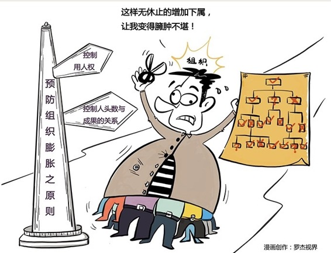

# 123｜“大企业病”有得治吗？

假如你是一位中层管理人员，你渐渐发现，自己不能胜任现在的工作了，总是被老板批评，你非常担忧万一失去工作，如何支付你儿子国际学校的高昂费用？你现在有三个选择。第一，主动辞职，把职位让给更优秀的人；第二，雇一位更优秀的人，协助自己工作；第三，任用两个水平比自己稍低的人当助手，一起把事情做好。你会选哪一个？

### 概念：帕金森定律

大部分人会选择第三条。

> 为什么？第一条路显然不能走，一辞职，立刻陷入经济危机；第二条路也不能走，那个人很可能成为你未来的竞争对手。只有第三条路。你找人分担了你的工作，儿子的国际学校也保住了。然后，你的两个平庸的下属，再为自己找到更多的下属，下属的下属再找下属。如此往复，最终产生臃肿的管理层。这是著名的“帕金森定律”。1958年，英国历史学家、政治学家西里尔·帕金森出版了《帕金森定律》一书。他说，组织一旦形成，就会受到“增加下属法则”和“增加工作法则”的影响，开始自我膨胀。法则：增加下属法则我先来解释一下“增加下属法则”。回到最开始的问题。为什么大部分人会选择第三条，也就是“增加下属”？那是因为：权力的危机感。如果你是一个私营业主，公司100%是你的。早期发展不错，但做大了后，管理一团糟。你面试了一位经验丰富的经理人给你做CEO。聊完后，你大喜，甚至觉得自愧不如。这时候，你会因为权力的危机感，而不把他收入麾下吗？不会。因为，公司永远是你的，他再优秀，也不会影响你绝对的权力。我们常说，刘邦会用人，用张良，用韩信；刘备会用人，用张飞，用孔明。好像咱们老刘家都挺懂管理的。但你要记住，刘邦和刘备，都拥有绝对的权力，公司100%是他们的。但你把这位CEO招进来后，他会再招一个比他更强的人做副总裁吗？这就难说了。因为，他的权力是你给予的，也是可以被你收回的。他就有权力的危机感，所以他只想增加助手，而不是对手。法则：增加工作法则帕金森说，一个人可以在10分钟内看完一份报纸，也可以看半天；一个忙人20分钟可以寄出一叠明信片，但一个无所事事的老太太为了给远方的外甥女寄张明信片，可以足足花一整天。这主要是看，你有多少时间。有多少时间，你就会忙多久，而且还觉得自己忙得很有价值。1914年到1928年，由于《华盛顿海军协定》的限制，英国海军士兵减少了三分之一，军舰减少了三分之二，但军官从2000人增加到3569人。1935年到1954年，英国海军地位不断下降、殖民地不断减少，但海军部从8118人，增加到33788人；殖民部从372人增加到1661人。增加下属后，大家乐此不疲地给彼此增加工作，企业因此患上“大企业病”。大企业病就是，在行政管理中，行政机构会像金字塔一样不断增多，行政人员会不断膨胀，每个人都很忙，但组织效率越来越低下。这条定律又被称为“金字塔上升”现象。

### 运用：对症下药的两个建议

第一，严格控制用人权。

还记得第82课的“套娃现象”吗？帕金森定律，也就是权力的危机感，是导致套娃现象的根本原因。根治“增加下属法则”的基本原则，就是用人权不能完全掌握在直属经理手上。直属经理的上级，要参与面试，做最终决策。如果公司不大，建议CEO参与每一位员工的面试，杜绝直属经理用越来越差的人。

第二，严格控制人头数和成果的关系。

大部分外企，都有一个叫“Head Count”（人头数）的指标。你这个部门就16个人头，想要第17个，请向全球CEO申请。严格控制人头数的总盘子，是预防大企业病不得已、却行之有效的方法。具体问题具体分析会出问题，因为每个部门都有84000个招人的理由。那这个人头数多少，算是合理呢？就要看你承诺多少成果了。比如对分公司总经理，只要多招一个人，就算是前台，都要承诺多100万的销售业绩。你能做到吗？不能免谈。

### 小结：认识帕金森定律

帕金森定律，就是组织一旦形成，就会受到“增加下属法则”和“增加工作法则”的影响，开始自我膨胀。

> 怎么办？第一，严格控制用人权，第二，严格控制人头数和成果的关系。