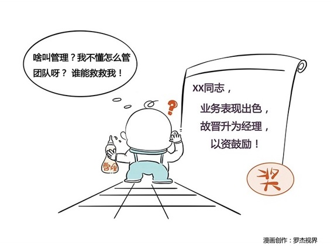

# 124｜别把晋升当激励

### 概念：彼得原理

著名的管理学家劳伦斯·彼得，分析了千百个有关组织中不能胜任的失败实例，归纳出彼得原理：在一个等级制度中，每个员工趋向于上升到最终他所不能胜任的职位。我第一次听到彼得原理时，大吃一惊。按照彼得的说法，每个员工都会晋升到不胜任的位置，那么长远来看，大部分在位的管理者，都不胜任啊！但认真一想，确实有可能。当你把晋升作为激励时，就会出现这种大规模不胜任的现象。晋升是什么？晋升，是承担更大的责任。虽然更大的责任，通常会带来更大的利益，但是晋升的本质是责任，而不是利益。

> 我们应该用利益去激励员工，而不能用责任。

晋升，主要功能是一种人力资源的有效配置，把合适的人放在合适的位置上，我们应该用其他方法（比如表扬、加薪、海外旅游、授予荣誉等等）来实现激励。

### 案例

> 李雷在某公司是技术大神，很受同事敬佩、领导赏识。不久前，领导决定升他为部门经理，管理一个30人的技术团队。李雷非常兴奋，更加努力地工作。可上任后不久，他却发现与人打交道，和与机器打交道完全不同。员工却越来越不满，他疲于奔命，但项目总是出问题。领导对此大为不满，李雷也很煎熬。

为什么会这样？因为技术大神，真不一定能做好管理。这是两个完全不同的工种。为了激励李雷，把技术大神放到管理层级上，正好应验了著名的：彼得原理。

### 运用：别把晋升当激励的两个建议

第一，丰富激励手段。

请回顾第15周，71到75课的内容：激发善意。认真复习激励员工的种种方法。这里，我再补充一项重要的激励的方法论：双轨制。你可以设定“职位”和“级别”两条晋升路线。职位，就是工程师，部门经理，总监，副总裁，CEO等等。级别，在微软就是59，60，61，62等等；在阿里，就是P6，P7，P8，P9等等；在IBM，就是Band 8，Band 9，Band 10，Band ABCD等等。职位，相当于军队的军官系统：军师旅团营连排班；而级别，相当于军队的军衔系统：将、校、尉、士。不用更高的职位激励员工，把更高的职位，也就是更大的责任，留给更有能力的员工，而用更高的级别，激励员工向上。预告一下，关于双轨制，我会在第127课“管理阶段：别把正确的方法，用在了错误的阶段”中，再次提到。

第二，制定晋升规划。如果不把晋升作为激励手段，让表现优异的员工不断升职，那我们升谁呢？难道升那些表现差的员工？当然不是。你会发现，在大多数优秀的企业中，最终晋升的，还是那些表现优异的员工。只不过，他们和一般企业的重要差别是，他们把一个员工在更大责任的职位上试错的风险，提前排除了。怎么排除？通过制定公司的晋升规划。比如“高级潜力员工计划”。

那我提前培养你吧，给你培训，给你实战锻炼的机会，甚至给你轮岗。如果你是可造之才，一定会脱颖而出。如果不是，我也庆幸没有把公司至于危险的境地。回到最开始的案例。也许领导可以激励李雷的方式，是给他更高的级别，同时加入高级潜力员工计划。

另外，对于极其重要的位置，比如CEO，高级潜力员工计划都是不够的。你需要用“接班人计划”，相当于美国的副总统。也就是说，现任CEO要懂得培养几个随时可以取代自己的接班人。训练他们，给他们表现的机会。这也是为什么海尔、华为等等巨型企业，都有“轮值总裁”的计划。本质上，这是对接班人的训练。

### 小结：认识彼得原理

彼得原理就是，在一个等级制度中，每个员工趋向于上升到最终他所不能胜任的职位。为什么会有彼得原理的现象？是因为很多机构，把晋升当作利益，而不是更大的责任。这将导致，总体上来说，大多数管理岗位上的人，都不胜任。

怎么规避可怕的彼得原理？

第一，丰富激励手段。回顾第71-75课“激发善意”的内容，也可以考虑用职位、级别双轨制，用级别的提升代替职位的晋升，激励员工；

第二，制定晋升规划。比如高级潜力员工计划、接班人计划。把晋升后不能胜任的风险，提前识别，并且规避。