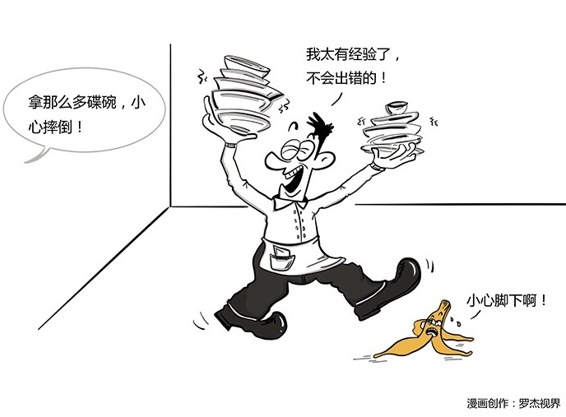

# 125｜只要可能出错，就一定出错

你有过这样的经验吗？要迟到了，偏偏一路红灯；刚洗完车，就下雨了；自己排的那一队，永远行进缓慢；越想找到的东西越找不到；重要的东西如果掉地上了，多半会滚落到橱柜下面的最里面；你把一片一面涂有果酱的面包掉在地毯上，通常一定是带有果酱的一面落在地毯上。简单地说：凡事有可能出岔子的话，就一定会出岔子。 恭喜你，你遭遇了“墨菲定律”。

概念：墨菲定律

墨菲是美国爱德华兹空军基地的上尉工程师。1949年，他和他的上司斯塔普少校，在一次火箭减速超重试验中，因仪器失灵发生了事故。墨菲发现，测量仪表被一个技术人员装反了。由此，他得出的教训是：

> 如果做某项工作有多种方法，而其中有一种方法将导致事故，那么一定有人会按这种方法去做。

后来，墨菲的这段话被广泛传播，不断演绎，最终变成了一句大家可能更加熟知的表述：

> 凡事只要有可能出错，那就一定会出错。

“墨菲定律”，和我们在第123课讲的“帕金森定律”，第124课讲的“彼得原理”一起，被并称为二十世纪西方文化的三大发现。延伸：顺利的事儿，你记不住虽然“墨菲定律”有这么高的地位，但在继续往下讲之前，作为数学系毕业的我，还是必须要先说一句：墨菲定律没有数学依据，它其实是一个心理学现象。如果火箭上天有可能失败，就一定会失败的话，那火箭永远上不了天；如果情人节送花，你有可能会写错名字，就一定会写错名字的话，那你永远找不到老婆。根据墨菲定律，人类已经灭绝几千次了。墨菲定律不是一个数学规律。墨菲定律，是一种“选择性记忆”的心理学现象。一路绿灯，按时到公司；洗完车后，天空万里无云；重要的东西没掉，或者就掉在脚边 …… 这些事情太顺利，不会给你深刻记忆，而只有那些让你挫折和痛苦的记忆，最难磨灭。墨菲定律的原理是：顺利的事儿，你记不住。但虽然墨菲定律不是客观的数学规律，它依然有其重大意义。人脑的这种更能记住挫折的机制，其实是一种保护机制，一种从生理和心理上，抑制“盲目乐观”，保护我们免受重大伤害的机制。

### 运用：免受意外风险的两点建议

第一，心理上：不能忽视小概率事件。我想这是墨菲定律对管理者们最大的意义：提醒我们保持“谨慎乐观”，而不是“盲目乐观”。还记得第119课讲的“风险管理”吗？泰坦尼克号的管理层，就是因为盲目乐观，在救生准备严重不足的情况下，出发远航。如何重视？默念墨菲定律的四个推理，激发你的心理保护机制：第一、任何事都没有表面看起来那么简单；第二、所有的事都会比你预计的时间长；第三、会出错的事总会出错；第四、如果你担心某种情况发生，那么它就更有可能发生。第二，行动上：做最好的计划，做最坏的打算。管理者应善用项目管理，做最好的计划；同时善用风险管理，做最坏的打算，应对风险。从可识别的角度看，风险有三种：已知的风险，已知的未知风险，和未知的未知风险。你打算针对北京市场，销售一款基于创新技术的空气净化器。这项新技术，还没有被大家理解，你有教育客户的资金成本，和时间成本，这是已知的风险；你知道北京在治理雾霾，但不知道什么时候能治好，万一有关部门突发神功，雾霾一夜之间没了，虽然你也很高兴，但产品没市场了，这是已知的未知风险；突然有一天，北京宣布迁都，雾霾你狠你留下，我们走，这是未知的未知风险。你必须意识到存在这三种风险，并有所打算。对第一种，全力解决，第二种，留些应急预算，以备万一；第三种，心存敬畏，密切关注。

### 小结：认识墨菲定律

墨菲定律就是，凡事只要有可能出错，那就一定会出错。墨菲定律不是一项数学规律，而是一个心理学现象，人们更容易记住挫折和痛苦。但墨菲定律，还是给了我们重要警示，管理者不要“盲目乐观”，要“谨慎乐观”。怎么做？第一，心理上，不能忽视小概率事件；第二，行动上，做最好的计划，做最坏的打算。针对已知的风险，已知的未知风险，未知的未知风险，做好风险管理。

本周，我们讲了五个管理常见病：破窗效应，旁观者效应，帕金森定律，彼得原理，和墨菲定律。忽视任何一个，都可能导致你的企业面临意想不到的挑战。你记住了吗？