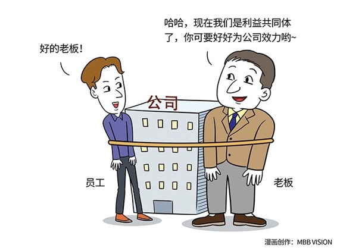

# 128｜降一半工资，委以重任，你干吗？

> 李雷是一家成熟企业的骨干员工。有一天老板去找他：李雷，最近公司面临重大转型，我在思考一个新的方向，很想听听你的意见。你觉得如果我们这么做、这么做可行吗？老板找他商量公司转型战略，李雷受宠若惊，说：老板，您说得太可行了，我觉得这是个非常正确的方向，一定能做成。老板说：太好了！你是公司的骨干，我打算任命你来负责这个项目。李雷一听，觉得自己马上就要成为CEO，迎娶白富美，登上人生巅峰了 ……但是，老板说：我打算从下个月开始，给你降薪50%。如果做成了，分给你500%的收益，可以吗？李雷怔住了，不知道怎么回答。他万万没想到，做更有挑战的事，不但不加薪，还要减薪。虽然做成了有更大的收益，但万一没做成呢？他突然意识到，自己刚刚说“一定能做成”。好的，问题来了，如果你是李雷，你怎么回答？这就涉及到“员工和企业到底是什么关系”的问题。

### 概念：三个共同体

员工和企业是雇佣关系。但雇佣关系的本质，是某种形式的共同体。

> 这种共同体有三种形态：利益共同体，事业共同体，命运共同体。

形态：利益共同体什么是利益共同体？我是来赚钱的。我帮公司赚钱，公司给我分钱。但如果我怎么努力，公司也不赚钱，那说明我们不是最合适的利益共同体。你另请能帮你赚钱的高明，我也去我的价值能真正兑现成货币的地方。

> 给我涨50%工资，我愿意接受挑战。这叫利益共同体。

形态：事业共同体但一些员工明白，短期利益和长期利益之间，必须有一个取舍；风险大小和收益多少之间，必须有一个平衡。我愿意投资自己应得的、无风险的短期收益，获取有风险的、长期的但是更大的回报。这项投资就叫做：事业。

> 降50%工资，但如果做成，给我500%的收益，我愿意接受挑战。这叫事业共同体。

形态：命运共同体那什么叫命运共同体呢？把上面的问题改一下：降50%工资，你再从家里掏500万现金投进来，如果做成，拿5000%收益，你愿意接受挑战吗？如果这你也愿意，说明你敢于把自己的既得利益也赌进去。这时候，因为有了共同的不能失去的东西，你们就真正的同生共死，成为了命运共同体。

> 回到最开始的问题，李雷的老板其实是希望和他，从利益共同体，变为事业共同体。李雷如果同意，就表示：第一，他真的看好这个方向，而不是敷衍老板；第二，他愿意牺牲短期利益，换取有风险的、长期的更大利益。李雷如果不同意，就表示他希望和公司继续保持利益共同体的关系，他们彼此的期待，出现错位。员工和企业的问题，很多都是因为彼此对这三种关系的期待，出现了错位的问题：一方想共担风险，一方想稳定利益。

### 运用：如何选择合适的共同体呢？

> 哪种关系，是员工与企业之间的最佳关系呢？其实，没有所谓的“最佳关系”，这要看你所处的“企业生命周期”的阶段。

> 第一，创业期。创业充满了不确定性。这时应该和合伙人保持命运共同体的关系；和高管保持事业共同体的关系，和底层员工保持利益共同体的关系。如果成功，共同荣华富贵；如果失败，一起灰飞烟灭。你想从谷歌挖个技术高管，人家不愿投钱，不要股票，只要双倍年薪。千万别挖，因为他只想和你分利益，不愿和你做事业，更别说和你共命运。雷军创立小米时，拿出一套组合方案：第一，你可以选择和跨国公司一样的报酬；第二，你可以选择2/3的报酬，然后拿一部分股票；第三，你可以选择1/3的报酬，然后拿更多的股票。你挑。这套方案，是重要地识别员工愿意和小米一起走多远的试金石。

第二，成熟期。成熟期的战略已经流程化，流程已经工具化。对大多数员工，甚至高管，只需要面向KPI的执行能力。所以，基于工资加奖金的“利益共同体”制度，是最主要的员工和企业的关系。

第三，转型期。转型期的企业面临巨大的战略不确定性。我们无法在过去的路上，走出新辉煌，公司需要敢于冒险的员工开疆拓土。这时候，公司应该和转型团队重新建立事业共同体关系，对于核心带头人，建立命运共同体关系。

### 小结：认识三个共同体

三个共同体：给你涨50%工资，你愿意干吗？这是利益共同体。给你降50%工资，如果做成，拿500%收益，你愿意干吗？这是事业共同体。给你降50%工资，另外请你掏500万投资，如果做成，拿5000%收益，你愿意干吗？这是命运共同体。在创业期、成熟期、转型期，企业应该和员工保持不同的共同体关系。