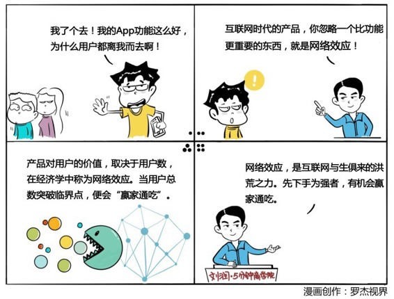

# 012｜互联网与生俱来的洪荒之力

### 概念：网络效应

某种产品对一名用户的价值，取决于使用这个产品的其他用户的数量，在经济学中，我们把它称之为：网络效应。用户越多，越有价值；越有价值，用户越多；不断地积累用户的黏性。甚至，一旦用户总数突破一个临界点之后，会最终进入“赢家通吃”的状态。正如著名的投资人克里斯·迪克森所说：为工具而来，为网络而留。

### 案例

> 微信，使用的人越多，对你就越有价值，当好友数量达到一定程度时，你们之间就形成了一张错综复杂的网络。就算有一天，你打算从微信换到另一个更好用的社交软件上，也很有可能因为大部分朋友都在微信上，而不得不回来。

### 运用：场景

场景1：旅行工具App

> 你做了一个功能强大的旅行工具App，可以查询航班等相关信息，用户粘性很差，当竞争对手有了新的功能时，用户就会调头转向对手。那么，为了增加用户的黏性，要想办法在工具App中加上一些“网络效应”。比如，通过这个工具App，可以知道你的哪些朋友也正好在机场候机，或者有没有到达目的地的乘客有同样拼车的需求，再或者有没有职业、专业相仿的人，想要在飞机上聊上一两个小时。这样，你就慢慢地在你的工具里面建立了一个网络，利用他们之间的“网络效应”，留存用户。这些用户就不会因为你的竞争对手推出了非常强大的新功能而瞬间离去，这就给了你一个非常重要的时间窗口，可以迅速修改产品，缩短和竞争对手之间的差距。

场景2：线下女装品牌店

> 你开了一家线下的服装店，你的用户基础还形不成网络效应，这时候，你可以试着用“异业联盟”的方式，建立更大的用户基础，构建这个效应。有一家叫“零时尚”的女装品牌，鼓励他们的每一家门店，和附近的美容院、理发店、健身房等等建立联盟关系，让他们的用户可以彼此之间享受优惠，消费积分。联盟之后，用户基础大大增加，网络效应开始明显，用户黏性显著增强。

场景3：航空公司

国航、深航加入了星空联盟，东航、南航加入了天合联盟。

### 小结：如何利用网络效应创业？

如果你打算利用互联网“网络效应”的这种神力创业，一定要注意这股力量的两个特点：

第一，网络效应会带来一种特殊的现象，叫：赢家通吃。用户越多就越有价值，越有价值，就会不断膨胀，一旦突破临界点，最终会吃掉绝大部分市场份额。

第二，因为赢家通吃的效应，互联网世界就有了一个基本策略：先下手为强。谁能够最先积累用户，谁就会最先达到赢家通吃的终点，后面的对手再强大，都几乎无法超越它。比如，阿里先下手为强，做了个淘宝，买家和卖家的数量过了临界点后，形成了跨边网络效应，这时虽然腾讯很厉害，但至今无法超越淘宝。反过来说，腾讯先下手为强，做了个微信，用户数量过了临界点后，形成了单边网络效应，这时阿里虽然很厉害，但同样的道理，至今依然无法超越微信。也有人把这种利用单边、或者跨边网络效应构建的商业模式，叫做：平台经济。