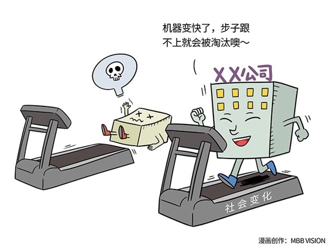

# 130｜长生不老，不如养儿防老

### 概念：永续经营

在中国古代，皇帝们一直相信，只要找到了灵丹妙药，人是可以的永生的。但今天我们知道，那是不可能的。人从降临的那一天，就开始向死而生。健康的生活方式可以延长生命长度，提高生命质量，却无法阻止生命结束。人类已经可以接受这个事实了，但是，很多企业家还不能接受，他们认为，他所创立的这个企业可以永生，就像很多开国皇帝认为自家的王朝是可以千秋万代一样，但终究没有一个王朝，也没有一家企业，是可以真正永生的。我读过不少研究企业如何永续经营的书，比如《基业长青》。这些书中，不少用来证明“企业可以长青”的长寿企业，今天都已经衰败或者消失了。也就是说，那些被归纳出来当作“长生不老药”一样的管理手段，并没有帮助这些企业自身，阻止死亡。这听上去，多么令人悲观啊。但是，正是这种企业的生死更替，带来了商业的生生不息。如果大企业越成功越长寿，永远老而不死，那今天统治商业世界的，可能还是吕不韦集团，或者管仲控股。

> 问题：真不能永续经营吗如果企业终将死掉，那我们学管理还有什么用啊？就真不能永续经营吗？

回答这个问题之前，我们先来看看人类是如何“永续经营”的。

> 人其实可以“永续经营”，但“永续经营”的，并不是肉体，而是“基因”。基因通过繁衍，传承到下一代，然后再到下一代，生生不息。

人的肉体，就算有再好的“管理”，也会走到尽头。人类生下自己的下一代，然后帮助下一代用“忘记、借用、学习”的方式，实现“永续经营”。“忘记”，是指这个孩子不带任何记忆出生，所以他不受你的经验、你的记忆、你的条条框框的约束。然后“借用”，是指他在你的资源养育之下不断成长。接着“学习”，他开始与外界接触，学习吸收，形成一些自己的价值观。你的孩子长大后，什么都不听你的，你很郁闷。但是，你发现他虽然用不一样的方法，却成功了，甚至比你更成功的时候，你会非常高兴，并意识到：他长大了。

### 运用：如何永续经营？

就是“忘记、借用、学习”。企业也是一样。我们在第126课讲“企业生命周期”时说，企业发展有三个阶段：创业期，成熟期，转型期。创业期，就是孩子出生；成熟期，就是不断学习和长大；转型期，就是世界巨变，你已老去。转型期的企业，也可以通过“生儿育女”，也就是孵化新机构的方式实现转型。

> 具体怎么做？我以海尔为例。海尔是一家年收入2000亿的商业帝国，全球第一白色家电品牌。如果时代发展，家电行业巨变，大家不再需要冰箱和洗衣机，1000亿收入面临巨大风险，我请问你，你到哪里去找1000亿收入来补？如果我们找的是1个亿收入的商业机会，可能满地都是。可是，能让一家公司获得1000亿收入的商业机会，一个时代也没几个。如果让你赌方向，你确定能赌中吗？所以，海尔采取了“生儿育女”式的转型方法，把机构分成平台、小微、创客三层。海尔是平台，生下的2000多个儿女是小微，员工是创客。给儿女们资源、资金的支持，你们去发展吧。谁能从市场上拿到投资，表示你们成年了。这2000多个小微，可能生生死死，最后活下来的，将延续海尔的基因。那到底谁会活下来，甚至成功呢？不知道。儿孙自有儿孙福。也许有一天，张瑞敏坐在花园里回顾这一生，自顾自地说了一句：怎么也没想到，居然会是他。但不管是谁，海尔的基因，已经成功地延续了下去。如果选择生儿育女式转型，那一定要趁早。你看，一个人通常是在他最年富力强的时候，生了他的下一代，然后用他还非常强壮的年华，来帮助他下一代成长。等一个企业已经到了老无可养时，再去生儿子，估计已经生不出来了。

### 小结：认识永续经营

企业和人一样，也有生命周期。每个企业真正进入巅峰期的时期，也就是转型开始的时候。转型，就是“养儿防老”，而不是幻想自己“长生不老”。

所谓的转型，也许正如吴晓波说的：找到靠谱的80后，然后把这个世界交给他。在管理篇的最后一课，我祝愿所有的企业，都能生命基业长青，基因永续经营