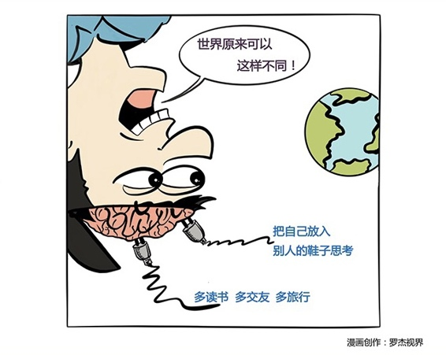

# 131｜你可能连杯子都要换掉

我们聊了一个季度的“商业”，我们与外部的关系，一个季度的“管理”，我们与内部的关系后，我们将进入“个人”篇，聊聊我们与自己的关系。

> 网上盛传一个故事，说大英图书馆建了一栋漂亮的新楼，准备整体搬迁过去。但你知道，书多重啊，还这么多，搬家是非常大的工作量。有人估算，做这件事要花350万美元，好大一笔钱。请问，如果你是馆长，怎样才能用尽量少的钱，把海量的书，搬到新馆去？

雇更便宜的人吗？发动所有员工及其家属？要求新馆建设者承担这个义务？

> 都不现实。在“搬书”这个固有的思维模式下，可能很难找到更好的方案了。你需要一次“思维转换”。

### 概念：思维转换

有位年轻人对馆长说：我来帮你搬，只要150万。年轻人在报纸上登了一则消息：“从即日起，大英图书馆免费、无限量向市民借阅图书，条件是从老馆借出，还到新馆去……”

年轻人从“搬书”的思维模式，转换为“还书”的思维模式，结果花了不到一个零头就完成了这个看似不可能完成的任务，自己也成为了百万富翁。

这就是思维转换（Paradigm Shift）。

> 每个人，都在以他的理解力和经历，构建自己的思维模式，然后再用这个思维模式，理解这个世界。思维转换，就是改变你理解这个世界的方式。

如果我们只想发生较小的变化，那么专注于自己的态度和行为就可以了，比如把杯子倒空；但如果你想发生实质性的变化，那就需要“思维转换”，可能连杯子都要换掉。

### 案例

> 周日清晨，纽约地铁。乘客们安静地坐着。这时上来了一位带着几个孩子的男子。孩子们一上来就四处奔跑，撒野作怪，而这个男子坐下来，就像没看见一样。大家非常不满。你也终于忍无可忍，对他说：先生，可否请你管管你的孩子们？

故事讲到这里暂停一下。问问自己：你忍无可忍的思维模式是什么？每个熊孩子背后一定有一个熊家长？

> 那人抬起眼来看你，仿佛如梦初醒般地轻声说：是啊，我想我是该管管他们了。他们的母亲一小时前刚刚过世，我们刚从医院出来。我手足无措，孩子们大概也一样。

这不是故事，这是《高效能人士的七个习惯》的作者史蒂芬·柯维的亲身经历。《七个习惯》卖了近3000万册，史蒂芬也被评为，对美国影响最大的25个人之一。

> 史蒂芬说，你能想象我当时的感觉吗？我瞬间怒气全消，非常自责，同情与怜悯之情油然而生：啊，原来您的夫人刚刚过世？我感到很抱歉！我能为您做些什么？

> 有时候，错的不是世界，错的，是你理解世界的思维模式。

开始这个季度的修炼之前，我想请你先打开也许已经生了锈的，“思维转换”的开关。

### 运用：打开“思维转换”开关的几个建议

### 第一，多读书，多交友，多旅行

每本书，都是一套“思维模式”。读的书越多，就会理解越多不同的思维模式，越有助于打开“思维转换”的开关。建议每年至少读20本书，并做笔记；有志气的人，可以考虑读50本以上。

每个人，也是一套“思维模式”。认识的人越多，你会越理解自己“思维模式”的局限性。

> 建议：不要独自吃午饭。只要名单上还有人，一个人吃午饭就是可耻的，你损失了理解别人思维模式的机会。

旅行，也能给你巨大的帮助。

有次我在美国商场买了样东西，标价83美元。我拿了张100美元，和3张1美元，一共103元，递给了售货员。那个售货员，一脸茫然。她把3美元还给我，说不需要。然后把商品递给我，说：83；接着一张张钞票数给我，说：93，98，99，100。

我立刻理解了她的思维模式：你给我100元，我连商品带找钱，加在一起还你100元。我的思维模式是：我给你103元，商品83元，减下来你找我20元。她居然不理解我的思维模式，我也没用过她的思维模式，但我们各自幸福生活了几十年。

### 第二，把自己放进别人的鞋子里。

每次争论，都是特别好的练习“思维转换”的机会。试着用对方的观点，说服自己。也就是：把自己放进别人的鞋子里。

张伟俊是中国第一位私人董事会教练。有一次，他受邀主持了一场企业家辩论会。这些平常在自己公司一言堂的企业家们，那谁能服谁，越辩越激动，我看差点就打起来了。张伟俊叫停辩论说：下一个环节是，交换观点，辩论继续。当时所有人都傻了。稍微停顿后，大家又唇枪舌剑起来，开始帮对方自圆其说。

这对在场的几百位企业家，都是深刻的一课。把自己放进别人的鞋子里，你才会明白，你过去捍卫的是自己的观点，还仅仅是自己的尊严。

### 小结：认识思维转换

思维转换，就是改变你理解这个世界的方式。

怎么练习打开“思维转换”的开关，接受这个季度“个人修炼”的课程呢？第一，多读书，多交友，多旅行；第二，把自己放进别人的鞋子里