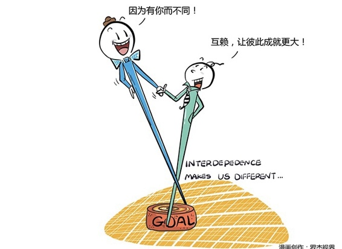
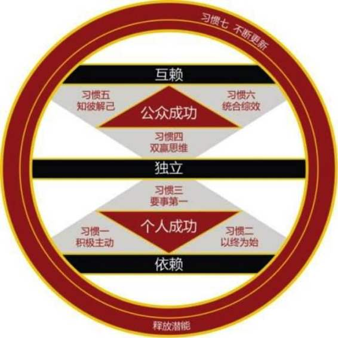

# 132｜独立，是不成熟的表现

> 你在原来公司做销售好多年，和一个大型央企客户的采购部负责人关系特别好。有一天他说：兄弟，你干嘛不出来自己干呢？你出来的话，我的订单都给你做。你听了非常心动，毅然辞职，然后真的接下了他的订单，小生意做的还不错。可是没过多久，你的这个朋友调动了，客户换了新任总经理，你的订单立刻没了。你很痛苦，到处找新客户。但是因为产品和服务没有突出优势，四处碰壁，最后只好关了你的“关系型公司”，回去打工。而你那个大型央企客户的新任总经理，觉得把钱都被你这样的公司赚了，非常不值得。他成立了很多子公司，生产各种配件和原材料，专门供给自己的公司。甚至，他连食堂、幼儿园、医院、家属楼，甚至菜地都自己建，形成了一个“城市型公司”。但是，很快他发现，每个子公司供货的质量和价格，都不如从外面采购，成本直线上升，公司不但没有更赚钱，利润反而直线下降。董事会几经讨论，最终决定开除了这位总经理。显然，你的“关系型公司”和这位总经理的“城市型公司”都有问题。可你们的问题是什么呢？你乐观估计了客户采购负责人的任期？他没有给子公司做好绩效考核？其实，你们俩的问题是同一个：不成熟。啊？为什么是不成熟？那什么是成熟？

### 概念：成熟模式图

有人说，人类都是早产儿。刚出生的小马，很快就能站起来，抖动几下身体就能走。可是人类的婴儿要七坐八爬，一岁才会走路，然后在父母的呵护、抚养、教育下，一点点成长。大学毕业之前，你基本不具备独立的能力，离开“衣食父母”几乎无法生存。我们把这个阶段，叫做“依赖期”（Dependent）。

大学毕业后，你迫不及待地远离家乡，越远越好，就算在同一个城市，也会想方设法脱离父母，独自租房子住。你为拿到第一个月的薪水激动不已，因为那意味着你可以独立了。你相信，只有抛弃身边的每一根拐杖，破釜沉舟，依靠自己，才能赢得最后的胜利。虽然比依赖要辛苦，但你知道独立才是成功之路，所以什么事都自己做。我们把这个阶段，叫做“独立期”（Independent）。

但你很快就遇到了瓶颈，并渐渐发现，自己一个人能做的事情，终究是有限的。你从害怕依赖别人，到开始尝试和别人合作，甚至把自己的后背交给信赖的战友。一群各有优势但都不完美的人，彼此合作，终于成就了一番真正的事业。我们把这个阶段，叫做“互赖期”（Interdependent），也就是互相依赖期。依赖显然不成熟，独立其实也不成熟，只有基于彼此优势的互相依赖，才是真正的成熟。回到最开始的案例。关系型公司，是“依赖型不成熟”的典型，它严重地单方向依赖对方。所谓“衣食父母”，给你吃、给你穿，是依赖型不成熟的代名词。城市型公司，是“独立型不成熟”的典型，他极端地恐惧依赖外部，希望完全靠自己。所谓“自给自足”，什么都自己种、自己养，是独立型不成熟的代名词。

运用：如何走向真正的成熟

今天，我要继续给大家介绍史蒂芬·柯维的书《高效能人士的七个习惯》，和他在书中提到，走向真正成熟的方法论，成熟模式图（Maturity Continuum）。

> 什么是“成熟模式图”？就是从依赖期，走过独立期，最终达到互赖期的两个阶段，七个习惯。

第一，从依赖到达独立的“个人成功”阶段。如何实现独立？史蒂芬说认为，有三个习惯可以帮你：积极主动，就是从“我不得不做”，变成“我想做”；以终为始，就是“先在脑海中构建未来，才可能在现实中实现未来”；要事第一，就是“多做重要的事情，就会减少紧急的事情”。第二，从独立到达互赖的“公众成功”阶段。如何实现互赖？史蒂芬认为，有另外三个习惯可以帮你：双赢思维，就是“要不然你也成功，只有我的成功我不要”；知彼解己，就是“比被别人理解更重要的，是理解别人”，统合综效，就是“你相不相信你可以和竞争对手共赢”。这不是六个习惯吗？那第七个呢？就是“不断更新”。习惯不是一蹴而就的，需要不断练习，才能更加成熟。《高效能人士的七个习惯》是我此生读过的最好的一本书，参加过的最好的一次培训，没有之一。史蒂芬可以说影响了我的一生。从明天开始，我将克制自己的激动，每天给大家仔细剖析一个习惯，希望对你，也能有同样的帮助。

小结：认识成熟模式图

依赖显然不成熟，独立其实也不成熟，只有基于彼此优势的互相依赖，才是真正的成熟。今天，我希望大家能先理解“成熟模式图”，就是从依赖期，走过独立期，最终达到互赖期的两个阶段，七个习惯。积极主动、以终为始、要事第一，这三个习惯，帮你到达个人成功阶段；双赢思维、知彼解己、统和综效，帮你到达公众成功阶段。不断更新，帮你磨砺前六个习惯，越来越成熟。