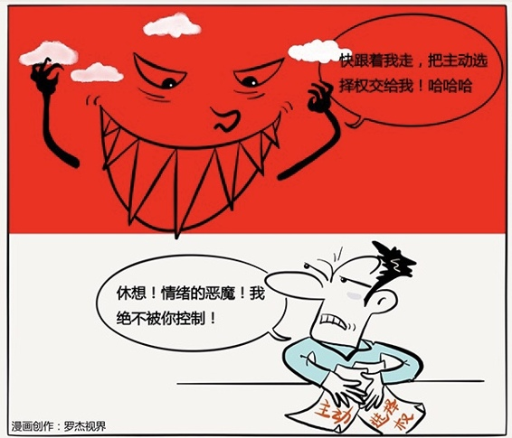

# 133｜别让消极，把你拉入海底

你有没有听到过，或者说过下面的这些话： “我就是这样做事的”，“他把我气疯了”，“我根本没时间做”，“要是我妻子能更耐心一点就好了”，“我只能这样做”……是的。

这些话在我们的生活中，如漫天繁星一样的常见。也许你已经意识到这些繁星很“消极”，你也一定知道消极不好。可为什么生活中会有那么多“消极”呢？是因为“生活太残酷”吗？

咳咳，我有必要提醒你，这个答案本身，也很“消极”。

有人立刻站起来反驳：“我说事实算是消极吗？我确实是办不到，他确实让我怒不可遏，我确实就是这样的，我就是我。如果积极是让我假装开心，我办不到。”可是，这真的是事实吗？他说了不客气的话是事实，时间紧张是事实，你的妻子不够耐心也许也是事实。但是，这些事实让你没有了选择，所以不得不这么做，却未必是事实。这是推卸责任的“环境决定论”：我没有责任，责任在他，责任在时间，责任在我妻子，是命运、基因、环境决定了现状，让我没得选择。真的就没有选择吗？

### 概念：积极主动

二战期间，一位犹太裔心理学家维克托·弗兰克被关进了纳粹集中营。你们知道，被关进纳粹集中营，那几乎就意味着死刑。弗兰克当然很痛苦。很多犹太人都从“为什么”的愤怒和恐惧，逐渐变成“这就是命”的消极接受，最终精神彻底崩溃，死在集中营里。在必死面前，应该算是没有选择了吧？其实并不是。弗兰克看到，还有另一些人非但活了下来，而且变得更坚强。他们居然每天用玻璃片把胡子刮干净，高贵地面对苦难。他深受感染，决定“选择”用积极的态度生活，做些力所能及的事情，甚至唱歌搞活动，和集中营中的囚徒们一起，渡过难关。战争终于结束了，弗兰克也最终走出了地狱，他写了一本著名的书《意义的呼唤》，他在书中说：选择态度的自由，是人可以拥有的最后一项自由。

消极，就是把苦难的责任，推卸给命运、基因、环境，然后怨天尤人，寻找心理宣泄，但对现实没有任何帮助。

消极，就是在抱怨中臣服于困难。消极，就像一块巨石一样，把你，和你周围的人一直往下拉，一直往下拉，直到沉入海底。所以，史蒂芬·柯维说，从依赖期，走向独立期，第一个必须建立的习惯，也是最重要的习惯，就是“积极主动”（Be Proactive）。积极主动，就是从“环境决定论”手中一把夺回“选择权”，就算看上去再不可能，也相信自己可以做出积极的改变，哪怕是改变一点点，都是在浮出水面，游向岸边。

### 运用：如何积极地获得主动权？

怎样才能不让外部环境，或者别人左右你，积极地获得主动权呢？史蒂芬在书中介绍了几个方法。

第一，在刺激和回应之间，给自己思考的时间。别人提了一个大胆的提案，你脱口而出“不可能”。他的提案是个刺激，“不可能”是你的回应。但真的不可能吗？先别着急下定论，至少在刺激和回应之间，给自己30秒时间想一想。别小看这短短30秒，它帮你从你的情绪手中，一把夺回“选择权”，然后交给理性和价值观。

第二，用积极的语言，替代消极的语言。你的语言代表你的心声。你说：我就是这样做事的。你心里其实在想：我这辈子改不了了。你把改不了的责任推卸给命运。试着选择积极的语言替代，比如：我可以选择不同的作风。你说：他把我气疯了。你心里其实是在想：是他的责任，他控制了我的情绪。你把生气的责任推卸给别人。试着选择说：我可以控制自己的情绪。

第三，减小关注圈，扩大影响圈。你关心健康、事业、甚至世界局势，这是“关注圈”。但关注圈中有些事，是你无法影响的，比如谁当选美国总统。关注圈中，那些你可以影响和控制的小圈，叫做“影响圈”。

怎么才能积极主动？把时间和精力，专注在影响圈上。比如，我不能影响上海的房价，但是我可以增加能力，赚更多钱；我不能影响老板的脾气，但我可以学习向上管理，增强有效沟通；我不能让一天变成25小时，但我可以加强时间管理，拒绝不重要、不紧急的事情。

### 小结：认识积极主动

积极主动，是一个人从依赖期走向独立期，最重要的一个习惯，就是不把责任推给命运、基因、环境，积极掌握主动性，用“选择的自由”，对自己负全责。怎么做？第一，在刺激和回应之间，给自己思考的时间；第二，用积极的语言，替代消极的语言；第三，减小关注圈，扩大影响圈。