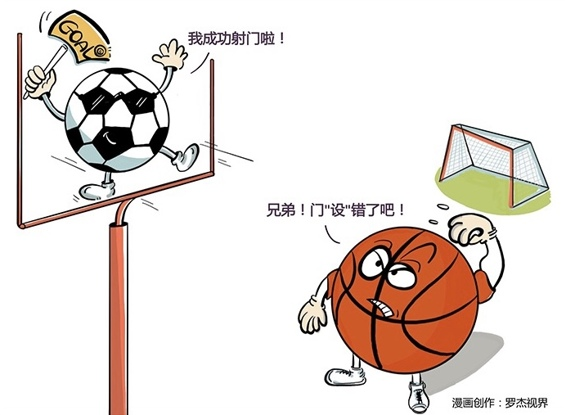

# 134｜别把追求成功的梯子，搭错了墙

### 概念：以终为始

想象一下，你受命去盖一栋大楼。你怎么开始？兄弟们，跟我上！干起来再说！这显然是不行的。估计你这样的建筑商，在电视剧里活不到第二集。盖大楼，一定要先设计：主体设计、外墙设计、景观设计、室内设计。你喜欢吗？喜欢？好，然后，开始出建筑施工图、结构施工图、设备施工图。最后，图纸拿去，开干。

> 你心中一定要有那个“终”，你才知道应该怎么“始”。这就是：以终为始。你要先通过基于心智的第一次创造（Mental Creation），设计出大楼，也就是那个“终”，然后才能通过基于实际的第二次创造（Physical Creation），从“始”出发，建造出大楼。第一次创造的终，是第二次创造的始。这就是以终为始。

### 运用：如何养成以终为始的习惯

怎样才能养成“以终为始”的习惯，成为自己的第一次创造者呢？

要注意三件事。

第一，目标。给你讲一个故事。有三只猎狗追一只土拨鼠，土拨鼠钻进了一个树洞。这只树洞只有一个出口。突然，树洞里钻出一只兔子，飞快地奔跑，并爬上一棵大树。兔子在树上没站稳，掉下来砸晕了正仰头看的三只猎狗。最后，兔子逃脱了。故事讲完了，你听完后，有什么问题吗？有人说：兔子不会爬树！有人说：一只兔子不可能同时砸晕三只猎狗。都是好问题。

> 但是，你有没有注意到：土拨鼠哪里去了？土拨鼠就是你的目标。

可很多人面对复杂的环境，常常迷失自己的目标。对于个人，我的人生使命是什么？对于企业，我的公司愿景是什么？对于项目，我的成功标准是什么？成为第一次创造者，第一步，就是要确定你的目标，然后坚定地追寻目标。第二、原则。有了目标之后，成为第一次创造者，你还需要一些基本的设计原则。我们的原则：用最少的时间，帮你掌握最透彻的知识。王石也是很有原则的一个人。在攀登珠峰时，他常常一个人坐在帐篷里，积蓄体力。队友说：出来看看，景色真美！王石说：外面的景色很美，但我更想到达山顶。第三，计划。1911年，英国的斯科特，和挪威的阿蒙森，展开了成为第一个到达南极点的人类的比拼。斯科特团队17人，而阿蒙森团队5人。你猜最后谁先到了？你猜对了，是阿蒙森。阿蒙森赢在计划。首先，阿蒙森准备了充足的物资。他的5人团队，准备了3吨物资，而斯科特的17人团队，只准备了1吨。其次，阿蒙森做了充分的研究。他去南极之前，专门和爱斯基摩人住了很长时间。所以，斯科特用马来拉物资，而阿蒙森选择了狗，因为狗不会出汗。在南极，斯科特的马跑起来就开始出汗，然后……就冻住了。还有，斯科特天气好时就多前进一些，天气差时候就少。但阿蒙森坚持不管天气如何，每天30公里，保持体力。最后，阿蒙森首先到达了南极点。而斯科特虽然随后也抵达南极点，但最终死在了回程的路上。

### 小结：认识以终为始

以终为始，是从依赖期到独立期的第二个习惯，是把基于心智的第一次创造的那个“终”，作为基于实际的第二次创造的那个“始”。怎么才能以终为始，成为自己的第一次创造者？

要注意三件事：目标、原则和计划。如果没有第一次创造，许多人都会拼命埋头苦干，到头来却发现，追求成功的梯子搭错了墙。虽然看上去忙碌不已，或者非常享受，但这种享受，可能只是在泰坦尼克号沉没之前，拉开了躺椅。