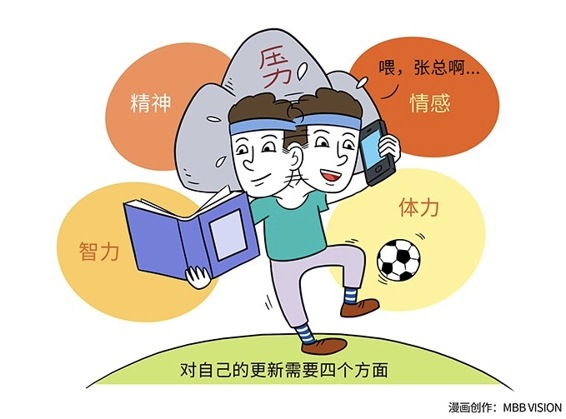

# 139｜把优秀，变成一种习惯

> 如果你也喜欢读武侠小说，我想请问，你认为如下三种武侠小说中的常见武功设定，哪一种最不科学：第一，轻功。轻轻一跃，就能从浦西飞到浦东；第二，点穴。手指一点，就能把对方立刻定住；第三，吸星大法。双掌一拍，60年的功力，就能从他身上转移你身上。你认为是哪一种？我认为是吸星大法。

### 概念：不断更新

轻功，也许是借助了某种当时的“可穿戴飞行器”；点穴，也许其实是超强肌肉僵硬药物瞬间注射的结果。但是“60年的功力”就像Word文件一样的传来传去，几乎不可能，因为它违反了“时间律”。什么是“时间律”？这个世界上，有些东西是偷不来、抢不来、要不来、用钱买不来的，获得它的唯一方法，就是用时间换。比如，你用1个亿都买不来会骑自行车，但却可以用三个小时的练习时间换来。

> 习惯，就是典型的符合“时间律”，也就是花再多钱都无法瞬间获得，只能用时间换的东西。你只有坚持不懈地站桩、扎马步、打梅花桩，才能不断精进，用时间，把优秀变成一种习惯。

### 运用：如何把优秀变成一种习惯

史蒂芬说，你需要养成第七个习惯，从“身体、精神、智力、社会/情感”四个方面，对自己“不断更新”（Sharpen the Saw）。

第一、身体。想要在商业、管理、个人方面做得更优秀，你必须有非常充沛的体力，旺盛的精力。最底层的工作者靠体力，中高级管理者靠智力，但最顶级的企业家，又回过头来靠体力。万达创始人王健林一天要出现在4个城市，苹果CEO库克一天只能睡3个小时。身体，就是你的手机电池。没有一块大电池，或者电量始终在20%以下，是成不了大事的。那应该怎么办呢？吃营养的食物，充分休息，以及定期运动，有规律的作息习惯。身体训练属于“重要，但不紧急”的事情。如果做到这些很难，可以试试我们在第61课讲的“对赌基金”，帮自己走入正循环。

第二、精神。强大的精神力量，也是需要不断训练的。2009年，我参加了“玄奘之路”戈壁挑战赛，在荒无人烟的盐碱地里，用4天，徒步了120公里。单调的景色，疼痛的双腿，理想、行动、坚持，冲过终点那一刻，我不是豪情万丈，而是平静如水。2013年，我飞到青海，用5天时间，在3300米的海拔上，环青海湖自行车骑行了360公里。有一天实在没有完成当天目标。第二天，我倒退20公里，追上部队，完成了全程。2015年，我和10位朋友一起，远赴非洲，用7天时间，攀登非洲第一高峰，海拔5895米的乞力马扎罗。在大雨、极寒、高原反应等等恶劣环境下，最后我们登顶的那一刻，所有人抱头痛哭。快乐是奖赏，痛苦是成长。经过这样的精神训练，你几乎可以面对任何商业世界的挑战。

第三、智力。智力，就是你手机的操作系统。智力训练，就是增加操作系统的功能，安装各种APP。怎么做呢？多读书。虽然微信上有很多文章，但大部分微信文章的内容比较碎片、甚至比较片面。我自己写过不少书，当我试着把自己某篇文章的观点，写成书的时候，会把自己挑战得体无完肤，甚至最后放弃。可以试着至少每季度读一本书，然后每月读一本，然后每周读一本。“得到”里的“每天听本书”是个很好的快速获取书籍精华的方式。如果你对某本书深有感触，应该再把全本找来，仔细阅读。多写作。试着把自己的想法写下来。你会发现，你以为自己想清楚的很多事情，其实并没有想清楚。写作，可以帮你把囫囵吞枣吃下去的知识，消化吸收。可以试着至少每个月写一篇文章，公开发表，接受大家的质疑。这些质疑，可以进一步帮助你完善思维和知识体系。

第四、社会/情感。还有一项必须不断训练，持续积累的，是社会关系，情感连接。常有人问我：你认识那么多人，这个人脉是怎么建立的？我说：给予价值。你能给予什么样的价值，就会认识什么样的人。如果不能用价值浇灌人脉，那就只能用人品抵押。抵押到最后还不起了，你还想借，就会破产。人脉，不是那些能帮到你的人，而是那些你能帮到的人。所以，持续的给予价值。这是更新、积累人脉的唯一方法。给予，减去索取，等于人脉；付出，减去回报，等于胸怀。

### 小结：认识不断更新

《高效能人士的七个习惯》之七，是“不断更新”。习惯，无法通过吸星大法瞬间获得，需要不断训练，持续积累。不断更新，就是通过身体、智力、精神、和社会/情感四个方面的不断训练，磨砺前面六个习惯，把优秀变成一种习惯。