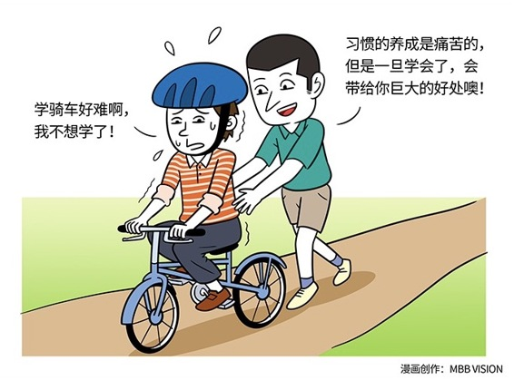

# 140｜从狭窄的5%，跨度到广阔的95%

### 概念：习惯

> 什么叫习惯？我们来做一个实验。请把你的双手十指交叉，紧紧地握在一起。好的，不要松手，现在来看一看，你的哪个手的拇指在最上面？右手？还是左手？紧接着，请你的几位同事也照做一遍。咦？他们其中居然有人与你不同！那么，让我们自己改变一下，试着故意让另一个手的拇指在上呢？怎么这么别扭？天啊！我做起来这么别扭的事情，怎么他们就做得那么自然呢？我做起来那么自然的事情，怎么他们就那么别扭呢？是的，这就叫“习惯”。

习惯，就是也许别人做起来就那么别扭的事情，你可以做得那么自然。

为什么会这样？这是人类的大脑结构使然。欧洲工商管理学院教授特奥·康普诺利在他著名的书《慢思考》里，把人的大脑分为：反射脑，思考脑，存储脑。简单来说，反射脑管直觉，思考脑管理性，存储脑管记忆。反射脑里的直觉，依赖习惯。用习惯做出反应，快速，“省电”，但是未必总是正确；思考脑里的理性，依赖逻辑。用逻辑做出反应，更加正确，但是缓慢，并且“费电”。那么，直觉和理性，也就是习惯和逻辑，哪一个对我们更重要？

> 行为科学研究得出结论：一个人一天的行为中，大约有5%是非习惯性的，而其它的95%的行为都是源自于习惯。

这几乎也就是说，是习惯，而不是逻辑，决定了我们的一生。这也许会颠覆你的认知。天啊，这可不行啊！我的思考脑，绝不能屈服于反射脑！可是，你打算毕生用5%的逻辑，与95%的习惯作斗争吗？不，这不是最佳策略。最佳策略恰好相反。

### 运用：如何选择最佳策略

最佳策略是：把你逻辑上认同的东西，训练成习惯。然后用习惯，指导你的一生。比如，“双赢思维”。也许在某一个合作中，你动用你的思考脑，用逻辑推导双方利弊，然后决定“双赢，或者就不做”。但这种情况只占5%，还有95%呢？你可能依然会习惯性地损害了对方利益。“把你逻辑上认同的东西，训练成习惯”，就是通过反复练习，把“双赢思维”写入反射脑，变成条件反射，从而让自己在100%的情况下，都能做出正确的决定。那这样的习惯，让人很痛苦吧？其实不然。养成习惯的过程很痛苦，但习惯本身，不会让人痛苦。刚学自行车的时候，很痛苦，不知道摔了多少跤。当时你可能都会很诧异，发明自行车的人真不简单，第一个学会骑自行车的人更不简单。学会之后，你每天骑车上下学之后，就不痛苦了。甚至从学校出来，到了家里，你会有这样的感觉：咦，我是怎么到家的？完全不记得了！骑车，已经成了一种习惯。当年痛苦学骑车的时候，觉得是车在骑我。当成为习惯之后，才是我在骑车。同样，当我们把“双赢思维”作为一项规则来遵守，会很痛苦；当双赢思维成为习惯之后，一切自然而然。觉得痛苦，只是因为那不是你的习惯。就像你习惯双手交叉时，习惯右手拇指在上，就会觉得左手拇指在上很痛苦。而每当你养成了一个好习惯，就相当于你又把一个正确的逻辑，写入了反射脑。你不但在做自己，你还成为了更好的自己。

> 史蒂芬·柯维说：想法产生行动，行动养成习惯，习惯变成性格，性格决定命运。

我想现在，你就会明白，为什么在过去的七天里，我每天都建议你确定一件要做的事情，然后在未来21天，养成这个习惯。因为这样做，可以帮你把思考脑中的逻辑，变成反射脑中的习惯，帮你从狭窄的5%，跨度到广阔的95%。

### 小结：认识习惯

习惯，就是也许别人做起来就那么别扭，但你却可以做得那么自然而然的事情。虽然逻辑很重要，但人的行为，只有5%是由思考脑中的逻辑驱动的，还有95%，都是由反射脑中的习惯驱动的。想法产生行动，行动养成习惯，习惯变成性格，性格决定命运。所以，养成好的习惯，不但可以让你做自己，更是做最好的自己。

养成好的习惯，本质上，就是把思考脑中的逻辑，通过反复训练，成为反射脑中的习惯。然后用习惯，指导你的一生。