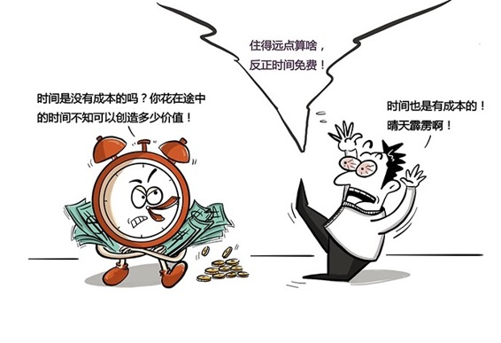

# 141｜到底是花时间做，还是花钱买？

### 概念：时间成本

> 2006年的一天，我在上海的徐家汇，打车去浦东机场。一辆大众公司的出租车接到了我。一上车，健谈的出租车司机就和我聊起了他的“商业模式”。他说：“做出租车司机，也要用科学的方法 …… 我每天开17个小时的车，每小时成本34.5元 ……”“怎么算出来的？”我追问。他说：“你算啊，我每天要交给公司380元份子钱，花大概210元的油费。一天开车17小时，那平均每小时，份子钱22元，油费12.5元。每小时的‘时间成本’不就是34.5元吗？”我第一次听出租车司机计算“时间成本”，以前的司机都是计算每公里成本。可是，计算时间成本有什么用呢？他说：“有一次一个人打车去火车站，问怎么走。他说，从地面走。我说，从地面走很堵，从高架走吧。他说，那就绕远了。我说，没关系，从地面走大概50块，从高架走，等里程表50块了，我就翻表。你只付50快就好了，多的算我的，付一样的钱，帮你省25分钟时间。”乘客很高兴。可这个出租车司机多走路，少收钱，不是傻吗？你理解“时间成本”的概念，就会理解他的决策逻辑了。多走4公里路的油钱，大概1元钱。少花25分钟时间，按每小时34.5元计算，就是14元。这省下来的25分钟，他还能接新客人，可能收入都不止14元。多花1元，却节省了至少14元，他到底是傻，还是聪明？大众公司的出租车司机一般一个月赚3、4千，好的大概5千，顶级的大概7千。2万个司机中，只有2～3个每月能赚8千以上。他就是其中之一。后来我把这次真实的经历写成一篇文章，叫《出租司机给我上的MBA课》，发表在自己的博客上，没想到点燃了整个互联网。一个出租车司机，懂得用“时间成本”的概念，做出理性决策。你懂了吗？时间成本，就是这个时间如果用于做别的事情，你可以获得的收益。它是一种特殊形式的机会成本。懂得计算时间成本，可以帮你在很多决策上做出到底是花时间做，还是花钱买的理性决策。

### 运用：如何计算时间成本

我们来练习一下，在日常生活中的时间成本如何计算，以及如何用时间成本的逻辑，来帮助决策。假如，你的收入是1万元一个月。一个月有21个工作日，每个工作日工作8小时。那么，你每小时的时间成本，就是1万元 / 21天 / 8小时 = 59.5元。我们用最开始的场景做练习。                                  第一，你愿不愿意每月多花2000元房租，从距离1小时路程的地方，搬到公司楼下？你每天实际花2小时在路上。所以，你每天投在交通上的时间成本，就是59.5元 x 2小时 = 119元。一个月就是119元 x 21天 = 2499元。多花2000元，搬到公司楼下，可以节省2499元的时间成本。你应该搬。第二，你愿不愿意每天为你的手机工作20分钟？不愿意？我们算算账。你花7000元买了一只苹果手机，只用了一年，就又换了。一年大概250个工作日。相当于你每天为手机花了7000元 / 250天 = 28元。你一小时时间成本59.5元，所以你每天为手机工作了28元 / 59.5元 = 0.47小时，相当于28分钟。你说你不愿意每天为手机打工20分钟，但你其实打工了28分钟。第三，你愿不愿意坚持二十年，不吃不喝，每天为你的房子打工8小时？2016年上海房子的均价大概4万元左右，你想买一套100平米的房子，也就是400万。假设算上利息，你20年大概，我是说大概啊，一共要花550万。那么，每天要赚多少才够呢？要赚550万 / 20年 / 250个工作日 = 1100元，相当于18.5小时。完了，我看你连觉也别睡了。第四，那么你愿不愿意花199元，订阅《刘润·5分钟商学院》呢？假如《刘润·5分钟商学院》每期知识，要至少帮你节省1小时学习时间，那一年260期，就至少节省了260小时。相当于15470元。花199元，节省1.5万元。《刘润·5分钟商学院》现在有9万左右学员，一共节省了价值13.5亿的国民总时间。

### 小结：认识时间成本

第一，什么是时间成本？时间成本，就是这个时间如果用于做别的事情，你可以获得的收益。第二，为什么要懂得计算时间成本？懂得计算时间成本，可以帮你在很多决策上做出到底是花时间做，还是花钱买的理性决策。