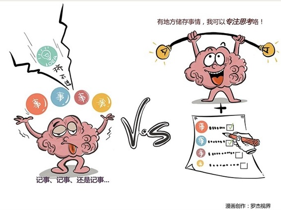

# 142｜让大脑用来思考，而不是用来记事

你有没有过这样的感觉，好像有件什么重要的事没做，但就是想不起来，很焦虑。第二天，老板晨会的时候问你，你五雷轰顶，突然想起来了。或者你在出租车上有一个绝妙的想法，喜出望外，可到了办公室，就已经忘了那个想法是什么了，非常抓狂。遗忘，让时间管理失去了意义：连做什么都忘了，还管什么时间。那是因为你老了、不中用了？还是因为你天生蠢萌？都不是。

### 概念：GTD

瑞士巴塞尔大学研究发现，遗忘，是大脑的一种自我保护机制。通过遗忘，大脑会删除一些不必要的信息，腾出空间，让神经系统正常运转。破坏此过程，可能导致严重的精神疾病。这听上去很安慰人：原来，“过目不忘”才是病啊。可是，有些事真的很重要啊，尤其是在管理自己的工作和时间过程中，老板交代的任务、突如其来的灵感、项目关键的节点等等，这些都不能忘，那怎么办呢？

> 著名的时间管理人戴维·艾伦说：那就给你的大脑外接一个“移动硬盘”，把这些事，从你那不靠谱的大脑里挪过去吧。

他在他最著名的书《尽管去做》里，提出了一套“移动硬盘”式的时间管理方法：GTD（Get Things Done）。真有这么神奇吗？我自己用GTD来管理时间，已经有十几年了。帮助确实非常大。想让自己不因遗忘而焦虑，最重要的秘诀，是把所有的待处理事项，全部从大脑中清除出去，让大脑用来思考，而不是用来记事。

### 运用：GTD的三个核心

今天我就来与你聊聊这套方法，以及它的三个核心：收集、处理、回顾。

第一、收集。你需要一个“收集篮”，安放那些从大脑里清除出来的事项。在远古时代，也就是十几年前，很多人会用小本子做收集篮。但是小本子不便于检索。手机时代了，你可以试着把所有事情，收集到一些电子的篮子里，比如“印象笔记”。作为收集篮，印象笔记做得很不错。收到电子邮件，可以转发给印象笔记收集；看到好的微信文章，可以分享到印象笔记收集；看到一条有启发的新浪微博，可以@印象笔记收集；浏览器上看到一篇新闻，可以点印象笔记按钮收集；在得到里听了一本书，可以打开文稿同步到印象笔记收集；多看阅读里有很多读书笔记，可以自动建立印象笔记收集；突然有一个灵感，用手机上印象笔记的快捷键收集；收到一张名片，可以拍张照自动识别到印象笔记收集，等等。清空大脑，把所有事情100%放入收集篮，是GTD的第一步。

第二、处理。清空大脑之后，就要处理收集篮了。在电梯里，在出租车上，在飞机延误时，在一切零碎的时间，你都可以处理你的收集篮。处理收集篮中每一件事情，记住，你只有这6个选择：

删除。一时冲动放入收集篮，但现在看来毫无价值的事情，立刻删除。

归档。有价值的资料，比如微信文章、多看笔记等，移到“归档”目录。

将来/可能。这些事情你需要在某个点去做，但不是马上，比如写一篇文章，读一本书等，移到“将来/可能”目录。

等待。这件事需要指派其他人完成，那就立刻指派，比如让秘书订机票等，然后移到“等待”目录，再给这件事增加一个到时间提醒。

下一步行动。需要你亲自完成的，比如给老板发个会议纪要，打电话给客户做回访等，移到“下一步行动”目录。但是，如果这件事2分钟内就能做完，比如用“同意”批复一封邮件，那就别移了，立刻批复。

项目。对于下一步行动要很多步骤的，就已经是一个项目了。为项目建一个专门的目录，定期回顾处理。

记住，你只有这6个选择。一旦移出收集篮，再也不要放回来。收集篮在大多数情况下，也应该是空的。

第三、回顾。收集，是把事情从大脑中清空；处理，是把事情继续从收集篮清空。然后呢？然后就是回顾。什么是回顾？早上往办公室一坐，我今天干什么呢？打开“下一步行动”目录，一件一件做就好了。如果“下一步行动”里是空的呢？恭喜你。看看“项目”里哪些事情，有没有进展？“将来/可能”里那些事情，有没有值得做的？“等待”里那些事情，别人都完成了吗？都没有。太好了。但那也说明你实在是太空了。找点事情放入收集篮吧。然后，随时回顾、每天回顾、每周回顾。

### 小结：认识GTD

GTD，是一套“让大脑用来思考，而不是用来记事”的时间管理方法，通过借助外部工具，比如印象笔记，第一，清空大脑，把所有事情，100%放入收集篮；第二，处理收集篮，把事情用删除、归档、将来/可能、等待、下一步行动、项目的方法归类；第三，随时回顾、每天回顾、每周回顾，从分类中提取需要完成的事情，然后，行动。使用GTD的方法，可以让你心中无事，从而再忙也不焦虑，专注于思考和解决问题。