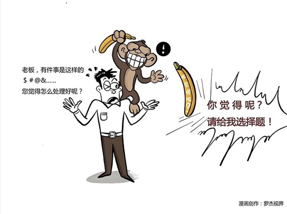

# 143｜别让猴子跳回背上

开完上一个会，你拿着笔记本电脑和咖啡，正在快速走回座位。这时你的下属李雷突然跳出来拦住你：“老板，占用你一分钟，有件事儿是这样的，blablabla，你觉得怎么处理好呢？”

你怎么回答？A、我现在很忙，我想想再告诉你；B、你应该这么做、这么做。你会选A，还是选B？

### 概念：猴子理论

从管理，尤其是时间管理的角度看，A，和B都不是正确的答案。为什么？因为你把本应由下属照料的猴子，抱到了自己身上。

这就是著名的“猴子理论”。

猴子理论，是由威廉·奥肯发明的一个有趣的理论。他在他著名的畅销书《别让猴子跳回背上》里面，把责任或者“下一个动作”，比喻成猴子。

> 一件事，本来是下属的责任，但是因为每个人都有“逃避责任”的天性，他们遇到困难时，在家依赖父母，在公司依赖老板。“你觉得怎么处理好呢”这样的问题，其实就是把他的责任，那只猴子，抱过来找你说：老板，你帮我照看这只猴子好吗？

你如果回答了A，“我现在很忙，我想想再告诉你”，就相当于说：好吧，猴子先给我，你去玩儿吧。你的下属，瞬间就兴高采烈地不见了。过了几天，他会出现在你的办公室门口，探进头来问：老板，那件事你想得怎么样了？

如果你回答了B，“你应该这么做、这么做”，就相当于说：照我说的做，给猴子吃点这个药，打点那个针。你的下属，瞬间又兴高采烈地不见了。过了几天，他又会出现在你的办公室门口，探进头来问：老板，那只猴子死了。你看下面怎么办啊？

> 你选A，是帮他承担决策的责任；你选B，是帮他承担决策可能失败后的责任。

假如你有10个下属，每个人每周都扔3个猴子到你身上，你都说“我现在很忙，我想想再告诉你”，也就是一周你要收养30只猴子，他们爬满你全身，让你焦头烂额，完全没有时间处理自己的责任。

### 神句：你觉得呢

那正确的做法是什么呢？

李雷问：“你觉得怎么处理好呢？”，这时候，你可以回答：“你觉得呢？”

这个“你觉得呢？”是一个神句。作为管理者，你要牢牢记住，对着镜子多练几遍。

他说：“老板，我想不出来，才找你的啊。”你说：“这样，你可以找几个人头脑风暴一下，一起再想想。我今天下午5:30有点时间。到时候，你拿几个方案，我们俩讨论一下。”

下午5:30，他带着5个方案来了。他讲完后问：“你觉得哪个方案好呢？”这时候，你要怎么回答？对了。你要说“你觉得呢？”

他说：“A不错。”你可以说：“A是不错，但是你有没有考虑过这种情况？”

他说：“有道理。那我觉得，D更好。”你可以说：“D也很好，可是如果竞争对手这样做，怎么应对？”

他说：“看来，还是C最好。”你说：“太棒了。就这么做。下周五你再来找我一次，我们看看效果如何。”

这时，猴子收回了已经搭在你肩上的那只手，回到了你下属身上。

这就是猴子理论。

### 运用：如何不让别人的猴子爬满你的全身

在第76课我们讲过，组织中最基本的原则，是“责权利心法”。但很多人都有“逃避责任”的依赖心理，让老板帮他承担决策的责任，和决策可能失败的责任，而有些老板，很享受这种被依赖的感觉，但是让下属的猴子占据了自己所有的时间，焦头烂额，下属也没有成长。猴子理论，就是让责任待在它的主人身上，不要让别人的猴子，爬满你的全身。

这是一套非常简单、但很有效的时间管理方法。不过在具体执行的时候，你要注意下面五个原则。

第一，你和你的下属必须明确猴子，也就是责任、下一个动作的归属，不能他以为在等你，你以为在等他。

第二，每次和下属像案例中那样的辅导和讨论，应控制在5～15分钟之内。每天控制总的讨论次数。

第三，只能在约定的时间讨论，不耽误你自身的责任。“我现在正在赶一份报告，你明天早上8:30来找我，可以吗？”

第四，和下属的讨论，一定要电话，或者见面，不能通过邮件。电话、见面，是同步沟通，沟通完，猴子还在下属身上。邮件是异步沟通，他写邮件给你，你没回的时候，猴子就在你身上了。

第五，每次讨论完，要约定下次沟通时间。“下周五你再来找我一次，我们看看效果如何。”否则可能因为困难，事情会不了了之，猴子被下属抛弃，饿死在路上。

### 小结：认识猴子理论

猴子理论，就是让责任待在它的主人身上，不要让别人的猴子，爬满你的全身，结果自己焦头烂额，下属还无法成长。

正确的做法是，用“你觉得呢”来提问，帮助下属养成“只出选择题，不出问答题”的习惯，节省自己时间，培养下属能力。