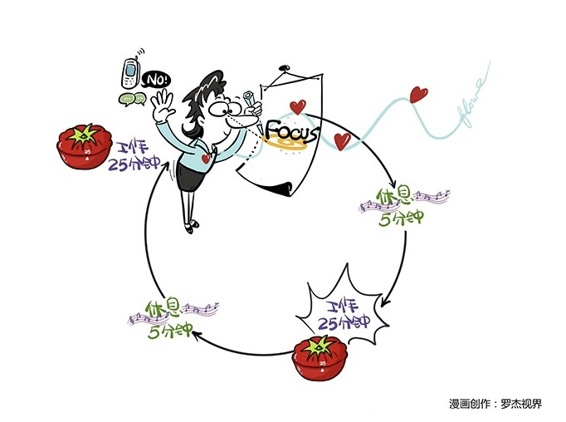

# 145｜人，真的可以三头六臂吗？

你有没有遇到过这样的情况？你正在准备第二天会议的演讲稿时，一位朋友的电话打进来，你不得不假装同时也听他在电话中抱怨，然后，时不时的吃两口桌上已经快冷掉的午饭，这时一封邮件从笔记本屏幕上弹出来，你顺手点开，居然是个段子，你努力忍住不让朋友听出你在笑，关掉邮件，回到明天的演讲稿，脑子一片空白，然后，又喝了一口汤……我们常常梦想：

> 我要是有三头六臂就好了。或者：我要是像电脑一样，能多任务处理就好了。人真的可以三头六臂吗？真的可以多任务处理吗？

### 概念：番茄工作法

首先，如果你学过《计算机原理》就会知道，电脑的多任务，其实是通过把CPU的计算时间，切成足够小的时间切片，然后供大家足够快地轮流使用而已。也就是说，所谓的多任务，就是高速切换的单任务。人脑中有一个叫“丘脑网状核（TRN）”的组织，扮演着和电脑一样的“任务切换机”的作用。但是，人脑“任务切换”的效率远不如电脑。如果你正在非常专心地做一件事，突然被一个电话打断，就算这个电话只接了1分钟，结束后你要重新专注，至少需要几分钟，甚至10-15分钟时间。也就是说，人脑每一次任务切换，都有可观的时间成本。

> 三头六臂式的多任务，不但不会节省时间，还会造成大量的时间浪费。

于是，很多人都在研究，到底多大的时间切片，多快的切换速度，是人脑最佳的工作频率。1992年，弗朗西斯科·西里洛发明了番茄工作法。番茄工作法，其实非常简单，就是指把人脑这颗CPU，切割为以30分钟为单位的时间切片，每集中精力工作25分钟，休息5分钟。你可以用厨房常用的番茄钟来计时，所以被称为番茄工作法。很简单吧？从时间管理的角度看，番茄工作法，其实就是用合适的时间颗粒度，来保证注意力的专注度，节省“任务切换”导致的时间浪费。

### 运用：想获得最好效果需注意

具体怎么做呢？非常简单，回去买个番茄钟，或者苹果钟，或者西瓜钟，坐在桌前，从GTD的“下一步行动”目录中，拿出一样事情来，就可以立刻开始尝试番茄工作法了。但是，为了获得最好的效果，有几个地方非常需要注意。

第一、防火防盗防打断。一次打断，会带来两次大脑中的任务切换，一来一回，可能会浪费好几分钟。番茄工作法的关键，是像防火防盗一样防打断，让这25分钟非常专注。怎么做？最被动的打断，来自电话。把手机关机，或者设为勿扰模式，只允许老板、家人的电话响铃，其余自动短信回复：“现在正忙，稍后给您回电。谢谢。”老板的电话接起来，如果不是急事，可以礼貌地说：“老板，我知道了，我30分钟后回复您可以吗？”最诱人的打断，来自微信。关闭微信和所有APP的提醒功能。那些动不动叮一下，震一下，亮一下屏，提醒我它的存在的APP，还不能关闭的，一定是流氓软件，我会一律卸载掉。微信做得很好，它甚至专门有个功能，叫：免打扰1小时。最难防的打断，来自自己。突然一件事出现在你脑海中，比如，想起忘了订火车票了，或者一个灵感冒出来了。你可以在手边放一张纸，或者电脑上打开一个记事本，用10个字记下这件事后，清除出大脑，然后继续专注刚才的番茄。必须坚决拒绝打断，否则别拿出番茄钟。

第二、努力进入心流体验。心流体验，就是一种忘我的状态，才思如泉涌，半小时过去了，你觉得才几分钟。努力让自己进入心流体验，会事半功倍。怎么进入呢？绝对安静，也许并不能帮助每个人进入心流体验。相反，在一些背景音下，比如流水，下雨，刮风，咖啡馆的喧哗，甚至是电视机的雪花音，很多人更容易专注。你家正好不下雨的话，可以在手机上下载一个“白噪音”APP。另外，半小时对心流体验来说，也许是不够的。这也是很多人批评“番茄工作法”的地方。强制性的每半小时一个番茄钟，粗暴地切断了心流。休息5分钟之后，可能再也回不去了。所以，我个人的做法是，设置25+5分钟的小番茄，和50+10分钟的大番茄。在杂事上，吃小番茄；在写作上，吃大番茄。

第三，要专注，也要休息。你用电脑很长时间，电脑会发烫。你用大脑很长时间，大脑也会发烫。所以，要保证番茄钟之间的休息。另外，专注可能让你限于局部；休息有助于把你拉回到全局。

### 小结：认识番茄工作法

番茄工作法，就是每集中精力工作25分钟，休息5分钟，是用合适的时间颗粒度，来保证注意力专注度的一种工作方法。这个方法听上去很简单，但是在执行的时候需要注意：第一，防火防盗防打断；第二，努力进入心流体验；第三，要专注，也要休息。