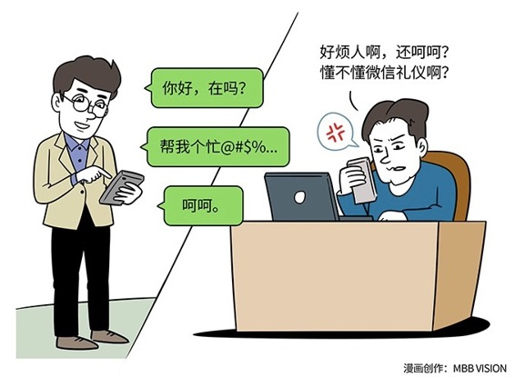

# 146｜再问“你好，在吗”，我就拉黑你

我职业生涯的第一课，叫Professionalism（职业化），这门课让我非常受益。你说学了些什么？其实也没什么，就是学了学独自上出租车，你该坐哪；如果是老板开车，你坐哪；如果老板开车，你上级也在，你坐哪；如果你老板开车，你上级也在，但还有个女士，你坐哪......

### 概念：微信礼仪

有必要搞那么复杂么？随便坐不就完了，他们不会在意的。其实，我从professionalism这门课学到最多的，不是“一辆出租车的七十二种坐法”。我从这门课中学到最多的，是这些职业化问题背后的思维方式：

> 永远要站在对方舒不舒服的角度考虑问题。让别人与你打交道的时候，感觉非常舒服，这就是职业化。

我们把享受这种职业化，并给别人带来舒适社交的人，叫做“绅士”。互联网时代的快速变化，给很多过去的“绅士”们出了难题。他们意识到（也许有的人其实还没有意识到），在过去某个场景下的“职业化”行为，在新时代不但不礼貌，还造成了很多问题。

### 案例

我有一位在陆金所的朋友告诉我，他们的客服人员和客户聊完之后，发了一个微笑表情给客户，以示友好，结果被客户投诉了。这听上去很不可理喻。但是，今天在很多社交工具尤其是微信里面，微笑表情的意思是：“我就静静地看着你装，不说话”，等同于“呵呵”。

有“绅士”可能会拍案而起：这是谁定义的？！在我的字典里，微笑表情，就是友好、友善、友情的意思。我问了我的几个朋友，他们都不认为微笑表情有这个意思！无聊！

这就是可怕的代沟。有个年轻人的母亲给他的父亲在微信群里发了三个微笑表情。看得这个年轻人毛骨悚然，觉得他们可能下一分钟就要打起来的感觉。他立刻打电话过去问，他妈妈说：啊，啥事没有啊，我就是觉得好，就发了。

> 职业化，是让别人觉得舒服。如果别人（尤其是你的客户）觉得舒服的方式变了，你也必须要变。这就是很多传统企业向互联网转型的底层文化障碍。不是不愿意接受，而是根本就不知道、不理解互联网时代的文化。

好吧。那还有哪些表情是“高危表情”呢？“微笑招手”。这个表情在很多微信语境下，已经不是“再见”的意思，而是含着笑说：滚。

所谓的职业化，体现在“微信礼仪”上，还不仅是用对表情，更多体现在交流的方式上。

比如在微信里面，如果一个人发“你好”，而你和这个人不太熟，有些人（尤其是在忙的时候）会选择不回复这条消息。如果收不到回复，通常他的下一句就是“在吗”。“在吗”这个问题，和“你有男朋友吗”一样，标准答案是：这要看是谁问了。

### 运用：理解不同沟通工具的特性

为什么会这样？这是沟通工具的特性导致的。

电话，是一个同步独享沟通工具。你愿不愿意和这个人沟通的决定，是通过按不按下“接听”这个键来决定的。按下去了，就相当于同意分配一段独享的时间给对方。然后，你们用“你好”、“你也好啊”来完成握手协议，在谈话过程中，用“对”、“是”来确认收到对方的信息，彼此同步。

邮件，是一个异步分享沟通工具。你愿不愿意和这个人沟通，是通过回不回复邮件来决定的。就算你回，从收到邮件、到回复邮件，你的这段时间，是分配给很多人共享的。这段时间你可能一边思考如何回复，一边做很多其他事情。直到收到你的邮件后，对方才会再进行他的下一步，是异步模式。

> 所以，邮件、电话，有完全不一样的职业化表现。

比如电话要不断说：是，对。这是为了让对方了解，你一直在与他同步；邮件要标题、正文尽量观点明确、逻辑清晰，在有限次的来回中提高效率。微信是介于电话和邮件之间的沟通工具。如果用同步、异步的程度来排序主流的沟通工具，我会从高到低排为：电话、QQ、短信、邮件。准确地说，微信是介于QQ和短信之间的状态。你说他在吧，他可能正在走路。你说他不在吧，他可能正在微信上聊天。也可能，他此刻正在微信上聊天，一分钟后他就要走路。所以，他回复你“在”好呢，还是“不在”好呢？万一回复了“在”，然后开始走路，你下面的话没人回复，你会觉得很不礼貌。如果回复“不在”，你会觉得这是几个意思，明明回复了，还说不在？所以，在微信上，很多人都对我说过，最反感那种“你好，在吗”这样的开场。这是因为，你在试图用电话，或者QQ的“职业化”方式，试图在微信里面表示礼貌，然后启动一段锁死独享时间的沟通。

### 小结：得体的微信礼仪

正确的做法应该是，说句“你好”，然后就以有事说事的心态，简短地说清楚你想说的事情。这样，给对方足够的自由时间，来选择要不要回复你，或者如何回复你。让对方舒服。所有的商业人士，都需要重新上一堂“互联网时代的职业化”课程，理解互联网时代，与客户、伙伴，甚至是自己的员工打交道的方式。