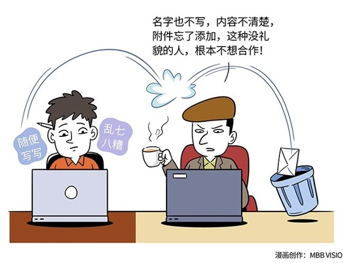

# 147｜这辈子，你们只会在邮件里“见字如面”

> 你有没有收到过这样的电子邮件？发件人叫“还好只是近黄昏”，邮件的标题是：“你好！”你觉得，这一定是漏网的垃圾邮件，但还是打开看了一眼，发现居然是供应商的方案和报价。你找了半天，没有方案，也没有报价啊？回信问。他说：啊！忘了添加附件了。我再发一遍。你会怎么看待这位供应商？如果是我，能不合作，就不要合作了。太不靠谱。

### 概念：邮件礼仪

作为管理者，我建议你做一个测试。找到5名与客户打交道最多的员工，然后随机抽取每位员工10封来往的邮件，看一下标题，问候，分段，用词，署名，字体，颜色。估计你会一身冷汗，我们就是这么一步一步把客户逼走的！我想这就是中国人常说的“见字如面”吧。在互联网时代：见邮件如面。

### 运用：如何写一封好的邮件

那么，一封好的邮件，到底应该长什么样呢？我们与人见面的基本礼仪，不是貌美如花，而是干干净净。一封好的邮件也一样。简洁、干净，是基础。然后才是你的风格。怎么做？

第一，正式的显示名和总结性的标题。邮件接收者首先看到的是两样东西：你的显示名，和邮件标题。所以，邮件礼仪的第一步，就是用真名”。个性化、诗意化，尤其是二次元的名字，比如“还好只是近黄昏”，“一只特立独行的猪”可以用在你的QQ签名上，不要用在商务邮件里。然后是标题。用不到20个字，总结这封邮件的核心内容。“你好”，“来自xx公司”，“报价”，都不是一个好标题。“请审阅：X公司关于Y项目的方案和报价”，才是一个好标题。

第二，简单大方的格式。一封好的邮件，一定是简单大方的。格式要让位于内容。尽量少用不同的颜色、大小、字体、排版，更不要用背景图、甚至背景音乐。真正高手的邮件，所有的字都是一个颜色，一样大小，一种字体，并只用三种方式来排版：分段、缩进，和加粗。分段负责阅读逻辑，缩进负责层次关系，加粗负责突出重点。所有复杂花哨的排版，基本都可以用这三个方式实现。

第三，逻辑清晰的正文。外国人喜欢称呼对方“Dear Tom”，你可以说“尊敬的张总”；外国人喜欢用“I hope this email finds you well”开场，你可以说“见信好”。问候之后，邮件正文一定要分段，每段只讲一件事情。邮件的标题，是全文概括，每段的首句，是整段概括。用小段，不要用大段；用短句，不要用长句；用简单的词，不要用复杂的词；能用100个字讲清楚的事，不用101个字。结尾的部分，总结邮件内容，强调需要他跟进的事情：恳请您拨冗回复修改意见，非常感激。然后，“祝：商祺”；亲密一些的“祝：春安”；再亲密一些的“祝：家人都好”。署名：“刘润，润米咨询。

第四，良好的回信习惯。收到邮件尽快回复，代表你的能力、效率、对他的重视程度。回信的专业方式，代表你的职业化程度。比如，善用抄送、密送；回复、全部回复这些功能。起草邮件，要决定抄送哪些人。一个不多，一个不少，是功力。回复邮件呢？添加、删除、移动抄送者，更是功力。默认，你应该“全部回复”，而不是仅仅“回复”发件人本人，因为他抄送这些人，就是希望他们持续关注你们的对话。如果你觉得没必要这么多人关注，可以把一些人从抄送，移到密送，然后在正文中注明“为了不打扰大家，我把谁谁谁移到了密送”。这样，他们知道自己从下一封信开始，就会离开讨论。如果邮件来来回回，甚至讨论的主题都发生变动，可以修改主题，或者重起一封新邮件，而不是文不对题的盖楼。然后，按下“发送”键之前，再次检查标题、称呼、错别字、有没有忘了附件。

> 小结：认识邮件礼仪

你和很多人这辈子可能只会通过邮件沟通，“见字如面”。你不一定要打扮得花枝招展，但必须要把自己收拾得干干净净。怎么做？第一，起正式的显示名，和总结性的标题；第二，用简单大方的格式；第三，写逻辑清晰的正文；第四，养成良好的回信习惯。