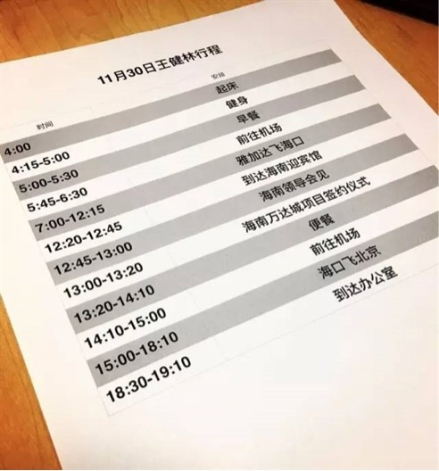

# 148｜时间颗粒度，是一个人的职业化程度

2016年12月，网络上流传一张王健林的行程表。这位62岁的中国首富，早上4点起床健身，然后飞行6000公里，出现在两个国家、三个城市，最终，晚上7点赶回办公室，继续加班。

这张行程表出现后，网友们纷纷表示，受到了10000点的伤害。最可怕的事情看来真的是：比我成功N倍的人，居然惨无人道地比我更努力！这世界，到底还给不给我们这些年轻人机会啊！

### 概念：时间颗粒度

这其实一点都不奇怪。有不少成功人士的努力程度，是很多常人无法想象、甚至都不愿想象。而我从这张行程表里看到的，是另一样东西：职业化。我在朋友圈里写到：

外企高管们，很多远不到首富级别的同志们，都是这样的 …… 时间颗粒度，可以看出一个人的职业化程度。

> 时间颗粒度，就是一个人安排时间的基本单位。根据行程表，王健林的时间颗粒度很细，大约是15分钟。和海南省领导会见？恩，蛮重要，给你15分钟。

另一个把时间切成颗粒的人，是全球首富比尔·盖茨。英国电子邮报资深记者Mary Riddell说，盖茨的行程表和美国总统类似，5分钟是基本时间颗粒度，而一些短会，乃至与人握手，则按秒数安排。

这哪里是把时间切成颗粒啊，这简直是把时间碾成粉末啊。但你不要觉得夸张。这个“按秒数安排”，我是亲眼见过的。

### 案例

2002年，比尔·盖茨到访中国，在北京香格里拉参加一些重要会面。微软中国的同事们为了他的到来，一遍又一遍测量，从电梯口到会议室门口要走多少步、几秒钟。我当时就在现场，亲眼目睹每个会议室都坐着一位等着他握手、签字的重要客人。比尔来了之后，一个房间、一个房间握手、签字、拍照、离开，几乎分秒不差。

每个人，都有自己的时间颗粒度。王健林是15分钟，盖茨是5分钟，大部分人是1小时，半天，甚至一天。恪守时间，是职业化的最基本要求。为什么很多人看似并不守时？是因为他的时间颗粒度，过于粗犷。

央视某主持人有一次采访王健林，她和摄制组迟到了3分钟，结果王健林当着他的面，坐着车绝尘而去。这位主持人感慨说，一分钟不等，一点脸不给，老王就是霸气。其实不是老王霸气，而只是时间颗粒度也许是1小时的他，无法理解，对一个时间颗粒度是15分钟的人来说，3分钟意味着什么。

衡量一个人在商业世界中是否职业化，恪守时间，是一项最基本的要求。如果你理解了“时间颗粒度”的概念，就会明白，恪守时间，就是理解、并尊重别人的时间颗粒度。

### 运用：如何管理时间颗粒度

#### 第一、理解别人的“时间颗粒度”。

理解，是尊重的前提。用时间颗粒度为1小时的人的心态，去评价一个时间颗粒度为15分钟的人的行为方式，很容易会说：至于吗？耍什么大牌啊？

时间颗粒度为1天的人，喜欢说：你到北京了啊？那怎么不顺便绕到天津来看我一下啊？

时间颗粒度为半天的人，喜欢说：你下午在办公室吗？我过来找你聊聊天。

时间颗粒度为1小时的人，喜欢说：路上堵疯了，我还有一会儿就到，你等我一下啊。

时间颗粒度为半小时的人，喜欢说：这事微信里说不清楚，我给你打电话吧。

这些话都没错。但是如果别人不去天津看你，拒绝你的临时到访，不谅解你的迟到，或者不接你电话，你要理解，那只是因为他的“时间颗粒度”和你不同。

### 第二、提升自己的“时间颗粒度”。

检查一下自己的时间颗粒度。怎么检查？看看你约人开会，一般约多长时间。一约就是半天的会？那你颗粒度是半天。你的会都是以小时为单位？那你颗粒度是1小时。

如果你的时间颗粒度是2小时，也不用自责。你的时间颗粒度，会随着你越来越成功，时间越来越值钱，一定会变得越来越细。这会自然而然，不用强求。

但是，当和别人打交道的时候，更具职业素养的商业人士，会懂得至少以30分钟为单位安排时间，以1分钟为单位信守时间。这就是职业化。

### 第三，善用日历管理“时间颗粒度”。

现在的电脑、手机都自带日历工具。建议学习把所有行程安排，都必须放入日历，而不是大脑中，然后利用工具，逐渐管理越来越细的时间颗粒度。关于工具，我个人比较喜欢用微软的Outlook，你也可以用其他手机自带的工具。

### 小结：认识时间颗粒度

时间颗粒度，就是一个人管理时间的基本单位。有人的时间颗粒度是半天，比如退休老人；有人的时间颗粒度是15分钟，比如王健林；有人的时间颗粒度是5分钟，比如比尔·盖茨。在商业世界中，拥有受人尊敬的职业化素养，恪守时间，是一项非常基本的要求。

> 而恪守时间的本质，就是理解、并尊重别人的时间颗粒度。