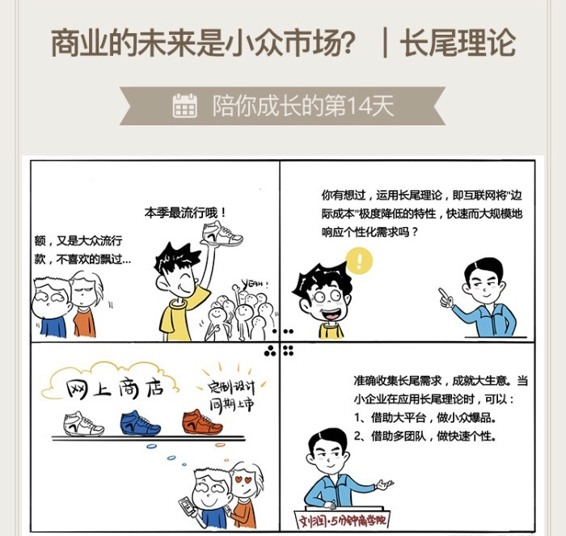

# 014｜商业的未来是小众市场？

### 概念：长尾理论

互联网的出现，使得企业规模化地满足人们个性需求成为了一种可能。无论是畅销款还是冷门产品，99%的商品都有机会被进行销售，那些原本冷门的、位于需求曲线中长尾部分的产品因此可以咸鱼翻身，成为被寄予厚望的新的利润增长点。

### 案例

1、楼下修理铺 VS 万能的淘宝

> 你家有一个老款电视机的遥控器坏了，在楼下的修理铺买不到，在“万能的淘宝”却可以买到。是因为，修理铺的销售“边际成本”不为零，所以，他必须陈列少量的、销量最大的“畅销品”，用20%的产品，谋求80%的利润。而在淘宝店陈列一件商品的“边际成本”几乎为零，所以有什么都可以上架。对这家淘宝店铺来说，全中国买这个“偏门”的遥控器的人加在一起，其实不一定会很少；对淘宝来说，全中国所有这种卖“偏门”产品的店加在一起，销量很有可能大于某些所谓的“畅销品”。

2、传统广告公司 VS 谷歌

> 过去，小微广告主的宣传需求无法得到满足；后来，谷歌用一种完全自动化的方式，把广告销售的“边际成本”直接打为零，不再关注恐龙的头部，而是把长长的尾部收集起来，用关键字匹配的方式，自动发布广告，并因此成为全球最大的广告公司。

3、传统书店 VS 亚马逊

> 过去线下卖书，因为陈列成本的缘故，绝大部分的书，你这辈子都没有机会知道。后来，亚马逊把销售的“边际成本”直接打为零，让很多“冷门书”重见天日，也让很多消费者的个性化阅读需求得到满足。

### 运用：场景

场景1：小众市场就是大市场

> 我有个朋友是做办公椅的，现在同质化很严重，问我怎么办？我说，做小众的大市场。比如，“优秀员工椅”，特别高大上，人体工程学、自动按摩、还镶着金边，远远看到就羡慕。公司用这把椅子激励本月的优秀员工，不断流动。互联网把销售的边际成本降为几乎为零，如果你能把这把椅子做到极致，也许会有不可想象的市场回报。这也是很多人说的：爆品战略。精准是核心。

场景2：快速满足个性化

> 网上著名的“韩都衣舍”，把机构打散成280多个小组，不断捕捉长尾需求，快速设计、快速下单、快速销售。所有这些准确捕捉的快时尚需求，收集起来，就是大生意。快速是核心。

### 小结：如何运用呢？

长尾理论的成立，有三个前提：

没有陈列成本，导致边际成本降为几乎为零；打破地域限制，小需求能被收集；个性化能被规模化满足。

小企业应用长尾理论，建议两个方法：

1、借助大平台，做小众爆品。  2、借助多团队，做快速个性。