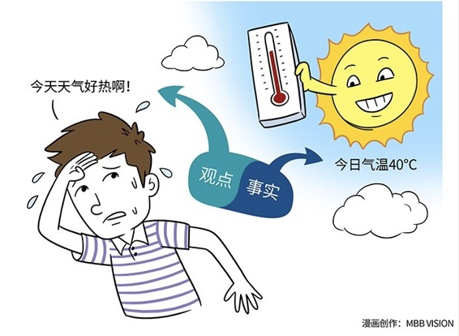

# 149｜事实有真假，观点无对错

我今天冒个险，问大家几个问题：你觉得，韩寒的身高，有没有1.73米？韩寒的书，是不是别人代笔的？韩寒是不是一个不学无术的人？我继续冒险，接着问你：你觉得，中医是不是伪科学？上帝是不是一些人的臆想？

你不用着急回答，甚至我都不建议你在留言区随便回答这几个问题，因为这几个问题，每一个都是著名的，能让好友面红耳赤，发小割席断交的“分手题”。为什么会这样？因为大家在讨论这些问题之前，甚至都没有先分清楚，他们在讨论的是一个事实，还是一个观点。

### 概念：事实和观点

什么是事实，什么是观点？

我先举个简单的例子。比如：今天天气好热啊！请问，这是事实，还是观点？

天气变热，天气变冷，这是自然规律，不以人的意志为转移，所以这应该是事实吧？

错！今天天气好热，这不是事实，是观点。那什么是事实呢？今天气温30度，这才是事实。至于在30度的气温之下，你觉得冷，还是觉得热，这是每个人都可以有的、不同的观点。

也许你会说：30度都不觉得热，这不是有病吗？但是，就算全世界99.99%的人在30度之下会觉得热，但是你依然不能说0.01%，也就是一万个人中，有一个人觉得冷，就是错的。

事实有“真假”，但是观点只要1）不违反事实，2）逻辑自洽，就没有“对错”之分。如果你认为只有自己的观点，才是无可辩驳的正确，与之相悖都是错，你就是在商业世界中持有“地心说”，而不自知。

职业化的基础，是尊重；尊重的基础，是理解；理解的基础，是接受不同；接受不同的基础，是能够区分事实（Fact）和观点（Opinion）。今天，我们就来聊一聊这两个，也许在小学就该学习的概念。

### 运用：如何区分事实和观点

#### 第一、事实。

什么是事实？就是在客观世界中，可以被证实或者证伪的东西。

有人说：“小龙虾是日军的化学武器”。这个“事实陈述”，可能为真，也可能为假。

如果你不信，可以不搭理他。如果你打算搭理他，别说：“我真为你的无知而感到羞耻”，这会打起来的。你可以说：“你是怎么确定的？”这就是一种证实、或者证伪的态度。

他说：“我看到一篇微信文章说的”。你别说：“我真为你的判断力而感到羞耻”，这又要打起来了。你可以说：“我在微信里看到过不少谣言，比如这个，比如那个，后来都辟谣了。你确定那篇文章一定属实吗？”这还是一种证实、或者证伪的态度。

关于事实，不需要辩论，只需要验证。

#### 第二、观点。

什么是观点？就是在一套认知体系中，不违反事实，逻辑自洽，因此无法被证明对错的东西。

有人说：“iPhone真是最好用的手机。”你知道，这是观点，不是事实。

你问：“你为什么这么认为？”他说：“因为APP最多啊！”这说明，在他的认知体系里，APP最多就是最好的手机。

你问：“为什么APP最多，就是最好用的手机？”他惊讶地看着你说：“这是共识啊！”这说明，他是个“地心说”患者，认为自己的道理，就是世界运行的公理。

但是，他认为“APP最多就是最好的手机”，有错吗？其实没错。在他的认知体系里，他当然可以这么认为。

如果你说：“你错了，iPhone太封闭，开放的手机，才可能是最好用的手机。”这时候，你就和他一样，也变成是“地心说”患者了。

你们俩是争不出结果的，因为你们俩在争的不是“iPhone是不是最好用的手机”，而是“到底什么才是最好用的手机”的认知体系。而只要你们彼此的认知体系不违反基本事实，又能逻辑自洽，也就是能自圆其说，就永远不会被对方说服。

那职业化的表述，应该是怎样的呢？你可以说：“哦，站在APP多少的角度，如果数据支持，那iPhone可能确实是最好用的手机。如果站在手机是否足够开放的角度，我个人认为iPhone并不是做得最好的。仅供你参考。”

这句话说完，你发现，大家立刻就没什么好辩论的了。

美国人从小学开始接受如何区分“事实”和“观点”的教育。

不少美国人喜欢说“Interesting”，也就是“有趣”。当一个美国人说“有趣”时，你别以为他认同了你的观点。他其实是在说：关于这件事，你竟然是那么看的。他说“有趣”，不是认同你的观点，而是认同你可以有自己的观点。

### 小结：认识事实和观点

职业化的基础，是尊重；尊重的基础，是理解；理解的基础，是接受不同；接受不同的基础，是能够区分事实，和观点。

什么是事实？就是在客观世界中，可以被证实或者证伪的东西；什么是观点？就是在一套认知体系中，不违反事实，逻辑自洽，因此无法被证明对错的东西。

事实有真假，观点无对错。遇到不同观点时，不要面红耳赤、割席断交，而要说：有趣。