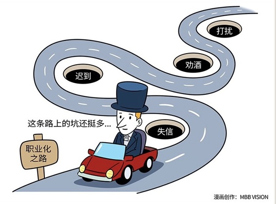

# 150｜职业化，就是商业世界的教养

讲了四期“职业化”的概念之后，有人可能会问：到底什么是职业化？如果微信礼仪是职业化，邮件礼仪是职业化，尊重别人的时间颗粒度是职业化，分辨事实和观点是职业化，看上去好像“好的东西”都是职业化，那什么不是职业化？

### 概念：职业化

这是非常好的问题。关于职业化（英文叫“Professionalism”），我非常喜欢这样一个解释：职业化，就是商业世界的教养。我们先来看看，什么是教养。

> 大雨刚停，马路上很多积水，一位司机开车从你后方驶来，你赶快往人行横道里面躲。这时，他踩刹车减速，缓缓经过你的身边，没有溅起一滴脏水，直到开出很远之后，才重新加速。这就是教养，一种对自己的利益，与别人的得失之间，分寸的拿捏。

> 他接着把车往前开，到了一个开阔的三叉路口。路口有一个“暂停（STOP）”标志，但明显四向无车。他没有减速直接转弯，而是按照标志要求，完全把车停住，做了一个实际很没必要的左看、右看的动作，再重新启动汽车，右转前行。这就是教养，一种在既定规则之下，对自己的克制。

> 教养的本质，就是对外的分寸感，和对内的克制力。排队买票，不大声喧哗，不乱丢垃圾，自动扶梯靠右站等等，都是源自于这种分寸感，和克制力。因为你尊重别人，所以别人也会尊重你、信任你，长远来看，你会得到更多人的帮助，最终获得更大的个人成功。

在商业世界也是一样。我们每天要与很多客户、合作伙伴、供应商、竞争对手打交道。如果你能足够尊重别人，在商业世界中表现出高超的教养，也就是职业化素养，你的合作伙伴会尊重你，信任你，你的竞争对手也会觉得，你是一个值得敬重的对手，从而不断降低信任成本，积累越来越多的影响力和势能，最终获得更大的商业成功。所以，用“商业世界中的教养”，尊重别人用微信的方式，尊重别人看邮件的习惯，尊重别人的时间颗粒度，尊重别人的观点，从而反过来赢得别人的尊重，降低你与整个世界的“信任成本”，就是所谓的“职业化”。

### 运用：请注意“不是”职业化的行为

讲了四天哪些“是”职业化的行为之后，今天我想与大家聊一聊，哪些“不是”职业化的行为，在商业文明越来越发达的今天，避免你在不经意间，损失了别人对你的尊重和信任。

第一、失信。有些人很喜欢说“这件事，就包在我身上了”，“放心，你的事，就是我的事”，“没问题，哥明天就给你搞定”。可是，第二天酒醒之后，自己说过什么，全忘了。完全不把自己的承诺当回事，或者超出自己能力过分承诺（Over-Commitment），都是职业化的大忌。这样行为成性的人，基本可以退出商业界了。这样行为泛滥的地方，基本已经脱离商业社会了。

第二、迟到。“我不就是迟到了15分钟吗，我保证，不耽误你后面的事，还是按照原定时间，准时结束。”这也是一种很危险的想法。你把和别人约的1小时，当成了自己的财富，然后大手一挥，这15分钟我不在乎，没了就没了。你要记住，这15分钟不是你的，如果45分钟真的可以聊完，那省下来的15分钟，对方一定有比等你更重要的事情可做。千万不能迟到。如果真的迟到了，一定要非常诚恳地道歉，并且补偿对方。

第三、劝酒。“你不喝，就是看不起我！”这是中国商业界的一道奇观，让外国人看得目瞪口呆。这个逻辑在哪里？你喜欢喝，你就喝；我不喜欢喝，我就不喝。“我不喝就是看不起你”，这个逻辑到底在哪里啊？劝酒，究其根源，是一种“服从性测试”。劝酒、服毒、投名状，都是在商业文明还不健全的时候，建立信任的手段。把这一瓶喝下去，我就把订单给你；把这颗毒药吃下去，完成任务后，再给你解药；去杀个人，带着人头上梁山，我们就是兄弟 …… 是一个道理。试着把喝酒，仅仅当成自己的爱好吧。

第四、打扰。“老师，我是个创业者，有个项目想听听你的意见。”这条消息，淹没在陌生留言中。他继续留言“老师，你能回复一下吗？”没回。“老师，你的意见对我很有价值。”没回。“没想到你是这样的老师！”每个人都有自己的目标、计划、任务、优先级，甚至自己的困惑。如果别人正好有空帮到你，你可以选择感激。但如果别人有自己的事情要做，没能帮你，也不要觉得这个世界伤害了你。

### 小结：认识职业化

职业化的本质：是通过尊重别人，从而赢得尊重，降低信任成本。职业化，是商业世界的教养，来自对外的分寸感，和对内的克制力。我今天与大家分享了四个“非职业化”的案例：失信、迟到、劝酒、打扰。