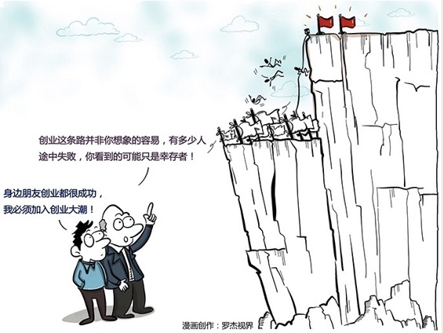

# 151｜看不见的弹痕最致命

如何用正确的姿势向成功者学习，才能学到他成功的真正精髓呢？听他的演讲吗？看他的传记嘛？为什么越来越多的人会觉得，成功者的传记很多都是心灵鸡汤，让你懂了很多的道理，却依然过不好这一生呢？或者对于成功者自己来说，如何才能从自己过去的成功中,找到那个真正的原因，用这个原因支持自己获得2次、3次的成功，而不是昙花一现呢？

要复制别人的成功或者延续自己的成功，就必须要理解过去成功的原因到底是什么，而成功者在总结自己成功的原因的时候，非常容易犯一个很大的错误，我们称之为：幸存者偏见。

### 概念：幸存者偏见

> 二战期间，美国统计学家沃德教授被授命研究如何降低战机被击落的概率的这个问题。他的研究发现，飞机的翅膀是最容易被击中的部分，而飞行员的座舱和飞机的尾部则是被击中最少的部分。

> 但是依照当时的航空技术，机器的装甲只能局部加强，以免过重。那么问题来了，到底是应该增强机翼，还是应该增强座舱和尾部呢？当时的作战指挥官认为，既然机翼最容易中弹，那么当然应该增强机翼了。但沃德教授则建议加强飞行员的座舱和飞机尾部发动机的位置。

沃德教授认为，作战指挥官的这个判断就是犯了这个严重的逻辑归因的错误：幸存者偏见。

从统计的观点来看，多次击中机翼的轰炸机，但依然能够安全返航，而机尾部分却发现很少中弹。那并不是因为他不会真的中弹，而是因为他一旦中弹了，可能根本就无法返航。

后来事实证明教授的建议是正确的。联军的轰炸机被击落的比率显著降低。英国军方还动用了敌后的工作人员，收集了部分坠毁在德国境内的飞机的残骸，发现中弹的部位果真如沃德所预料，主要集中在座舱与尾部发动机的位置。

> 所以说看不见的弹痕最致命。

有时候，我们要研究的问题并不是这些幸存者是怎么活下来的，而是那些没有这个幸运回来的飞机是如何死去的。可是很不幸的是，死去的人是无法开口的，而你采访幸存者，他们是如何活下来的时候，他会带有一种并非主观意愿的偏见，因为他们从来没有看见过那个看不见的弹痕。

> 到底什么叫做幸存者偏见，它是一种常见的逻辑的谬误。我们只能看到经过某种筛选而产生的结果，并没有意识到筛选的过程，而忽略了一些非常关键的信息。

### 运用：如何避免幸存者偏见？

#### 第一，要向失败者学习。

马云曾经说过，我创业10年以来最大的心得是永远去思考别人是怎么失败的。

著名的财经作家吴晓波先生也写过一本书，叫做《大败局》，告诉大家如何从别人的失败中获得自己的经验，向失败者学习的本质就是意识到沉默数据的存在，让死人开口告诉你发生了什么。

#### 第二，我们也要向反对者学习。

你做了一个产品，想收集一些用户的意见。很多热心用户给你提了各种意见，希望追加这个功能，追加那个功能，但这些人可能都是你的产品的幸存者，他们觉得你的产品其实还不错，还愿意继续用下去，所以才会给你提意见。

可是那些真正觉得你的产品其实很烂的人，他可能用了一次之后就把你的软件给删掉了，他们的意见其实可能会更重要，但是因为死人无法开口，所以你可能永远都是听不到。主动找到他们，问问他们为什么要走，而不仅仅是剩下来的人为什么要留，也许会给你不一样的视角，和更大的价值。

#### 第三，培养识别幸存者偏见的能力。

有个江湖郎中，号称有个祖传秘方，据说能够包生男孩，一副见效售价2000，生下男孩再付钱，不灵不要钱。于是很多人去找他。如果生下的是女孩，人们没付钱也不去找他了，而生下男孩的就高高兴兴的把钱给送去了。按照概率啊，有一半的人能生男孩，所以他平安无事行骗了很多年，还挣到了一屋子的锦旗。

给他送锦旗的那些人都是因为幸存者偏见。

### 小结：认识幸存者偏见

第一，大家一定要理解所有的成功者其实都是幸存者。       

第二，我们要向成功者祝福，但是要向失败者学习，抛掉对个案的迷信，让死人开口说话，全面系统地了解才能克服这个偏差。

第三，要建立非常严谨的逻辑思维方式，一次成功，很多人是靠运气，二次成功，要想排除运气的部分，就要靠基于严密的逻辑思维的战略思考。而能够3次或者4次成功的企业家，通常对整个商业世界的运行规律有着自己深刻的理解。他通常是一个哲学家。