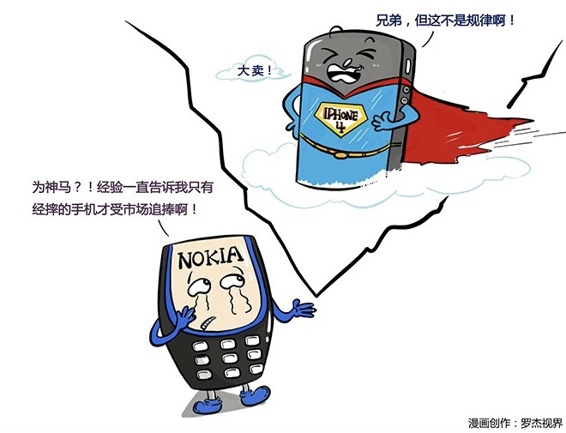

# 152｜知识，是经验的升华

小时候，我们都学过一项非常重要的生存技能：哭。我们只要一哭，妈妈就过来了“宝贝，怎么了？不哭不哭”。吃的、玩的，什么都有了。于是，我们脑海中获得了一项重要的知识：哭，可以获得资源。

终于，你长大了。有一天，你的客户批评你的方案，决定把订单给你的竞争对手。你怎么办？怎么办？你决定故计重施，突然，在客户办公室嚎啕大哭，惊天动地 …… 结果 …… 结果，你被保安扔出来了。

也许你会觉得很可笑。怎么会有人这么傻？是的，确实很傻。好的，那么问题来了。请认真思考一下然后回答：他傻在哪里？

### 概念：库博学习圈

“哭，可以获得资源”，是不是一个“规律”？不是，这只是“经验”。他傻就傻在没有意识到，套用这个“经验”，有一个重要的前提：对方必须是你妈。对方就算是你爸，估计都没用。

> 库博说，不能用经验指导行动。那应该怎么做呢？应该“从行动归纳出经验，把经验升华为规律，用规律再指导行动。”这就是著名的“库博学习圈”。

库博认为，一个完整的学习，是“行动-&gt;经验-&gt;规律-&gt;行动”的四步大循环，缺一步，就是假学习。

第一种“假学习”，是缺了“规律”，形成“行动-&gt;经验-&gt;行动”的“经验主义”小循环。

前天你狠狠骂了一顿员工，员工今天努力工作了。昨天又骂了一顿，今天更努力了。“骂员工”，就变成你的“经验”了。你没有思考中间的“规律”，你就在企业家论坛到处讲“好人不要做老板”。

这两天你挖了个牛人做CEO，总觉得应该先要骂他一顿。刚骂完，他不来了。

第二种“假学习”，是不但缺了“规律”，甚至还缺了“经验”，形成“行动-&gt;行动”的“行动派”。

“别听理论家胡说，他们要是有本事，自己早赚钱了”，“什么理论？行动就是理论”，“多学无益，干起来，创业路上的坑，一个都少不了”。

可是，行动派真的没有理论支撑吗？

> 为什么你要在商业街开店，而不是无人区？为什么你要卖漂亮的衣服，而不是丑衣服？你说这是“常识”啊！所谓常识，就是你认为必然正确的规律。很多人用行动掩盖懒惰，只是不想积累新经验、不想学习新规律而已。

从行动到经验，从经验到规律，从规律再到行动，一个不落，才是正确的学习姿势。

### 运用：如何保持正确的学习姿势

第一、从行动归纳出经验。

经验有两种，第一种是自己的直接经验，第二种是别人的间接经验。

直接经验，感受最深。被信赖的伙伴坑过一次，你会痛彻地得出“谁也不能相信”的经验；勒紧裤带、苦苦支撑三年，终于渡过难关，你会刻骨铭心地得出“今天很艰难，明天更艰难，但是后天很美好”的经验。

但是，人的生命有限，你不可能把每件事都“直接经验”一次，所以和有经验的人沟通、学习，建立圈子、成立学习小组，让一个人活出经历了三生三世的感觉。

#### 第二、从经验升华出规律。

库博说：知识的获取，源于对经验的升华和理论化。可是，从经验升华和理论化到规律，有一道巨大的鸿沟。跨越这道鸿沟的方法，是“反思和验证”。

比如，“今天很艰难，明天更艰难，但是后天很美好”这条经验，是规律吗？

反思一下，有没有一些企业，今天不难，明天也不难，第一天就成功的呢？还有没有一些企业，今天很难，明天更难，后天就终于死掉的呢？为什么？

经过深刻反思后，也许你会得出一个更加接近规律的结论：

“在那些处于上升期的行业，及早布局的企业，成功概率会随着时间的推移，逐渐增大。”

反思之外，就是验证。行业数据支持这个结论吗？这是大概率事件，还是偶然事件？我身边的人有亲身经验吗？验证后，也许你会进一步修正你的结论：

“在那些处于上升期的行业，踩准时间点（而不是及早）布局的企业，成功概率会随着时间的推移，逐渐增大；布局太早，冻死；布局太晚，饿死。”

除了利用反思和验证的方式，自己把经验升华和理论化为规律外，还要懂得学习前人已经升华好、理论化好的，“被验证的规律”。

这就是为什么我说：前人的思考，我们的阶梯。你的顿悟，可能只是别人的基本功。

#### 第三，用规律再指导行动。

规律没有作用于行动，就是没有价值的。企业家不能仅仅沉迷于规律之美，千万不要忘了：行动！行动！行动！

#### 小结：认识库博学习圈

库博认为，一个完整的学习，是“行动-&gt;经验-&gt;规律-&gt;行动”的四步大循环。一步都不能少，否则就会犯经验主义，或者行动派的错误。

具体怎么做呢？从行动归纳出经验，把经验升华为规律，用规律再指导行动。尤其是“把经验升华为规律”这一步，是学习的核心。