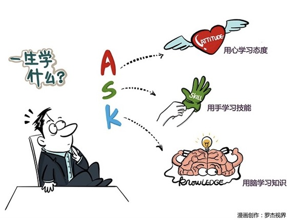

# 153｜为什么人类不擅长谈恋爱？

大学学的知识，对“你”现在的工作有多大的帮助？100%？50%？完全没帮助？或者是“看情况”？

### 概念：知识技能态度

### 10%。为什么这么说？我开始解释……

我这一生只能学会三件事：知识（Knowledge）、技能（Skill）和态度（Attitude）。

#### 知识（Knowledge）：

> 什么是知识？知识就是已经被发现和证明的规律，它是确定的，不需要你通过自身的成功、挫败去验证，然后恍然大悟的那些规律。

比如，1+1=2，那就绝不会等于3，也不可能等于0.5。别和我抬杠啊，这不是脑筋急转弯。再比如，供给大于需求，价格就会下降；把商品放对了心理账户，会增加消费者购买意愿。学习知识的方法简单直接：通过“记忆”，把知识分门别类地存放在你的“存储脑”的某个抽屉里。

大学，甚至你的整个学生生涯，学的大部分都是知识，数学，物理，化学，地理，历史，生物，生理卫生 …… 都是知识。所以检查你学会没有的方法，是做题：请列举南昌起义的四个重大意义；默写李商隐的《无题》；甚至，无理数，就是符合什么和什么条件的数，请填空。

但知识是有适用边界的，甚至是保质期的。你生命中最有知识的时刻，几乎一定是你高考的最后一天。第二天估计就忘了一半。比学习知识更重要的，是学习技能。

#### 技能（Skill）：

> 什么是技能？技能就是那些你以为你知道，但如果你没做过，就永远不会真的知道的事情。

很久以前，有人教过我怎么同时抛三个橘子：第一，左手把橘子抛到空中，第二，立刻把右手的橘子交到左手，并等待落下的橘子；第三，等上升的橘子到了最高点，抛出下一个。要领很简单，我很快就记住了。可是到今天，我还是抛不起来。为什么？因为我缺乏练习。抛橘子之所以叫“技能”，就是因为它是“学”不会的，要靠“习”。

还有哪些是技能呢？骑自行车是技能，你永远“学”不会骑车，连只能靠练“习”，甚至浑身淤青之后，才能掌握。演讲是技能，你读了100本如何演讲的书，但从不上台，恕我直言，你一辈子都“学”不会演讲。谈恋爱是技能。但很可惜你一辈子也谈不了几次恋爱，所以因为缺乏练习，自古以来地球人都是不擅长谈恋爱的，等你真的“习”得了这种能力，估计已经用不上了。

仔细想想，我们是不是常说，沟通“技”能，谈判“技”能，演讲“技”能，管理“技”能，为什么不说沟通“知识”，因为这些都只有靠练习，才能变成条件反射，存储在你的“反射脑”中。

#### 态度（Attitude）：

> 什么是态度？态度就是你选择的，用来看待这个世界的那副有色眼镜。

比如，你觉得这世界是友善的，还是充满恶意的？诚信的人，是更加值得合作的聪明人，还是可以用来欺骗的傻子？商业利益，是满足客户的顺带结果，还是满足客户，是获得商业利益的一种手段？

最难学的，就是态度。每人心中都有一扇门，无论外人如何呼喊，冲撞，这扇门始终只能从里面打开。态度是没有人可以教的，态度是你的“心”的选择。

最后我说：总结一下，对我今天的帮助，态度大于50%，技能大概30%，知识只有不到20%。其中来自大学课堂的知识，可能已经不到一半，也就是10%了。大学虽好，你必须保持终身学习。

#### 运用：关于知识、技能、态度的几个建议

第一，不要把知识当技能学。

有一些“实战主义者”，只相信自己感悟的东西，说“听了那么多道理，还是过不好这一生”，所以拒绝学习，忽视前人的思考、客观的规律，把知识当技能学，通过四处碰壁，总结出一些似是而非的经验。这就是“重新发明轮子”。你的顿悟，可能只是别人的基本功。只有站在前人的肩膀上，人类才能不断进步。

第二，不要把技能当知识学。

有一些“理论主义者”，喜欢通过买书来学习。怎么演讲？买本书来看看。怎么谈判？买本书来看看。怎么看书？买本书来看看。你能买到的书，都是如何练习技能的步骤，而不是技能本身。这就是为什么我们说：纸上得来终觉浅，绝知此事要躬行。

### 小结：认识知识技能态度

学习只有三件事：用脑学习知识，用手学习技能，用心学习态度。把知识学以致用，把技能练成艺术，那么你用心相信的东西就一定会实现。