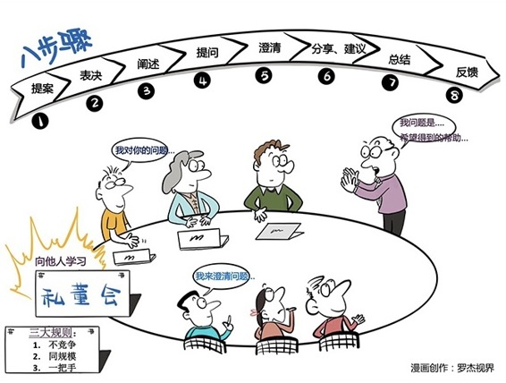

# 154｜作为自己的CEO，你有“私人董事会”吗？

### 概念：私人董事会

还记得第90课学习的“贝尼斯定理”吗？我们70%的成长，来自“工作中学习”，20%来自“向他人学习”，10%来自“正式的培训”

如何在工作中学习？走出舒适区，主动承担更有挑战性的工作，把学到的知识用在其中；那如何向他人学习呢？今天，我要给你介绍一种非常受企业家、CEO们欢迎的方法：私人董事会。

> 什么是私人董事会？一个标准的私人董事会（Peer Advisory Board），一般由16～18名“董事”组成。第一，为了能放心学习，他们必须来自非竞争性的行业，并签署保密协议；第二，为了能互相学习，他们的经营规模和发展阶段，必须比较接近；第三，为了能学以致用，他们必须是一把手，比如董事长，或CEO。

你从这“三大规则”就能看出来，“私人董事会”专为彼此“向他人学习”，做了设定。那然后呢？然后怎么学习呢？

运用：如何有效地向他人“学习”？

#### 第一，提案。

每个企业家提交一个“议题”。这个议题，不能是“如何应对互联网时代”这样空泛的课题，而必须是“我的销售团队能力差，三个季度未完成指标，怎么办？”这样的真实问题。

只有讨论真实问题，才能做出真实改变。

#### 第二，表决。

然后，全体董事投票表决。我们今天到底是作为谁的私董会，帮谁解决问题。

大家投出来的问题，一定是都觉得最有价值，也可以让自己获益的问题。

#### 第三，阐述。

被选中的“问题拥有者”，向董事们详细阐述自己的问题。为了有效表达，建议格式可以是：

“我有____的问题。这个问题是重要的，因为_____。到目前为止，为了解决这个问题，我已经做了_____。我希望小组能帮到我的是_____。”

#### 第四，提问。

这时，董事们可以向“问题拥有者”提问了。

你会发现，企业家、CEO们不喜欢提问，他们上来就喜欢给建议：你这个问题，我遇到过，应该这么做，这么做。

还记得第137课讲的“知彼解己”吗？摁住自己，不要着急给建议。先从问出直达本质的好问题，理解对方开始。

比如“你的潜在销售机会，是实际销售额的几倍？”，“能成功卖出你的产品的三个关键点，是什么？”

你会发现，问对了问题，答案基本就找到了。

#### 第五，澄清。

一轮提问下来，问题拥有者可能会发现，他对问题关注的焦点是不对的。他可以澄清自己的问题。比如表述为：

“如何把成功销售经验变成关键步骤，减小业绩对人的依赖。”

#### 第六，分享和建议。

董事们终于可以分享经验、提建议了。

严格控制发言时间。不然“我今天就说两点”，但这两点，能从下午两点，说到半夜两点。

每人只有3分钟。练习精确的表达。

#### 第七，总结。

问题所有者，这时可能已经后背发凉，或者大汗淋漓了，甚至曾有人痛哭流涕。在有效流程下，直指本质的对话，最能触动人心。

最后，请他总结改进问题的步骤和时间。然后所有董事，分享今天内容对自己的连接和启发。

#### 第八，反馈。

还没结束。问题所有者还有一项工作，就是在下次私董会时，向所有董事汇报他的实施进展，并征求下一步的建议。

必须变成行动，才不辜负时间。

#### 小结：认识私人董事会

私人董事会，是一套建立学习小组，向他人学习的方法。

具体怎么做？三大规则：不竞争、同规模、和一把手；八大步骤：提案、表决、阐述、提问、澄清、分享和建议、总结、和反馈。

> 看似简单的规则，却可以帮助问题拥有者解决实际问题，对其他董事产生关联启发，帮所有人进入深度思考，训练直指本质的提问能力，精准简练的表达能力，向他人学习，最后，还能收获深厚的友谊。