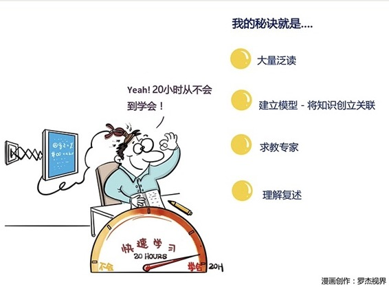

# 155｜如何用20小时，快速学习？

### 概念：快速学习

作为一名咨询顾问，我们每天要面对各行各业的客户。他们用20年，“精通”行业99%的商业细节，而顾问，必须用20小时，“学会”行业80%的核心逻辑，然后，才有资格说“我认为”。

> 所以，“快速学习”能力，是一名优秀顾问的六脉神剑，甚至是商业机密。今天，我就与你聊聊这个机密：快速学习四步法。

#### 运用：如何快速学习？

第一步，大量泛读。

学习一项新知识，有人喜欢买一本所谓“最好的书”，然后从第一个字精读到最后一个字。这是一个从小学开始养成的坏习惯：我们在没有整体历史观的情况下，就从秦朝学到清朝。没有作战地图，就开始打巷战。

#### 应该怎么做？

比如你想学习“区块链”，先上豆瓣网，搜索“区块链”或者相关关键字，找到评价最高的3本书；通过“买过这本书的人，还买过哪本”的方法，再选5本；最后，加2本不畅销，但明显系统性强的书，比如《区块链原理》等。

然后，把这10本书都买回来，开始泛读。泛读时注意几点：

> 5分钟看自序，5分钟看目录。很多人不看自序和目录，这又是一个坏的习惯，因为作者会在自序中，梳理框架逻辑；在目录中，提炼核心观点。

> 15分钟泛读。要点是：略过故事，略过案例，略过证明；标注概念，标注模型，标注公式，标注核心观点。

> 最后，再用5分钟简单回顾，记录下自己的困惑、问题、想法。

用个长一点的下午，或者再加上晚上的时间，高强度地把这10本书读完。建议读电子版，可以大大提高标注、回顾、记录的效率。

#### 第二、建立模型。

好好睡一觉，让知识在你的大脑中自由地碰撞、连接、融合。第二天早上，给自己最清醒的3小时，建立模型。

应该怎么做？

> 找一面巨大的白板墙，把标注的概念、模型、公式，写在即时贴上，贴到白板上，再用白板笔和板擦，建立、修正他们之间的关联，逐渐形成系统模型。白板，是非常重要的思考工具，可用A4纸代替。

#### 第三、求教专家。

还有不清楚的问题，就要求教真正的专家了。

比如，我在准备“项目管理”的时候，有疑问不断跟老板等项目管理经验丰富的人询问，很多问题豁然开朗。

为什么要先建立模型，而不是先求教专家？因为如果你没有基本的全局观，问不出好问题。另外，有些专家有犀利的洞察，但也未必有全局观。他自由发挥2小时，你可能不知所云。

如果你不知道去哪里找业内专家，可以上类似于“在行”之类的平台，花些费用，带着问题虚心求教。然后，修正你的模型。

#### 第四、理解复述

你花了5小时泛读，3小时建模，2小时求教，剩下的10小时，可以花在“复述”上。

> 关于学习，有个著名的“费曼技巧”。用你的语言，把你的模型，讲给别人听。你很可能会发现，讲着讲着讲不明白了；或者你觉得讲明白了，别人就是听不懂。这些地方，就是你理解的薄弱点。

记下这些薄弱点，回到泛读资料里，重新理解；或者上互联网找答案；或者再请教专家。重新理解后，再复述。如此重复。

最终，你就用20小时，快速的学习了一项完全陌生的知识。

### 小结：认识快速学习

> 我们常听说“10000小时定律”，这是帮助你从“学会”，到“精通”的刻意练习方法。那么从“不会”，到“学会”呢？如果你的方法得当，也许20小时就可以了。

具体怎么做？

第一，花5小时，大量泛读；

第二，花3小时，建立模型；

第三，花2小时，请教专家；

第四，花10小时，理解复述。