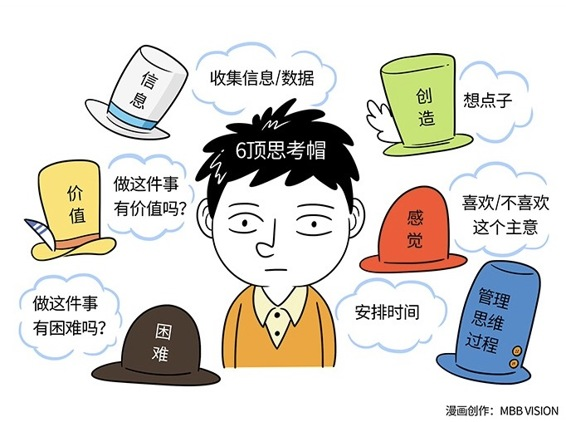

# 156｜从对抗性思考，到平行思考

我问你一个问题。如果国家把婚姻终身制，改为五年合约制，你是赞同，还是反对？我相信很多人立刻就炸锅了，当然……赞同啊！立刻更多人跳起来了：什么？这哪能赞同啊？必须反对了！然后正反双方不断举证，誓死捍卫自己的观点。

为什么会这样？因为人们思考问题的基本方法，是先有一个结论，然后再辩护这个结论。“直觉”先宣布这个主意行还是不行，“理性”再来证明自己的观点，或者批驳对方的漏洞。

#### 那什么才是正确的思考方法呢？

思考方法，是极其重要的基本技能。如果思考能力不够，其他什么能力都要打折。本周，我将给你介绍5个非常重要的思考方法，帮助大家训练大脑。今天，先从“六顶思考帽”开始。

### 概念：六顶思考帽

什么是六顶思考帽？

> 世界创新思维、概念思维领域的专家爱德华·德·波诺说，每个人都有六顶不同颜色的，代表不同思维方式的帽子，它们是：

代表“信息”的白帽，充分搜集数据、信息和所有需要了解的情况；

代表“价值”的黄帽，集中发现价值、好处和利益；

代表“感觉”的红帽，让团队成员释放情绪和互相了解感受；

代表“创造”的绿帽，专注于想点子，寻找解决办法；

代表“困难”的黑帽，只专注缺陷，找到问题所在；

代表“管理思维过程”的蓝帽，安排思考顺序，分配思考时间。

如果你戴着黑色“困难”的帽子，你会觉得“合约制婚姻”充满挑战：孩子怎么办？夫妻哪还有信任可言？如果你戴着黄色“价值”的帽子，你会觉得简直明天就该推行：大量“将就将就吧”的婚姻从此解放。如果你带着红色“感觉”的帽子呢？你会觉得：反正我就是不喜欢这个主意，就是不喜欢，别和我说，我也不想听。

这六种完全不同的思维方式，在一个人的大脑中彼此对抗，在一群人的讨论中寸土不让，最后浪费了大量的时间，却没有结论。

爱德华说，我们应该训练一种思考能力，所有人在同一时刻，只戴一顶思考帽，充分思考后，再换另一顶帽子。这种从争论式的“对抗性思维”，走向集思广益式的“平行思维”，就叫做“六顶思考帽”。

#### 思考方法：蓝白黄黑绿红蓝

怎么来做？比如，关于合约制婚姻的问题，你可以试试“蓝白黄黑绿红蓝”的思考方法。

蓝帽主持讨论流程，先让所有人带上白帽，搜集全球合约制婚姻相关的信息；然后带上黄帽，专注想想，这么做所有可能的好处，哪怕很小；接着，再带上黑帽，列举这么做，会带来的所有问题，和实施的一切困难；再然后，带上绿帽，穷尽解决问题、克服困难的方法；再带上红帽，表达情绪，基于信息、价值、困难、创造，你感觉是否赞同合约制婚姻；最后，蓝帽总结讨论结果。

你会发现，本来三天三夜不会有结果的讨论，三十分钟就讨论完了。就算最后没有结论，这个“没有结论”也会来得更快一些。

运用：六顶思考帽的多种戴法和几个基本建议

“蓝白黄黑绿红蓝”的思考方法，可以用在很多地方。当然除了这个组合，六顶思考帽，还有很多种戴法。简单问题，可以戴“蓝白绿”；改进流程，可以戴“黑绿”；寻找机会，可以戴“白黄”；保持谨慎，可以戴“白黑”；做出选择，可以戴“黄黑红”等等。“六顶思考帽”的组合非常多，但有几个基本建议。

第一、白帽先行。通常，我们应该从获取信息开始，这会使得其他的思考帽，有讨论的坚实基础。

第二、黄在黑前。先思考价值，再思考困难，有助于我们产生正向的动机，获得正能量。

第三、黑后有绿。黑帽让我们看到问题、困难、风险，但黑后有绿，鼓励思考者探索黑帽是否有解决方案。

其实，六顶思考帽的逻辑，和彩色打印机很相似。彩色打印机有青、红、黄、黑四种颜色，它把每种颜色，分四次打印在同一张纸上，最终形成了彩色照片。所以，你可以看把“六顶思考帽”称之为“彩色思考”。

因为使用六顶思考帽，J.P. Morgan将会议时间减少了80%，英国Channel 4 电视台在两天内创造出新点子比过去六个月里想出的还要多；施乐公司用不到一天的时间就完成了过去一周才能完成的工作。

### 小结：认识六顶思考帽

爱德华认为，每个人都有六顶不同颜色的，代表不同思维方式的帽子，它们是代表“信息”的白帽，代表“价值”的黄帽，代表“感觉”的红帽，代表“创造”的绿帽，代表“困难”的黑帽，代表“管理思维过程”的蓝帽。

同一时刻，只戴一顶帽子，从争论式的“对抗性思维”，走向集思广益式的“平行思维”的思维方式，从而克服人脑容易情绪化、不知所措，和混乱的缺陷，就叫做 “六顶思考帽”。

六顶思考帽的戴法顺序，无穷无尽，但有几个基本建议：白帽先行，黄在黑前，黑后有绿。